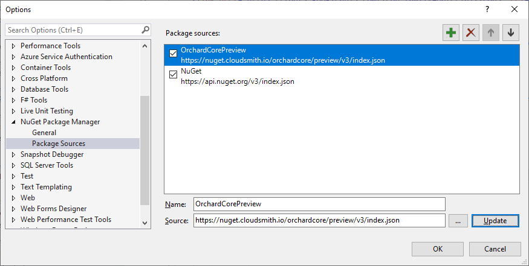

# Add preview package source

In this article, we are going to add a new package source pointing to the preview packages.  
The preview packages are built each time some code is committed on the `dev` branch, compared to the ones on NuGet, built from the `master` branch.  
They are the most up to date versions but not the most stable and can contain breaking changes.

!!! warning
    We do not suggest you to use the dev packages in production.

## Adding Orchard Core preview Feed to Visual Studio

In order to be able to use the __preview__ feed from Visual Studio, open the Tools menu under NuGet Package Manager --> Package Manager Settings.
The feed url is <https://nuget.cloudsmith.io/orchardcore/preview/v3/index.json>




## Adding Orchard Core preview Feed with NuGet.config

You can also add the package source by using a NuGet.config file:

```xml
<?xml version="1.0" encoding="utf-8"?>
<configuration>
  <packageSources>
    <clear />
    <add key="NuGet" value="https://api.nuget.org/v3/index.json" />
    <add key="OrchardCorePreview" value="https://nuget.cloudsmith.io/orchardcore/preview/v3/index.json" />
  </packageSources>
  <disabledPackageSources />
</configuration>
```
