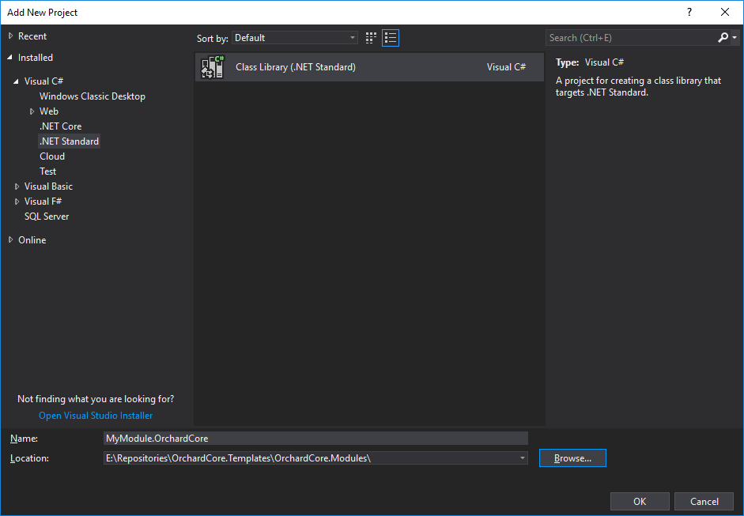

# Code Generation Templates

Orchard Core Templates uses `dotnet new` template configurations for creating new websites, themes and modules from the command shell.

More information about `dotnet new` can be found at <https://docs.microsoft.com/en-us/dotnet/core/tools/dotnet-new>

## Installing the Orchard CMS templates

Once the .NET Core SDK has been installed, type the following command to install the templates for creating Orchard Core web applications:

```CMD
dotnet new install OrchardCore.ProjectTemplates::1.7.0
```

This will use the most stable release of Orchard Core. In order to use the latest `main` branch of Orchard Core, the following command can be used:

```CMD
dotnet new install OrchardCore.ProjectTemplates::1.7.0-* --nuget-source https://nuget.cloudsmith.io/orchardcore/preview/v3/index.json  
```

## Create a new website

### From Command Shell (automated way)

#### Generate an Orchard Cms Web Application

!!! warning
    Due to a bug in the current published version, the following `dotnet new` commands will require the extra argument `--orchard-version 1.7.0`. For instance, instead of typing `dotnet new occms` use `dotnet new occms --orchard-version 1.7.0`

```CMD
dotnet new occms
```

The above command will use the default options.

You can pass the following CLI parameters to setup options:

```CMD
Orchard Core Cms Web App (C#)
Author: Orchard Project
Options:
  -lo|--logger           Configures the logger component.
                             nlog       - Configures NLog as the logger component.
                             serilog    - Configures Serilog as the logger component.
                             none       - Do not use a logger.
                         Default: nlog

  -ov|--orchard-version  Specifies which version of Orchard Core packages to use.
                         string - Optional
                         Default: 1.7.0
```

Logging can be ignored with this command:

```CMD
dotnet new occms --logger none
```

#### Generate a modular ASP.NET MVC Core Web Application

```CMD
dotnet new ocmvc  
```

### From Visual Studio (New Project dialog)

The templates can also be used from the New Project dialog in Visual Studio.

### From Visual Studio (manual way)

Fire up Visual Studio, create a new solution file (`.sln`) by creating a new ASP.NET Core Web Application:


Now that we created a new Web Application we need to add proper dependencies so that this new Web Application be targeted as an Orchard Core application.

!!! note
    If you want to use the `preview` packages, [configure the OrchardCore Preview url in your Package sources](../preview-package-source.md)


Finally, we will need to register Orchard CMS service in our `Program.cs` file like this:

```csharp
using OrchardCore.Logging;

var builder = WebApplication.CreateBuilder(args);

builder.Host.UseNLogHost();

builder.Services
    .AddOrchardCms()
    .AddSetupFeatures("OrchardCore.AutoSetup");

var app = builder.Build();

if (!app.Environment.IsDevelopment())
{
    app.UseExceptionHandler("/Error");
}

app.UseStaticFiles();

app.UseOrchardCore();

app.Run();
```

## Create a new CMS module

### New module from Command Shell (automated way)

#### Module commands

```CMD
dotnet new ocmodulecms
```

The above command will use the default options.

You can pass the following CLI parameters to setup options:

```CMD
Orchard Core Module (C#)
Author: Orchard Project
Options:
  -A|--AddPart           Add dependency injection for part in Program.cs. If PartName is not provided, default name will be used
                         bool - Optional
                         Default: false / (*) true

  -P|--PartName          Add all files required for a part
                         string - Optional
                         Default: MyTest

  -ov|--orchard-version  Specifies which version of Orchard Core packages to use.
                         string - Optional
                         Default: 1.7.0
```

```CMD
dotnet new ocmodulecms -n ModuleName.OrchardCore

dotnet new ocmodulecms -n ModuleName.OrchardCore --AddPart true

dotnet new ocmodulecms -n ModuleName.OrchardCore --AddPart true --PartName Test 
```

!!! note
    `Part` is appended automatically to the end of the supplied `PartName`.

### New module from Visual Studio (manual way)

Fire up Visual Studio, open Orchard Core solution file (`.sln`), select `OrchardCore.Modules` folder, right click and select "add --> new project" and create a new .NET Standard Class Library:



For marking this new Class Library as an Orchard Module, we will now need to reference `OrchardCore.Module.Targets` NuGet package.

!!! note
    If you want to use the `preview` packages, [configure the OrchardCore Preview url in your Package sources](../preview-package-source.md)

Each of these `*.Targets` NuGet packages are used to mark a Class Library as a specific Orchard Core functionality.  
`OrchardCore.Module.Targets` is the one we are interested in for now.  
We will mark our new Class Library as a module by adding `OrchardCore.Module.Targets` as a dependency.  
For doing so you will need to right click on `MyModule.OrchardCore` project and select "Manage NuGet Packages" option.  
To find the packages in Nuget Package Manager you will need to check "include prerelease" and make sure you have Orchard Core feed that we added earlier selected.  
Once you have found it, click on the Install button on the right panel next to Version : Latest prerelease x.x.x.x


Once done, your new module will look like this:


For Orchard Core to identify this module it will now require a `Manifest.cs` file. Here is an example of that file:

```csharp
using OrchardCore.Modules.Manifest;

[assembly: Module(
    Name = "TemplateModule.OrchardCore",
    Author = "The Orchard Team",
    Website = "http://orchardproject.net",
    Version = "0.0.1",
    Description = "Template module."
)]

```

For this module to start, we now will need to add a `Startup.cs` file to our new module. See this file as an example:  
[`OrchardCore.Templates.Cms.Module/Startup.cs`](https://github.com/OrchardCMS/OrchardCore/tree/dev/src/Templates/OrchardCore.ProjectTemplates/content/OrchardCore.Templates.Cms.Module/Startup.cs)

Last step is to add our new module to the `OrchardCore.Cms.Web` project as a reference for including it as part as our website modules. After that, you should be all set for starting building your custom module. You can refer to our [template module](https://github.com/OrchardCMS/OrchardCore/tree/dev/src/Templates/OrchardCore.ProjectTemplates/content/OrchardCore.Templates.Cms.Module/) for examples of what's basically needed normally.

## Create a new theme

### New theme From Command Shell (automated way)

#### Theme commands

```CMD
dotnet new octheme -n "ThemeName.OrchardCore"
```

### New theme from Visual Studio (manual way)

Should be the same procedure as with modules but instead, we need to reference `OrchardCore.Theme.Targets` and the `Manifest.cs` file differs slightly:

```csharp
using OrchardCore.DisplayManagement.Manifest;

[assembly: Theme(
    Name = "TemplateTheme.OrchardCore",
    Author = "The Orchard Team",
    Website = "https://orchardproject.net",
    Version = "0.0.1",
    Description = "The TemplateTheme."
)]
```
