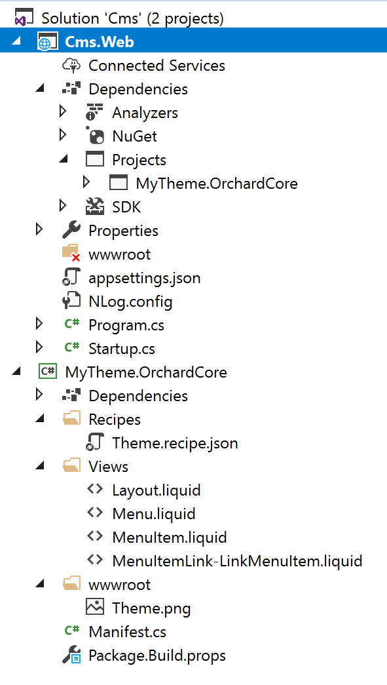

# Getting started with an Orchard Core Theme

In this article, we are going to create an Orchard Core Theme by adding it to an existing Orchard Core CMS application [created previously](README.md).

## Create an Orchard Core Theme

- Install the [Code Generation Templates](templates/README.md) 
- Create a folder alongside (*not* within) the application folder created before, with the name of your theme (Ex: `MyTheme.OrchardCore`). Preferably create a new folder under `OrchardCore.Themes` directory. Open it. We are going to create a new project in this folder.
- Execute the command `dotnet new octheme`
- In Visual Studio, add the newly created theme project to the solution, then add a reference to the project from the main Orchard Core CMS Web application.
- In Visual Studio Code or CLI, execute the command `dotnet sln add MyTheme.OrchardCore.csproj` to add project to solution. Then, go to `OrchardCore.Cms.Web` folder and execute the command `dotnet add OrchardCore.Cms.Web.csproj reference ../OrchardCore.Themes/MyTheme.OrchardCore.csproj`
- Set the main Orchard Core CMS Web application as the startup project.

A thumbnail can also be created by adding a `Theme.png` in the `wwwroot` folder.



The properties of the theme can be changed in the __Manifest.cs__ file:

```csharp
using OrchardCore.DisplayManagement.Manifest;

[assembly: Theme(
    Name = "MyTheme",
    Author = "My name",
    Website = "https://mywebsite.net",
    Version = "0.0.1",
    Description = "My Orchard Core Theme description."
)]
```

The theme should be available in the `Active themes` admin page, and can be set as the default theme.

## How to enable Razor templates in my theme?

The themes we have in source code uses only `Liquid` files so their .csproj only reference : 

`<Project Sdk="Microsoft.NET.Sdk">`

If you want to use Razor templates in your theme you simply need to change this .csproj first line for :

`<Project Sdk="Microsoft.NET.Sdk.Razor">`


