## Introduction

In this article, you will learn how to use Orchard CMS as a decoupled CMS with the .NET Blazor (SSR/Server Interactive) Application.

## Setting up the project

### Prerequisites

- .NET 8 SDK.
- Visual Studio 2022 or Visual Studio Code.
- Orchard Core's [code generation templates](../../getting-started/templates/README.md)
- Knowledge of [getting started with Orchard Core CMS](../../getting-started/README.md)
- Be familiar with C# and HTML.
- Basic knowledge of Orchard Cms modules, e.g. creating content definition, creating content, executing recipes.

### Create Orchard Core CMS Application
 
- Create a new Orchard Core CMS Application and set up the default site using a `headless` recipe. Follow [create orchard cms application guide](https://docs.orchardcore.net/en/latest/docs/guides/create-cms-application/) to create a new Orchard Core website.
- Alternatively, you can run the following commands to create a new Orchard Core application. 

```shell
mkdir OCBlazor
cd OCBlazor
dotnet new sln
dotnet new occms -o BlazorCms
dotnet sln add ./BlazorCms
```

- Open `OCBlazor.sln` in Visual Studio 2022 and run the application. If you are using Visual Studio Code, you can run the application by running `dotnet run --project ./BlazorCms/BlazorCms.csproj`.
- Open a browser, navigate to `https://localhost:5001`, and complete setting up a default site. In this guide, we are using the `Headless site` recipe.

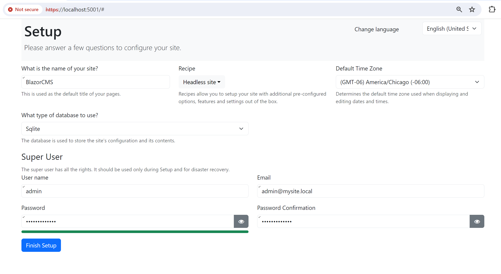

- Once the setup is complete, log in to the admin and create a new content type as following. (By navigating to `Content` -> `Content Definition` -> `Content Types`) 
    - Create a 'MarkdownPage' content type.
    - Add Parts 
        - TitlePart
        - AliasPart
        - MarkdownBodyPart.
- Create a new content item and publish it.
- Alternatively, you can import the following recipe to create the content definition and content item that we are using for this guide.
- To import the recipe, log in to administration, and go to `Configuration` > `Import/Export` > `JSON Import`

```json
{
  "name": "",
  "displayName": "",
  "description": "",
  "author": "",
  "website": "",
  "version": "",
  "issetuprecipe": false,
  "categories": [],
  "tags": [],
  "steps": [
    {
      "name": "Content",
      "data": [
        {
          "ContentItemId": "48swn17t4vn6dwvgkzk970q6dp",
          "ContentItemVersionId": "4x0wa7sfp911brv9gmvdmp7rmf",
          "ContentType": "MarkdownPage",
          "DisplayText": "ORCHARD CORE",
          "Latest": true,
          "Published": true,
          "ModifiedUtc": "2024-01-27T20:26:30.0529958Z",
          "PublishedUtc": "2024-01-27T20:26:30.0704945Z",
          "CreatedUtc": "2024-01-27T20:26:08.2132621Z",
          "Owner": "4bs2031dvfyh2zxwvvz109e1nr",
          "Author": "admin",
          "MarkdownPage": {},
          "AliasPart": {
            "Alias": "orchard-core"
          },
          "MarkdownBodyPart": {
            "Markdown": "## Introduction \r\nOpen-source, modular, multi-tenant application framework and CMS for ASP.NET Core\r\n\r\n## Features\r\n- Media Management\r\n- Multi-Lingual\r\n- Modular\r\n- Multi-Tenant\r\n- Security\r\n- Workflows"
          },
          "TitlePart": {
            "Title": "ORCHARD CORE"
          }
        }
      ]
    },
    {
      "name": "ContentDefinition",
      "ContentTypes": [
        {
          "Name": "MarkdownPage",
          "DisplayName": "Markdown Page",
          "Settings": {
            "ContentTypeSettings": {
              "Creatable": true,
              "Listable": true,
              "Draftable": true,
              "Versionable": true,
              "Securable": true
            },
            "FullTextAspectSettings": {},
            "GraphQLContentTypeSettings": {}
          },
          "ContentTypePartDefinitionRecords": [
            {
              "PartName": "MarkdownPage",
              "Name": "MarkdownPage",
              "Settings": {}
            },
            {
              "PartName": "AliasPart",
              "Name": "AliasPart",
              "Settings": {
                "ContentTypePartSettings": {
                  "Position": "1"
                }
              }
            },
            {
              "PartName": "MarkdownBodyPart",
              "Name": "MarkdownBodyPart",
              "Settings": {
                "ContentTypePartSettings": {
                  "Position": "3"
                }
              }
            },
            {
              "PartName": "TitlePart",
              "Name": "TitlePart",
              "Settings": {
                "ContentTypePartSettings": {
                  "Position": "0"
                }
              }
            }
          ]
        }
      ],
      "ContentParts": []
    }
  ]
}
```

- Go to `Content` -> `Content Items` and verify that the content item is available as shown in the image below.
 
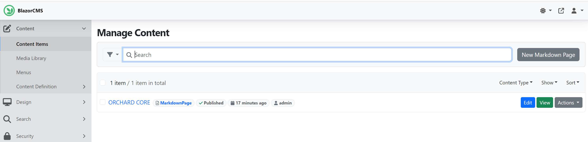

### Create a Blazor App in the Razor Class library.

In this section, we will create a .NET Blazor application, as Razor Class library and then, we will reference it in the Orchard Core application.

> !!! NOTE
> 
> You can add `.razor` files in the main Orchard Core Web application, however adding `.razor` files in Orchard Core modules is not supported. For this reason, and to have maximum reusability of your razor components, always use the razor class library and add it as a reference to your Orchard Core Web project or Orchard Core module.

- Create a Razor class library project `OCBlazorLib.csproj` and add it to the solution `BlazorCms`. 
- Add the project's reference to your web application project.
- You can run the following commands to create a new Razor class library project.

```dotnetcli
dotnet new razorclasslib -f net8.0 -o OCBlazorLib
dotnet sln add ./OCBlazorLib
dotnet add ./BlazorCms/BlazorCms.csproj reference ./OCBlazorLib/OCBlazorLib.csproj
```

Now, your project explorer should look like the image below.

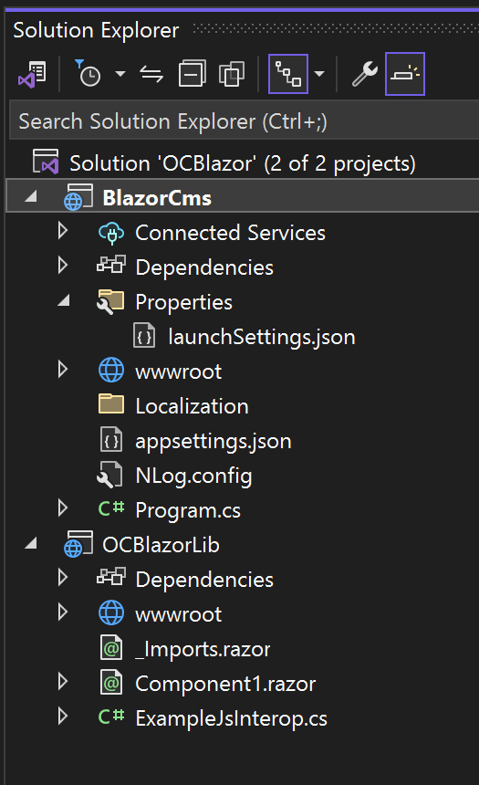

- We are using ASP.NET Core Framework-specific features in our class library so we need to add a reference to `AspNetCore.App`. To achieve this, edit `OCBlazorLib.csproj` and add the following `ItemGroup` section:

```xml
  <ItemGroup>
    <FrameworkReference Include="Microsoft.AspNetCore.App" />
  </ItemGroup>
```

- Next, let's create the basic structure of our Blazor application that includes the main App, Layout, NavMenu, and router components in the project `OCBlazorLib` 
- Add  New Item ->  Razor component -> `App.razor`.
- Add New Item -> Stylesheet -> `App.razor.css`
- Update `App.razor`, `App.razor.css`, and `_Imports.razor` with the following code.

=== "App.razor"

    ```razor
        <!DOCTYPE html>
        <html lang="en">
            
            <head>
                <meta charset="utf-8" />
                <meta name="viewport" content="width=device-width, initial-scale=1.0" />
                <base href="/" />
                <link rel="stylesheet" href="OrchardCore.Resources/Styles/bootstrap.min.css" />
                <link rel="stylesheet" href="_content/OCBlazorLib/OCBlazorLib.bundle.scp.css" />
                <HeadOutlet />
            </head>
            
            <body>
                <Routes />
                <script src="_framework/blazor.web.js"></script>
            </body>
        </html>
    ```

=== "App.razor.css"

    ```css
        html, body {
            font-family: 'Helvetica Neue', Helvetica, Arial, sans-serif;
        }
        
        a, .btn-link {
            color: #006bb7;
        }
        
        .btn-primary {
            color: #fff;
            background-color: #1b6ec2;
            border-color: #1861ac;
        }
        
        .btn:focus, .btn:active:focus, .btn-link.nav-link:focus, .form-control:focus, .form-check-input:focus {
            box-shadow: 0 0 0 0.1rem white, 0 0 0 0.25rem #258cfb;
        }
        
        .content {
            padding-top: 1.1rem;
        }
        
        h1:focus {
            outline: none;
        }
        
        .valid.modified:not([type=checkbox]) {
            outline: 1px solid #26b050;
        }
        
        .invalid {
            outline: 1px solid #e50000;
        }
        
        .validation-message {
            color: #e50000;
        }
        
        .blazor-error-boundary {
            background: url(data:image/svg+xml;base64,PHN2ZyB3aWR0aD0iNTYiIGhlaWdodD0iNDkiIHhtbG5zPSJodHRwOi8vd3d3LnczLm9yZy8yMDAwL3N2ZyIgeG1sbnM6eGxpbms9Imh0dHA6Ly93d3cudzMub3JnLzE5OTkveGxpbmsiIG92ZXJmbG93PSJoaWRkZW4iPjxkZWZzPjxjbGlwUGF0aCBpZD0iY2xpcDAiPjxyZWN0IHg9IjIzNSIgeT0iNTEiIHdpZHRoPSI1NiIgaGVpZ2h0PSI0OSIvPjwvY2xpcFBhdGg+PC9kZWZzPjxnIGNsaXAtcGF0aD0idXJsKCNjbGlwMCkiIHRyYW5zZm9ybT0idHJhbnNsYXRlKC0yMzUgLTUxKSI+PHBhdGggZD0iTTI2My41MDYgNTFDMjY0LjcxNyA1MSAyNjUuODEzIDUxLjQ4MzcgMjY2LjYwNiA1Mi4yNjU4TDI2Ny4wNTIgNTIuNzk4NyAyNjcuNTM5IDUzLjYyODMgMjkwLjE4NSA5Mi4xODMxIDI5MC41NDUgOTIuNzk1IDI5MC42NTYgOTIuOTk2QzI5MC44NzcgOTMuNTEzIDI5MSA5NC4wODE1IDI5MSA5NC42NzgyIDI5MSA5Ny4wNjUxIDI4OS4wMzggOTkgMjg2LjYxNyA5OUwyNDAuMzgzIDk5QzIzNy45NjMgOTkgMjM2IDk3LjA2NTEgMjM2IDk0LjY3ODIgMjM2IDk0LjM3OTkgMjM2LjAzMSA5NC4wODg2IDIzNi4wODkgOTMuODA3MkwyMzYuMzM4IDkzLjAxNjIgMjM2Ljg1OCA5Mi4xMzE0IDI1OS40NzMgNTMuNjI5NCAyNTkuOTYxIDUyLjc5ODUgMjYwLjQwNyA1Mi4yNjU4QzI2MS4yIDUxLjQ4MzcgMjYyLjI5NiA1MSAyNjMuNTA2IDUxWk0yNjMuNTg2IDY2LjAxODNDMjYwLjczNyA2Ni4wMTgzIDI1OS4zMTMgNjcuMTI0NSAyNTkuMzEzIDY5LjMzNyAyNTkuMzEzIDY5LjYxMDIgMjU5LjMzMiA2OS44NjA4IDI1OS4zNzEgNzAuMDg4N0wyNjEuNzk1IDg0LjAxNjEgMjY1LjM4IDg0LjAxNjEgMjY3LjgyMSA2OS43NDc1QzI2Ny44NiA2OS43MzA5IDI2Ny44NzkgNjkuNTg3NyAyNjcuODc5IDY5LjMxNzkgMjY3Ljg3OSA2Ny4xMTgyIDI2Ni40NDggNjYuMDE4MyAyNjMuNTg2IDY2LjAxODNaTTI2My41NzYgODYuMDU0N0MyNjEuMDQ5IDg2LjA1NDcgMjU5Ljc4NiA4Ny4zMDA1IDI1OS43ODYgODkuNzkyMSAyNTkuNzg2IDkyLjI4MzcgMjYxLjA0OSA5My41Mjk1IDI2My41NzYgOTMuNTI5NSAyNjYuMTE2IDkzLjUyOTUgMjY3LjM4NyA5Mi4yODM3IDI2Ny4zODcgODkuNzkyMSAyNjcuMzg3IDg3LjMwMDUgMjY2LjExNiA4Ni4wNTQ3IDI2My41NzYgODYuMDU0N1oiIGZpbGw9IiNGRkU1MDAiIGZpbGwtcnVsZT0iZXZlbm9kZCIvPjwvZz48L3N2Zz4=) no-repeat 1rem/1.8rem, #b32121;
            padding: 1rem 1rem 1rem 3.7rem;
            color: white;
        }
        
        .blazor-error-boundary::after {
            content: "An error has occurred."
        }
    
        .darker-border-checkbox.form-check-input {
            border-color: #929292;
        }
    ```

=== "_Imports.razor"

    ```csharp
        @using System.Net.Http
        @using System.Net.Http.Json
        @using Microsoft.AspNetCore.Components.Forms
        @using Microsoft.AspNetCore.Components.Routing
        @using Microsoft.AspNetCore.Components.Web
        @using static Microsoft.AspNetCore.Components.Web.RenderMode
        @using Microsoft.AspNetCore.Components.Web.Virtualization
        @using Microsoft.JSInterop
        @using OCBlazorLib
    ```
    
- Now create a Layout for our Blazor application in `OCBlazorLib`. Create a folder `Layout` and add new files `MainLayout.razor` and `MainLayout.razor.css` with the following content.

=== "MainLayout.razor"

    ```razor
        @inherits LayoutComponentBase

        <div class="page">
            <div class="sidebar">
                <NavMenu />
            </div>
        
            <main>
                <div class="top-row px-4">
                    <a href="https://docs.orchardcore.net/" target="_blank">Learn Orchard</a>
                </div>
        
                <article class="content px-4">
                    @Body
                </article>
            </main>
        </div>
        
        <div id="blazor-error-ui">
            An unhandled error has occurred.
            <a href="" class="reload">Reload</a>
            <a class="dismiss">🗙</a>
        </div>
    ```

=== "MainLayout.razor.css"

    ```css
        .page {
            position: relative;
            display: flex;
            flex-direction: column;
        }
        
        main {
            flex: 1;
        }
        
        .sidebar {
            background-image: linear-gradient(180deg, rgb(5, 39, 103) 0%, #3a0647 70%);
        }
        
        .top-row {
            background-color: #f7f7f7;
            border-bottom: 1px solid #d6d5d5;
            justify-content: flex-end;
            height: 3.5rem;
            display: flex;
            align-items: center;
        }
        
        .top-row ::deep a, .top-row ::deep .btn-link {
            white-space: nowrap;
            margin-left: 1.5rem;
            text-decoration: none;
        }
    
        .top-row ::deep a:hover, .top-row ::deep .btn-link:hover {
            text-decoration: underline;
        }
    
        .top-row ::deep a:first-child {
            overflow: hidden;
            text-overflow: ellipsis;
        }
        
        @media (max-width: 640.98px) {
            .top-row {
                justify-content: space-between;
            }
        
            .top-row ::deep a, .top-row ::deep .btn-link {
                margin-left: 0;
            }
        }
        
        @media (min-width: 641px) {
            .page {
                flex-direction: row;
            }
        
            .sidebar {
                width: 250px;
                height: 100vh;
                position: sticky;
                top: 0;
            }
        
            .top-row {
                position: sticky;
                top: 0;
                z-index: 1;
            }
        
            .top-row.auth ::deep a:first-child {
                flex: 1;
                text-align: right;
                width: 0;
            }
        
            .top-row, article {
                padding-left: 2rem !important;
                padding-right: 1.5rem !important;
            }
        }
        
        #blazor-error-ui {
            background: lightyellow;
            bottom: 0;
            box-shadow: 0 -1px 2px rgba(0, 0, 0, 0.2);
            display: none;
            left: 0;
            padding: 0.6rem 1.25rem 0.7rem 1.25rem;
            position: fixed;
            width: 100%;
            z-index: 1000;
        }
        
        #blazor-error-ui .dismiss {
            cursor: pointer;
            position: absolute;
            right: 0.75rem;
            top: 0.5rem;
        }
    ```

- Let's create the navigation component. Add new files `NavMenu.razor` and `NavMenu.razor.css` in the `Layout` folder and add the following code.

=== "NavMenu.razor"

    ```razor
        <div class="top-row ps-3 navbar navbar-dark">
            <div class="container-fluid">
                <a class="navbar-brand" href="">BlazorCMS</a>
            </div>
        </div>
        
        <input type="checkbox" title="Navigation menu" class="navbar-toggler" />
        
        <div class="nav-scrollable" onclick="document.querySelector('.navbar-toggler').click()">
            <nav class="flex-column">
                <div class="nav-item px-3">
                    <NavLink class="nav-link" href="" Match="NavLinkMatch.All">
                        <span class="bi bi-house-door-fill-nav-menu" aria-hidden="true"></span> Home
                    </NavLink>
                </div>
                @*More Nav links here *@
            </nav>
        </div>
    ```

=== "NavMenu.razor.css"

    ```css
        .navbar-toggler {
            appearance: none;
            cursor: pointer;
            width: 3.5rem;
            height: 2.5rem;
            color: white;
            position: absolute;
            top: 0.5rem;
            right: 1rem;
            border: 1px solid rgba(255, 255, 255, 0.1);
            background: url("data:image/svg+xml,%3csvg xmlns='http://www.w3.org/2000/svg' viewBox='0 0 30 30'%3e%3cpath stroke='rgba%28255, 255, 255, 0.55%29' stroke-linecap='round' stroke-miterlimit='10' stroke-width='2' d='M4 7h22M4 15h22M4 23h22'/%3e%3c/svg%3e") no-repeat center/1.75rem rgba(255, 255, 255, 0.1);
        }
        
        .navbar-toggler:checked {
            background-color: rgba(255, 255, 255, 0.5);
        }
        
        .top-row {
            height: 3.5rem;
            background-color: rgba(0,0,0,0.4);
        }
        
        .navbar-brand {
            font-size: 1.1rem;
        }
        
        .bi {
            display: inline-block;
            position: relative;
            width: 1.25rem;
            height: 1.25rem;
            margin-right: 0.75rem;
            top: -1px;
            background-size: cover;
        }
        
        .bi-house-door-fill-nav-menu {
            background-image: url("data:image/svg+xml,%3Csvg xmlns='http://www.w3.org/2000/svg' width='16' height='16' fill='white' class='bi bi-house-door-fill' viewBox='0 0 16 16'%3E%3Cpath d='M6.5 14.5v-3.505c0-.245.25-.495.5-.495h2c.25 0 .5.25.5.5v3.5a.5.5 0 0 0 .5.5h4a.5.5 0 0 0 .5-.5v-7a.5.5 0 0 0-.146-.354L13 5.793V2.5a.5.5 0 0 0-.5-.5h-1a.5.5 0 0 0-.5.5v1.293L8.354 1.146a.5.5 0 0 0-.708 0l-6 6A.5.5 0 0 0 1.5 7.5v7a.5.5 0 0 0 .5.5h4a.5.5 0 0 0 .5-.5Z'/%3E%3C/svg%3E");
        }
        
        .bi-plus-square-fill-nav-menu {
            background-image: url("data:image/svg+xml,%3Csvg xmlns='http://www.w3.org/2000/svg' width='16' height='16' fill='white' class='bi bi-plus-square-fill' viewBox='0 0 16 16'%3E%3Cpath d='M2 0a2 2 0 0 0-2 2v12a2 2 0 0 0 2 2h12a2 2 0 0 0 2-2V2a2 2 0 0 0-2-2H2zm6.5 4.5v3h3a.5.5 0 0 1 0 1h-3v3a.5.5 0 0 1-1 0v-3h-3a.5.5 0 0 1 0-1h3v-3a.5.5 0 0 1 1 0z'/%3E%3C/svg%3E");
        }
        
        .bi-list-nested-nav-menu {
            background-image: url("data:image/svg+xml,%3Csvg xmlns='http://www.w3.org/2000/svg' width='16' height='16' fill='white' class='bi bi-list-nested' viewBox='0 0 16 16'%3E%3Cpath fill-rule='evenodd' d='M4.5 11.5A.5.5 0 0 1 5 11h10a.5.5 0 0 1 0 1H5a.5.5 0 0 1-.5-.5zm-2-4A.5.5 0 0 1 3 7h10a.5.5 0 0 1 0 1H3a.5.5 0 0 1-.5-.5zm-2-4A.5.5 0 0 1 1 3h10a.5.5 0 0 1 0 1H1a.5.5 0 0 1-.5-.5z'/%3E%3C/svg%3E");
        }
        
        .nav-item {
            font-size: 0.9rem;
            padding-bottom: 0.5rem;
        }
        
            .nav-item:first-of-type {
                padding-top: 1rem;
            }
        
            .nav-item:last-of-type {
                padding-bottom: 1rem;
            }
        
            .nav-item ::deep .nav-link {
                color: #d7d7d7;
                background: none;
                border: none;
                border-radius: 4px;
                height: 3rem;
                display: flex;
                align-items: center;
                line-height: 3rem;
                width: 100%;
            }
        
        .nav-item ::deep a.active {
            background-color: rgba(255,255,255,0.37);
            color: white;
        }
        
        .nav-item ::deep .nav-link:hover {
            background-color: rgba(255,255,255,0.1);
            color: white;
        }
        
        .nav-scrollable {
            display: none;
        }
        
        .navbar-toggler:checked ~ .nav-scrollable {
            display: block;
        }
        
        @media (min-width: 641px) {
            .navbar-toggler {
                display: none;
            }
        
            .nav-scrollable {
                /* Never collapse the sidebar for wide screens */
                display: block;
        
                /* Allow sidebar to scroll for tall menus */
                height: calc(100vh - 3.5rem);
                overflow-y: auto;
            }
        }
        
    ```

- Now, let's create a router. Select `OCBlazorLib` project, add a new Item -> Razor component -> `Routes.razor` at same level as `App.razor` and add following code.

```razor
    <Router AppAssembly="typeof(App).Assembly">
     <Found Context="routeData">
      <RouteView RouteData="routeData" DefaultLayout="typeof(Layout.MainLayout)" />
      <FocusOnNavigate RouteData="routeData" Selector="h1" />
     </Found>
    </Router>
```

Our blazor application's basic structure is finished. Now we are ready to create the page that will get the Orchard Core CMS content item and will render in Blazor app. 

- Let's create new folder `Pages` and add a home page. To add home page, Add New Item -> Razor Component -> `Home.razor`
- Also create Content Page `Content.razor`. Replace the page content with following code:

=== "Home.razor"

    ```razor
        @page "/"

        <PageTitle>Home</PageTitle>
        
        <h1>Hello, Orchard!</h1>
        
        Welcome to your new Blazor CMS app.
    ```
    
=== "Content.razor"

    ```razor
        @page "/content"
        <h3>Content</h3>
        
        @code
        {
         protected override async Task OnInitializedAsync()
         {
        
         }
        
         protected override async Task OnParametersSetAsync()
         {
        
         }
        }        
    ```

- Next, let's add a link to our `/content` page in `NavMenu.razor`. Use the following code to add a new NavLink in `NavMenu.razor` to our content page below `Home` link.

```razor
     <div class="nav-item px-3">
        <NavLink class="nav-link" href="content">
            <span class="bi bi-list-nested-nav-menu" aria-hidden="true"></span> Orchard Core
        </NavLink>
    </div>
```

- Our Blazor application razor class library is now complete.
 
### Serving Blazor App from Orchard Core CMS.

The Blazor application razor class library is not ready to be served by the ASP.NET pipeline yet. To achieve this, in the `BlazorCms` project, open `Program.cs` and replace all comments for `\\Orchard Specific Pipeline` with the following code.

```cs
builder.Services
    .AddOrchardCms()
    // Orchard Specific Pipeline
    .ConfigureServices( services => {
        services.AddRazorComponents()
       .AddInteractiveServerComponents()
       ;

 })
    .Configure( (app, routes, services) => {
         app.UseStaticFiles();
         app.UseAntiforgery();
         routes.MapRazorComponents<App>()
             .AddInteractiveServerRenderMode()
        ;
     })
```

Now, it's time to run our application. Once the application is running, notice that the Blazor application is now served from `/` as the Home page and you can access admin from `/admin` as shown below.

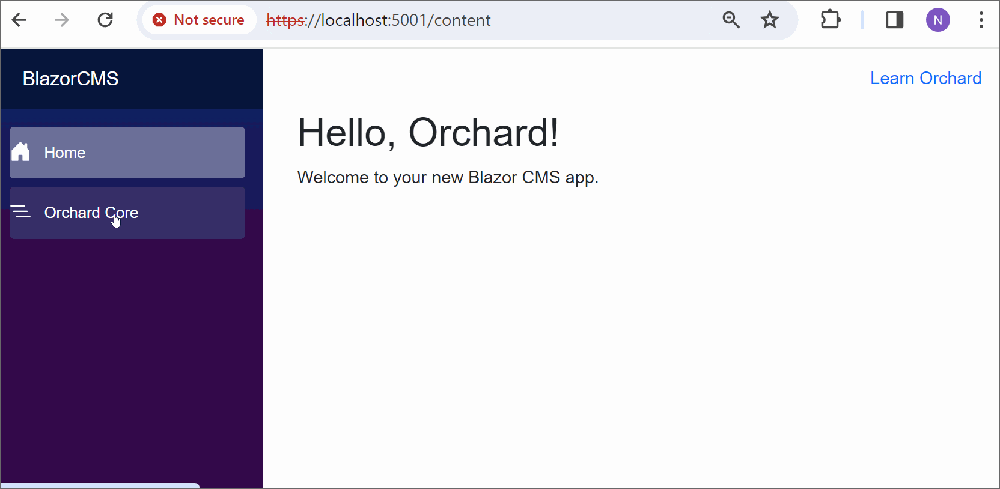

### Add Orchard Core CMS content to the Blazor Page

In our `OCBlazorLib` blazor Library project, Let's enrich our `/content` page to serve content from Orchard Core CMS. To achieve this, follow these steps:

- In `OCBlazorLib.csproj` Add a NuGet package reference to `OrchardCore.ContentManagement`

```dotnetcli
dotnet add ./OCBlazorLib/OCBlazorLib.csproj package OrchardCore.ContentManagement --version 2.1.2
```

- Add the following `using` statements in `_Imports.razor`

```csharp
@using OrchardCore;
@using OrchardCore.ContentManagement;
@using OrchardCore.Settings;
```

- From the `Pages` folder, open `Content.razor` and edit the `@page` route and add an alias to the route, and add the following `@using` and `@inject`. Here we are injecting `IContentHandleManager` and `IContentManager`.  `IContentHandleManager` helps to retrieve the content item ID from the alias and `IContentManager` helps retrieve the content item using the content item ID.

```csharp
@page "/content/{alias}"
@using OrchardCore.ContentManagement.Models
@inject IContentHandleManager handleManager
@inject IContentManager contentManager
@inject ISiteService SiteService
```

- Within the `@code` section, add a property to access the alias defined in the route parameter.

```csharp
[ParameterAttribute]
public string Alias { get; set; }
```

- Also define the following three properties in the `@code` section.

```csharp
 protected ContentItem ContentItem { get; set; }
 protected string Markup { get; set; }
 protected ISite Site { get; set; }
```

- Update `OnParametersSetAsync` with the following code, to retrieve the content item using an alias.

```csharp
protected override async Task OnParametersSetAsync()
{
    string id = await handleManager.GetContentItemIdAsync($"alias:{Alias}");
    ContentItem = await contentManager.GetAsync(id, VersionOptions.Published);
    var bodyAspect = await contentManager.PopulateAspectAsync<BodyAspect>(ContentItem);
    Markup = bodyAspect.Body.ToString();
}
```

- Let's get `SiteName` from Site settings on `OnInitializedAsync` with the following code.

```csharp
protected override async Task OnInitializedAsync()
{
    Site = await SiteService.GetSiteSettingsAsync();
    await Task.Delay(500);
}
```

Notice that we are adding `Task.Delay(500);` to mimic a long-running task.

- In razor markup replace `<h3>Content</h3>` with the following code to render the `Markup` property.

```csharp
@if (ContentItem == null)
{
    <p><em>Loading...</em></p>
}
else
{
    <PageTitle>@ContentItem.DisplayText - @Site.SiteName</PageTitle>

    <h1>@ContentItem.DisplayText</h1>
    @((MarkupString) Markup)

}
```

- Finally, update `NavLink` in `NavMenu.razor` to add an alias for our content item. In our example, we are using a sample content item created earlier with the alias `orchard-core`. Update the `href` value for `Orchard Core` NavLink to `content/orchard-core`.

```razor
<div class="nav-item px-3">
    <NavLink class="nav-link" href="content/orchard-core">
        <span class="bi bi-list-nested-nav-menu" aria-hidden="true"></span> Orchard Core
    </NavLink>
</div>
```

Run the application. Click on the `Orchard Core` link on the Left Nav will load the Markdown of content item renders as per the image below.

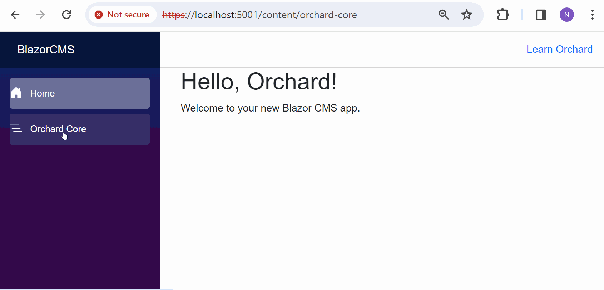

- Now lets add `@attribute [StreamRendering]` on `Content.razor` to add stream rendering. Run the application and see stream rendering in action as per the below image.

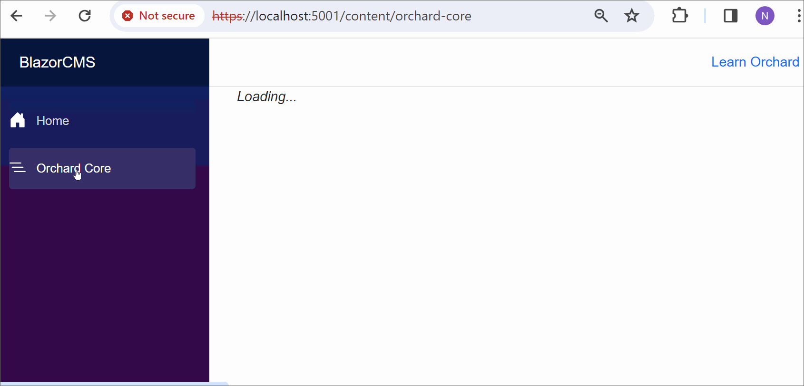

# Add multitenancy to the Blazor App
One of the key features of Orchard Core is its multi-tenancy support. In this section, we will add multi-tenancy support to our Blazor application.

!!! note
    Orchard Core listens for requests, also on '/' (e.g. when a site needs to be configured). So having our Blazor app listening to '/' as well can pose a problem.
    A solution is to replace `@page "/"` with `@page "/home"` in our `home.razor` file (and update our `navmenu.razor`), so Blazor (the app) will listen to `/home` while Orchard Core is not hindered by that.

=== "Home.razor"

    ```razor
         @page "/home"
         
         <PageTitle>Home</PageTitle>
         
         <h1>Hello, Orchard!</h1>
         
         Welcome to your new Blazor CMS app.
    ```
    
=== "NavMenu.razor"

    ```razor
        <div class="top-row ps-3 navbar navbar-dark">
            <div class="container-fluid">
                <a class="navbar-brand" href="">BlazorCMS</a>
            </div>
        </div>
        
        <input type="checkbox" title="Navigation menu" class="navbar-toggler" />
        
        <div class="nav-scrollable" onclick="document.querySelector('.navbar-toggler').click()">
            <nav class="flex-column">
                <div class="nav-item px-3">
                    <NavLink class="nav-link" href="home" Match="NavLinkMatch.All">
                        <span class="bi bi-house-door-fill-nav-menu" aria-hidden="true"></span> Home
                    </NavLink>
                </div>
                <div class="nav-item px-3">
                    <NavLink class="nav-link" href="content">
                        <span class="bi bi-list-nested-nav-menu" aria-hidden="true"></span> Orchard Core
                    </NavLink>
                </div>
                @*More Nav links here *@
            </nav>
        </div>
    ```
    
## Enable the tenant feature.

In orchard core admin, go to `Configuration` -> `Features` and enable the `Tenants` feature.

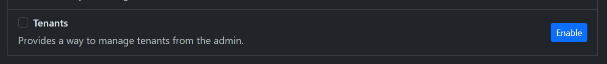

## Add the first tenant

Navigate to `Multi tenancy` -> `Tenants` and add a new tenant with the following settings.

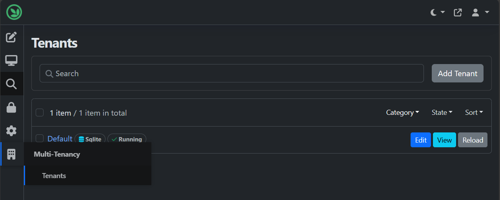

- Tenant name: FirstTenant
- Url Prefix: tenant01
- Recipe: Headless site

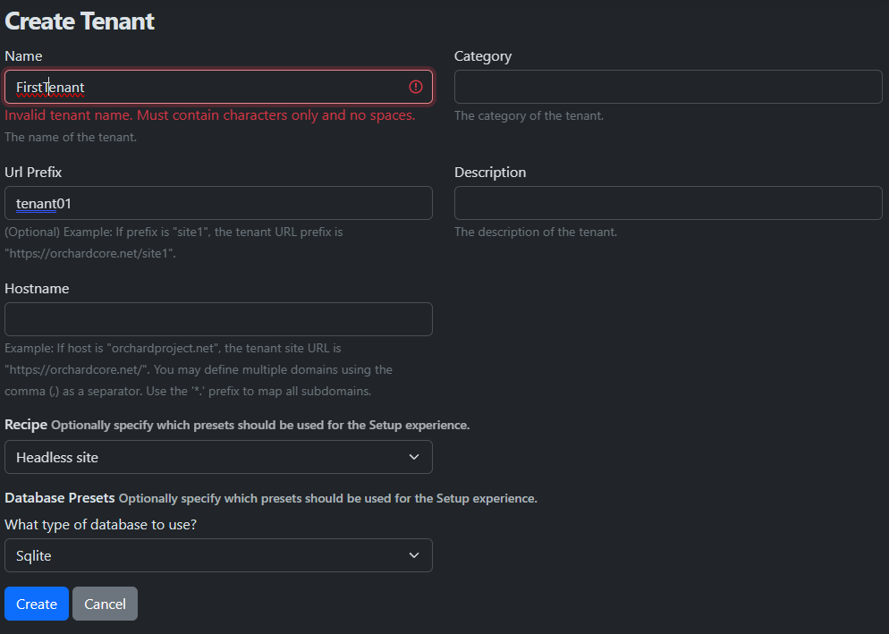

Now setup the first tenant, by clicking on the `Setup` button.

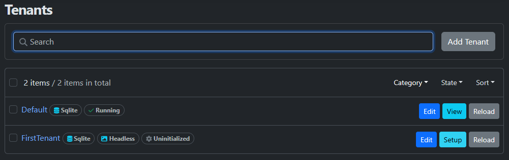

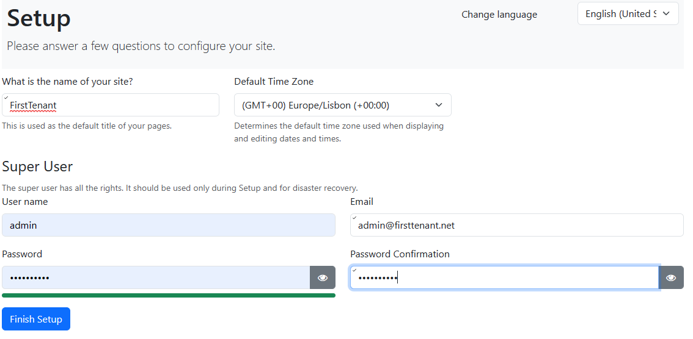

After setup is finished, you can access the first tenant by navigating to `https://localhost:5001/tenant01`. Since Orchard listens to ```/``` (and on ```/tenant01/```), it presents the login screen. You can log in with the user you just created in the setup procedure.

# The base url
In App.razor in the razor class library that contains our Blazor App, we need to add the base url to the base tag. This is necessary because the Blazor App is served from a subpath of the Orchard Core application.

```razor
<base href="/" />
```

This is the default and works great if we only use one tenant, the default.

But each tenant lives on a different subpath, so we need to adjust the base tag to reflect that.

The most obvious way to do this is to use the `NavigationManager` to get the base path of the current tenant and set the base tag accordingly.

So, let's modify our App.razor to use the base path of the current tenant.

```razor
@inject NavigationManager NavManager

<!DOCTYPE html>
<html lang="en">

<head>
 <meta charset="utf-8" />
 <meta name="viewport" content="width=device-width, initial-scale=1.0" />
 <base href=@_baseUrl />
 <link rel="stylesheet" href="OrchardCore.Resources/Styles/bootstrap.min.css" />
 <link rel="stylesheet" href="_content/OCBlazorLib/OCBlazorLib.bundle.scp.css" />
 <HeadOutlet />
</head>

<body>
 <Routes />
 <script src="_framework/blazor.web.js"></script>
</body>
</html>

@code
{
 protected string _baseUrl = "/";

 protected override void OnParametersSet()
 {
  base.OnParametersSet();
  _baseUrl = NavManager.BaseUri;
 }
}
```

The `NavigationManager` is injected into the App component and the base path is set in the `OnParametersSet` method.

> NOTE:
> 
> There are other ways of retrieving, or composing the base path, but this is the simplest and most straightforward way. Other ways include:
>  
> - Using the HttpContext (Request.BasePath)
> - Using the ShellScope (Context.Settings.RequestUrlPrefix)
> - Using the settings of ISiteService (Site.BaseUrl). This can be set in the admin UI.

The example contains a page with the url ```baseurl``` that demonstrates the various methods. 

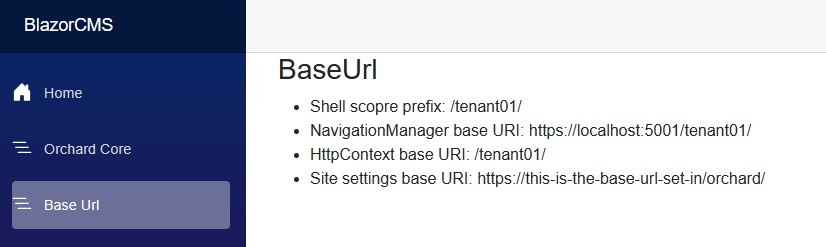

> NOTE:
>
> The base url can be specified as an absolute path, or as a relative path.
>
> NOTE:
>
> The settings for the base path can be set in orchard. If you don't set them, the value returned is null/empty.
>
> 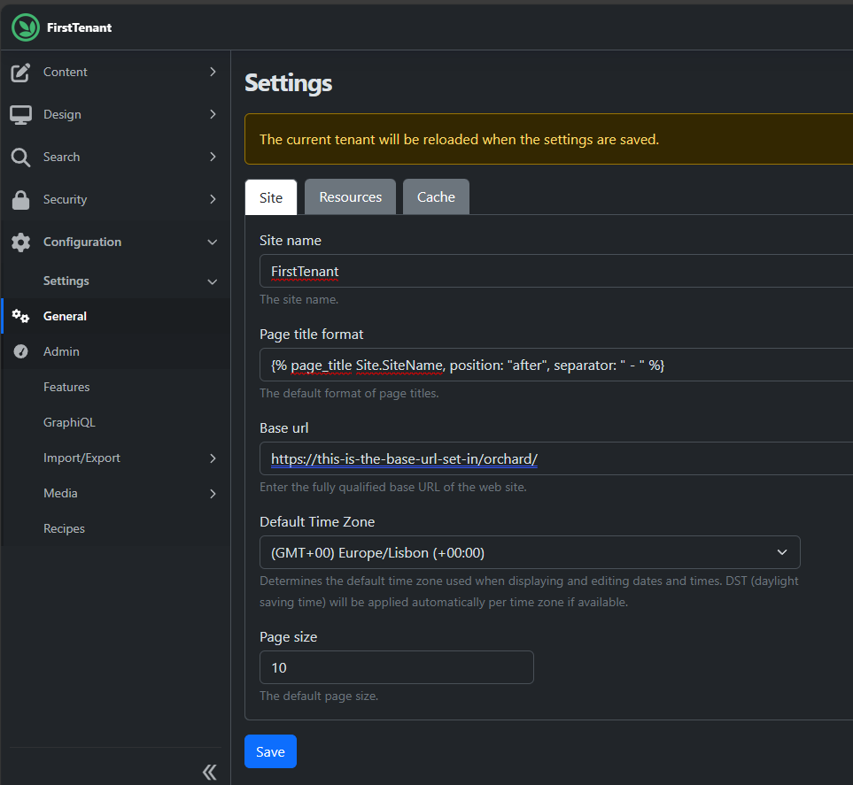

## Test the modifications

Now make sure the tenant 01 also imports the content type and content item, so we can verify multi-tenancy in the Blazor App.

Import the following:

Log in to administration, and go to `Configuration` > `Import/Export` > `JSON Import`

```json
{
  "name": "",
  "displayName": "",
  "description": "",
  "author": "",
  "website": "",
  "version": "",
  "issetuprecipe": false,
  "categories": [],
  "tags": [],
  "steps": [
    {
      "name": "Content",
      "data": [
        {
          "ContentItemId": "48swn17t4vn6dwvgkzk970q6dp",
          "ContentItemVersionId": "4x0wa7sfp911brv9gmvdmp7rmf",
          "ContentType": "MarkdownPage",
          "DisplayText": "ORCHARD CORE FOR TENANT 01",
          "Latest": true,
          "Published": true,
          "ModifiedUtc": "2024-01-27T20:26:30.0529958Z",
          "PublishedUtc": "2024-01-27T20:26:30.0704945Z",
          "CreatedUtc": "2024-01-27T20:26:08.2132621Z",
          "Owner": "4bs2031dvfyh2zxwvvz109e1nr",
          "Author": "admin",
          "MarkdownPage": {},
          "AliasPart": {
            "Alias": "orchard-core"
          },
          "MarkdownBodyPart": {
            "Markdown": "## Introduction \r\nOpen-source, modular, multi-tenant application framework and CMS for ASP.NET Core\r\n\r\n## Features\r\n- Media Management\r\n- Multi-Lingual\r\n- Modular\r\n- Multi-Tenant (as we are seeing)\r\n- Security\r\n- Workflows"
          },
          "TitlePart": {
            "Title": "ORCHARD CORE"
          }
        }
      ]
    },
    {
      "name": "ContentDefinition",
      "ContentTypes": [
        {
          "Name": "MarkdownPage",
          "DisplayName": "Markdown Page",
          "Settings": {
            "ContentTypeSettings": {
              "Creatable": true,
              "Listable": true,
              "Draftable": true,
              "Versionable": true,
              "Securable": true
            },
            "FullTextAspectSettings": {},
            "GraphQLContentTypeSettings": {}
          },
          "ContentTypePartDefinitionRecords": [
            {
              "PartName": "MarkdownPage",
              "Name": "MarkdownPage",
              "Settings": {}
            },
            {
              "PartName": "AliasPart",
              "Name": "AliasPart",
              "Settings": {
                "ContentTypePartSettings": {
                  "Position": "1"
                }
              }
            },
            {
              "PartName": "MarkdownBodyPart",
              "Name": "MarkdownBodyPart",
              "Settings": {
                "ContentTypePartSettings": {
                  "Position": "3"
                }
              }
            },
            {
              "PartName": "TitlePart",
              "Name": "TitlePart",
              "Settings": {
                "ContentTypePartSettings": {
                  "Position": "0"
                }
              }
            }
          ]
        }
      ],
      "ContentParts": []
    }
  ]
}
```


Now, navigate to `https://localhost:5001/tenant01` and click on the `Orchard Core` link in the left navigation. You should see the content item rendered in the Blazor App.

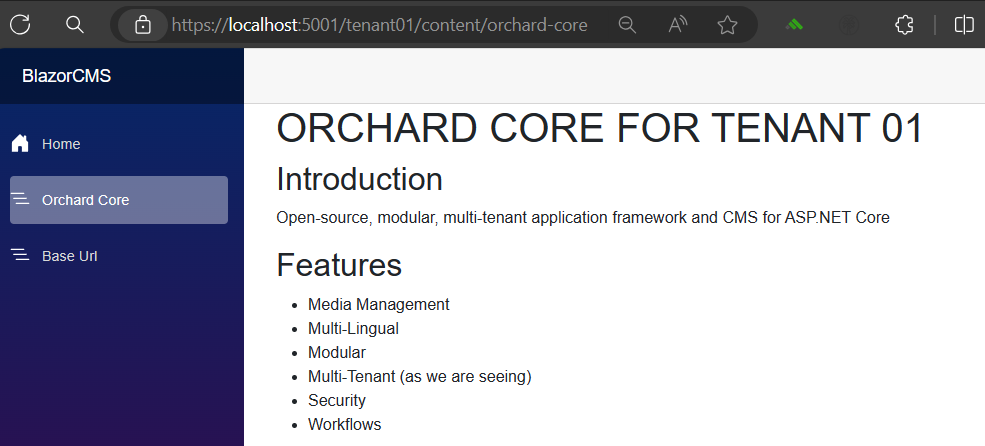

## Blazor SSR works, what about interactivity?

The Blazor App is now served from a tenant-specific subpath, and the content is rendered correctly. But what about interactivity? As you saw we specified to use the `InteractiveServerRenderMode` in the `MapRazorComponents` method. This should mean that when we specify a component to be rendered using the `InteractiveServerRenderMode`, it should be interactive.

Let's add a button to our BaseUrl page that displays the current local time. This will demonstrate that the interactivity works.

Create a Components solution folder in the Blazor App project and create a file called ```InteractiveButton```, with the following content:

```razor
<h3>Interactivity test</h3>

<button class="btn-primary" @onclick="Clicked">Test</button>
<hr />
@_interactiveFeedback

@code {

    protected string? _interactiveFeedback;

    protected void Clicked()
    {
        _interactiveFeedback = $"Clicked! [{DateTime.Now.ToLocalTime()}]";
    }
}
```

On the BaseUrl page, we add:

```razor
<OCBlazorLib.Components.InteractiveButton @rendermode="RenderMode.InteractiveServer" />
```

> Note the ```@rendermode="RenderMode.InteractiveServer"``` attribute. This tells the framework to render this component in interactive mode.

When you navigate to the BaseUrl page, you should see the button. When you click it, the text should change to reflect the time of the click.

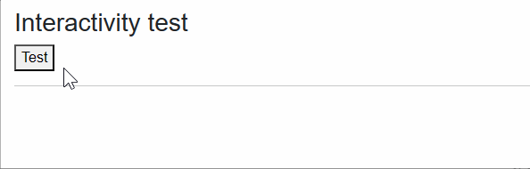

To further verify that there is now an active SignalR connection with the server, you can open the browser's developer tools and look at the network tab. Filter on web socket connections, and refresh the page. You should see a connection to the server. Click it to see the messages being sent when you click the button.

### Conclusion

In this guide, we have seen how to create a Blazor application, in a Razor class library, and serve it from an Orchard Core CMS application. We have seen how to add multi-tenancy support to the Blazor application, and how to make the Blazor application interactive.

The source code for this guide is available at [github.com/OrchardCMS/OrchardCore.Samples](https://github.com/OrchardCMS/OrchardCore.Samples) 
