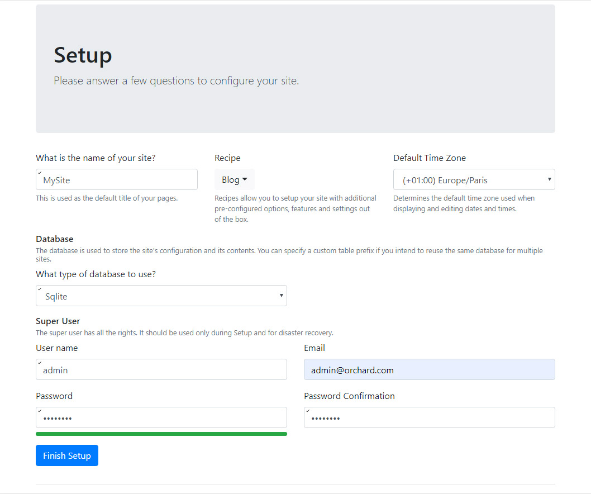

# Creating an Orchard Core CMS website

In this guide you will setup Orchard Core as a Content Management System from a project template.

## What you will need

- The current version of the .NET SDK. You can download it from here <https://dotnet.microsoft.com/download>.
- A text editor and a terminal where you can type dotnet commands.

## Creating the projects

There are different ways to create sites and modules for Orchard Core. You can learn more about them [here](../../getting-started/templates/README.md).  

In this guide we will use our "Code Generation Templates". You can install the latest stable release of the templates using this command:

```dotnet new -i OrchardCore.ProjectTemplates::1.0.0-*```

!!! note
    To use the development branch of the template add `--nuget-source https://nuget.cloudsmith.io/orchardcore/preview/v3/index.json`

Create an empty folder that will contain your site. Open a terminal, navigate to that folder and run the following command:

```dotnet new occms -n MySite```

This creates a new Orchard Core CMS project in a folder named `MySite`.

## Setting up the site

The application has been created by the template, but it has not been setup yet.

Run the application by executing this command:

`dotnet run --project .\MySite\MySite.csproj`

!!! note
    If you are using the development branch of the templates, run `dotnet restore .\MySite\MySite.csproj --source https://nuget.cloudsmith.io/orchardcore/preview/v3/index.json` before running the application

Your application should now be running and listening on the following ports:

```
Now listening on: https://localhost:5001
Now listening on: http://localhost:5000
Application started. Press Ctrl+C to shut down.
```

Open a browser and navigate to <https://localhost:5001> to display the setup screen.

For demonstration purposes, we will create the website using the __Blog__ recipe. The __Blog__ recipe is a [starter recipe](../../getting-started/starter-recipes.md) included with Orchard Core that contains a list of features and steps to configure an Orchard Core website.

Complete the setup form and select the __Blog__ recipe and __SQLite__ for the database.



Submit the form. A few seconds later you should be looking at a Blog Site.


In order to configure it and start writing content you can go to <https://localhost:5001/admin>.

## Summary

You just created an Orchard Core CMS powered blog engine.
