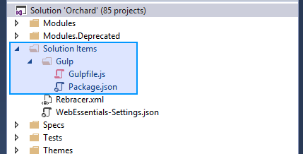
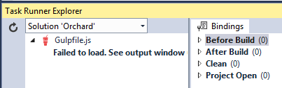
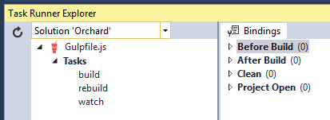

# Gulp Pipeline

Orchard Core includes a processing pipeline for client-side assets (typically scripts and stylesheets) which is used to perform front-end development workflow tasks such as transpilation, minification and bundling of client-side assets in both core projects and extensions (i.e. modules and themes). Many of the built-in modules and themes in Orchard Core use this pipeline to process client-side assets, and you can enable your own extensions to use it as well.

# Overview

The client-side asset pipeline is powered by [Gulp](http://gulpjs.com), a popular open-source task runner based on [Node.js](https://nodejs.org) that can be used to automate a wide variety of tasks in a development workflow. The pipeline defines a set of Gulp *tasks* that can be executed by Gulp using either the command line or using the **Task Runner Explorer** tool window in Visual Studio 2022 or later. For those using Visual Studio Code you can use its terminal.

Physically, the client-side asset pipeline consists of two files in the Orchard Core solution folder:

- `src/package.json` contains information about the Node packages required by the pipeline. This file tells the Node package manager (NPM) which packages it needs to download and install for the pipeline to function.
- `src/gulpfile.js` contains JavaScript code that defines a set of Gulp tasks and their implementation logic.

In Visual Studio you will find these files in **Solution Explorer** in a solution folder named `Solution Items`:



There are several reasons why the pipeline has been implemented at the solution level rather than in each extension that needs to process client-side assets.

* Current and future can share the existing pipeline logic instead of having to reinvent it.
* Only one copy of the necessary Node.js packages needs to be downloaded and stored alongside the codebase.
* Keeping Node package folders (`node_modules`) anywhere inside the `OrchardCore.Cms.Web` project causes their contents to be included when publishing Orchard for deployment which would increase the size of the deployment package by orders of magnitude even though these files are only useful at development time.

The client-side asset pipeline is not configured by default to be invoked automatically when opening or building Orchard Core. To minimize build time and make it as easy as possible to get started with Orchard Core, all built-in modules and themes in Orchard Core are kept in source control with their processed output files included. This means you don't have to activate and run the client-side asset pipeline to build or run Orchard Core out of the box. You only need to run the client-side asset pipeline if you make changes to these assets, or wish to use it to process assets in your own extensions.

# Getting started

## Installing prerequisites

The client-side asset pipeline requires Node.js to be installed. If you are using Visual Studio 2022 or later, Node.js is typically already installed as part of Visual Studio. If you are not using Visual Studio, or if you selected not to include Node.js when installing Visual Studio, you will need to install Node.js manually from https://nodejs.org.

Next you will need to use NPM to install all the packages the client-side asset pipeline needs, including Gulp itself. Using the command line, navigate to the Orchard Core solution folder and execute the command `npm install`, which will install all dependencies referenced in the `package.json` file. In Visual Studio 2022 or later, you can instead simply open the `package.json` file and save it without making any changes - this will trigger an automatic `npm install` behind the scenes.

## Executing tasks

There are three different Gulp tasks that you can invoke to execute the pipeline in different ways.

- **build** performs an incremental build of all asset groups in the solution; asset groups whose outputs are already newer than all their inputs are not processed.
- **rebuild** performs an unconditional full build of all asset groups in the solution, even if their outputs are already newer than their inputs.
- **watch** monitors all asset groups in the solution for changes to their inputs, and rebuilds an asset group if one or more of its inputs are modified.

Note: These tasks also take the asset manifest files themselves into consideration when evaluating changes; a modification to the asset manifest file (`Assets.json`) is treated the same as a modification to one of the input asset files declared in the manifest.

The way you typically execute the Gulp tasks depends on whether you are using Visual Studio or not.

### Using the command line

1. Make sure you have Node.js installed and added to your `PATH` varable.
2. Make sure you have installed all the required Node.js packages using the `npm install` command as described above.
3. Navigate to the Orchard Core solution folder where the file `gulpfile.js` is located.
4. Execute one of the commands `gulp build`, `gulp rebuild` and `gulp watch` to execute the corresponding Gulp task.

### Using Visual Studio

Visual Studio 2022 and later comes with a built-in tool window named **Task Runner Explorer** that can be used to execute NPM tasks as well as tasks from different task runners such as Gulp and Grunt among others.

To open Task Runner Explorer, select **View -> Other Windows -> Task Runner Explorer** from the menu. Alternatively, you can right-click on the file `gulpfile.js` in Solution Explorer and select **Task Runner Explorer** from there.

Initially you may see an error message in Task Runner Explorer:



This can happen if you have not installed the necessary dependency packages (see the section on installing prerequisites above) or if you have recently installed dependency packages and Task Runner Explorer has not yet retried the parsing of the Gulp file after that. Once you have installed all the dependency packages, just click the refresh icon and wait for it to reload:


When Task Runner Explorer has correctly parsed the Gulp file you will see the list of tasks contained inside it:



You can now double-click one of the tasks to execute it.

### Binding tasks to Visual Studio events

Task Runner Explorer also has the ability to "bind" tasks to be executed automatically in response to Visual Studio solution events. Orchard Core is not preconfigured with any such bindings because all assets in the original code base are already processed and their outputs are included in source control, but it can be useful to configure these bindings temporarily while developing your own client-side assets or while working on modifications to the ones in Orchard Core.

The most common scenario is to bind the **build** task to the **After Build** solution event. This way, each time you build Orchard Core (for example, by hitting `F5` or `Ctrl+F5` or selecting **Build -> Build Solution** from the menu) the asset pipeline's **build** task will be executed at the end of the build process. Any asset groups whose input files have changed since the last build will be refreshed.

To configure this binding, follow these steps:

  1. Right click on the `build` task
  2. Select **Bindings**
  3. Select **After Build**

Another common scenario is binding the **watch** task to the **Project Open** solution event, which will start the **watch** task when the solution is loaded and keep it running until you terminate it.

Note: It's important to be aware that task bindings are stored in a specially formatted comment in the beginning of the Gulp file, so when you configure task bindings you are effectively making a change to one of the core files belonging to the Orchard Core code base which may be overwritten if you later choose to update your code base to a newer version of Orchard Core.

# Using the pipeline for your own module or theme

You typically don't have to execute any of the tasks in the client-side asset pipeline unless you are either making changes to Orchard Core itself or creating your own custom extensions and wish to utilize the pipeline to process your own client-side assets. This section explains how to enable the pipeline for your own extension.

## Adding an asset manifest file

The first step is to add an *asset manifest file* to your extension. This asset manifest file is a simple JSON document that declares one or more *asset groups* to be processed by the pipeline. Each asset group specifies a set of *input files* in your extension (such as `.less`, `.scss`, `.css`, `.ts` or `.js` files) along with an *output file* and (optionally) one or more options to influence the processing.

To add an asset manifest, add a new JSON file named `Assets.json` to the root folder of your extension (both the name and location of the file are mandatory. The client-side asset pipeline will detect and parse this file, and add the asset groups declared inside it for processing when of the pipeline tasks are executed.

The basic structure of the asset manifest looks like this:

```js
[
    {
        // First asset group
        "inputs": [
            "some/input/file.less",
            "some/input/file2.less"
        ],
        "output": "some/output/file.css"
        // Options can be added here
    },
    {
        // Repeat for more asset groups
    }
]
```

All input and output paths are relative to the extension root folder. However they do not have to reside within the extension folder; using `../` to resolve paths outside of the extension folder is fully supported. It is a common convention in Orchard Core to use a folder named `Assets` to contain input asset files and to keep those separate from the output asset files, but this is not required.

Using the asset pipeline is completely optional. If you don't add an `Asset.json` manifest file in the root folder of your extension, the client-side asset pipeline will simply ignore your extension.

## Basic example (single input file)

The following example takes the LESS stylesheet `Assets/Styles.less` in your extension and transpiles it into the output file `Styles/Styles.css`:

```js
[
    {
        "inputs": [
            "Assets/Styles.less"
        ],
        "output": "Styles/Styles.css"
    }
]
```

When executing the **build** or **rebuild** task, the asset pipeline will perform the following tasks on `Styles.less`:

- Transpile LESS to plain CSS
- Add/remove vendor prefixes as necessary
- Add source maps (non-minified output only)
- Add a static informational header (non-minified output only)
- Normalize line ending characters
- Minify

After the **build** task has executed your extension's `Styles` folder will contain two files:

* `Styles.css` (non-minified with inline source maps)
* `Styles.min.css` (minified)

Once these output asset files have been generated you can reference them from Razor views just as you normally wolud using the Orchard Core resource manager, either by declaring them in a resource manifest class and requiring them using one of the `Require()` methods or by including them by path using one of the `Include()` methods.

Note: The generated output asset files will not be automatically added to your extension project (`.csproj`) file. If you wish to keep the output asset files in source control, you will need to manually include them in your project using Solution Explorer after they have been generated for the first time. See the section on advanced scenarios below for some pointers on when you may or may not want to do this.

## Multiple input files

You can also specify multiple inputs in the same asset group:

```js
[
    {
        "inputs": [
            "Assets/Grid.less",
            "Assets/Forms.less",
            "Assets/Type.less",
        ],
        "output": "Styles/Styles.css"
    }
]
```

This works exactly like the basic example above with the single input, with the addition that all three inputs will be bundled into the output files `Styles.css` and `Styles.min.css`.

## Globs (wildcards)

The client-side asset pipeline also supports using [glob wildcard patterns](https://www.npmjs.com/package/glob#glob-primer) to include multiple input assets without having to specify each one individually.

The following example processes all files with a `.js` extension in the `Assets` folder and all its subfolders, and bundles them into a single `Scripts/Scripts.js` output file:

```js
[
    {
        "inputs": [
            "Assets/**/*.js" // Include all .js files anywhere in or underneath the Assets folder
        ],
        "output": "Scripts/Scripts.js"
    }
]
```

## Separate output files for each input file

In many cases you will want to process many input files in the exact same way but keep them in separate output files. You could do this by declaring a separate asset group for each pair of input/output files. However this can be extremely tedious and error prone to write, and even more so to maintain over time as you add or remove assets to your extention, especially if you have a large number of asset files.

The pipeline makes this easier by allowing you to use the `@` characted instead of a file name the output file path of your asset group. The `@` character disables the bundling step and basically translates to "the same filename as whatever input asset file is currently being processed". When combined with glob wildcards this can make it a lot easier to manage your assets:

```js
[
    {
        "inputs": [
            "Assets/Moment/Localizations/*.ts"
        ],
        "output": "Scripts/Localizations/@.js"
    }
]
```

In this example, all TypeScript files in the `Assets/Moment/Localizations` are processed and each generated into a separate `.js` file with the same name in the `Scripts/Localizations` folder. For example, assuming the `Assets/Moment/Localizations` folder contains `en-GB.ts`, `fr-FR.ts` and `sv-SE.ts`, then the output `Scripts/Localizations` folder would contain the resulting files `en-GB.js`, `en-GB.min.js`, `fr-FR.js`, `fr-FR.min.js`, `sv-SE.js` and `sv-SE.min.js`. If localization files are added or removed over time, the asset group is implicitly redefined accordingly.

## Multiple asset groups

You can define multiple asset groups in the same asset manifest, as in the following example:

```js
[
    { // First asset group
        "inputs": [
            "Assets/Bootstrap/Bootstrap.less",
            "Assets/Bootstrap/Theme.less"
        ],
        "output": "Styles/Bootstrap.css"
    },
    { // Second asset group
        "inputs": [
            "Assets/Styles.less"
        ],
        "output": "Styles/Styles.css"
    },
    { // Third asset group
        "inputs": [
            "Assets/JavaScript/Lib/**/*.js",
            "Assets/JavaScript/Admin/Admin.js"
        ],
        "output": "Scripts/Lib.js"
    }
]
```

## Adding additional files to be watched

As described above, the **watch** task can be used to continuously monitor input asset files for changes and rebuild affected asset groups automatically for a smooth and efficient local dev/test workflow.

In some cases you may want the **watch** task to monitor additional files besides those specified as input assets. In particular, this is commonly needed when using LESS/SASS imports or the TypeScript `<reference>` or `import` keywords to indirectly include files into the pipeline which were not part of the initial input specification.

Let's say you have a main SCSS stylesheet that looks something like this:

```less
@import "Utils/Mixins.scss";
@import "Utils/Variables.scss";
@import "Utils/Type.scss"
```

In these cases you can use the `watch` property in an asset group to specify an additional set of files to monitor for changes:

```js
[
    {
        "inputs": [
            "Assets/Main.scss" // This one imports additional .scss files
        ],
        "output": "Styles/Styles.css",
        "watch": [
            "Assets/Utils/*.scss" // Also watch these two files for changes
        ]
    }
]
```

Note that glob wildcards are supported.

## Supported asset file formats

The client-side asset pipelines can process either *stylesheet assets* or *script assets*.

An asset group can only be used to process one of these categories, and must have a matching output asset file extension. Asset groups dealing with stylesheet assets must specify a `.css` output file, while asset groups dealing with script assets must specify a `.js` output file. An asset group can contain mixed types of input assets as long as they can be processed into the same output file type (i.e. as long as they all belong to either the stylesheet or the script family).

For example you can specify both `.less` and `.css` input assets in a group targeted for a `.css` output file and you can specify both `.ts` and `.js` input assets in a group targeted for a `.js` output file, but you cannot mix and match; if you try the asset pipeline will throw an error.

### Stylesheet assets

The following file types are supported as stylesheet input assets:

* LESS (`.less`)
* SASS (`.sass`)
* SCSS (`.scss`)
* Plain CSS (`.css`)

The following tasks are performed on stylesheet assets:

* LESS/SASS transpilation
* Vendor prefix normalization
* Inline source map generation (unless disabled)
* File header generation
* Line ending normalization
* Bundling (unless disabled)
* Minification

### Script assets

The following file types are supported as script input assets:

* TypeScript (`*.ts`, `*.jsx`)
* Plain JavaScript (`*.js`)

The following tasks are performed on script assets:

* TypeScript transpilation
* Inline source map generation (unless disabled)
* File header generation
* Line ending normalization
* Bundling (unless disabled)
* Minification

Note: All input script assets are processed through the TypeScript transpiler, also plain JavaScript `.js` files. This means the asset pipeline will throw errors for obvious syntactical errors in plain JavaScript files. This should generally be considered an advantage as JavaScript errors can be caught at build time rather than at runtime.

## Supported options

The following is an exhaustive list of all possible properties that can be specified in an asset group in the asset manifest file.

### `inputs` (required)

An array of input files to include in the asset group. Paths are relative to the asset manifest file. Glob wildcards are supported. Single entries must be wrapped in an array.

### `output` (required)

The output file to be generated by the asset group. The path is relative to the asset manifest file. All inputs will be bundled into the specified output file unless `@` is specified as the base filename, eg `Scripts/@.css`, to skip bundling. A minified version with a `.min` suffix will be automatically generated also.

### `watch`

An array of additional files to be monitored for changes. Paths are relative to the asset manifest file. Glob wildcards are supported. Single entries must be wrapped in an array.

### `generateSourceMaps`

`true` to emit inline source maps into non-minified output files, `false` to disable source maps. Default is `true`.

### `flatten`

By default, when using a glob to specify input assets and using the `@` character in the output file path to bypass bundling, output files are generated in the same relative location as their corresponding input assets relative to the first glob in the input pattern. For example, assuming you have the following input assets:

* `Assets/Pages/PageStyles.less`
* `Assets/Widgets/LoginWidget/Login.less`

Given the following asset group definition:

```js
[
    {
        "inputs": [ "Assets/**/*.less" ],
        "output": "Styles/@.css"
    }
]
```

The default behavior of the asset pipeline would generate the following output files:

* `Styles/Pages/PageStyles.css`
* `Styles/Pages/PageStyles.min.css`
* `Styles/Widgets/LoginWidget/Login.css`
* `Styles/Widgets/LoginWidget/Login.min.css`

This may not always be the desired behavior. The `flatten` property can be set to `true` to have the asset pipeline flatten the output folder structure and disregard the relative locations of the input asset files. In this case, setting `flatten` to `true` would instead produce the following two output files:

* `Styles/PageStyles.css`
* `Styles/PageStyles.min.css`
* `Styles/Login.css`
* `Styles/Login.min.css`

### `separateMinified`

By default, minified output files are generated alongside their non-minified siblings with a `.min` filename extension:

* `Styles/SomeStyles.css`
* `Styles/SomeStyles.min.css`    

In some cases, such as when using a runtime module loader, it can be useful to place minified output files in a subfolder instead of suffixing their filenames. This allows you to simply configure a different base path for the module loader depending on execution mode (i.e. debug vs. release) rather than having to declare every resource differently. Setting the `separateMinified` option property to `true` will result in the following alternative output structure:

* `Styles/SomeStyles.css`
* `Styles/min/SomeStyles.css`

### `typeScriptOptions`

Any options you wish to pass through to the TypeScript transpiler (only applicable for script asset groups). The following default values are specified by the asset pipeline unless overridden in this property:

```js
{
    allowJs: true,
    noImplicitAny: true,
    noEmitOnError: true
}
```

# Advanced scenarios

## Excluding output files from source control

When developing an extension intended for redistribution and used by third parties, it is recommended that generated output files be added to `.csproj` files of the containing extension and included in source control. All the built-in projects in the Orchard Core code base employ this methods. This is so that consumers can use your extension without having to install Node.js and execute the Gulp tasks in the client-side asset pipeline to generate the needed output asset files first.

However, when developing an extension for internal use you may also consider the alternative approach of leaving generated output files out of both `.csproj` files and source control and rely on them being rebuilt by the client-side asset pipeline whenever needed. This is similar to how you often assume that the NuGet package manager will be used to restore NuGet package references before a project is built.

This approach has a couple of advantages:

* Smaller version control footprint
* No risk of inconsistent/stale output assets due to forgetting to rebuild them or commit their changes to version control

When using this approach, the `Styles` and `Scripts` folders in your extension will always remain empty in Solution Explorer although they will contain the output files on disk, and you will typically configure a Gulp task binding to ensure that client-side assets are always built when the solution is built in Visual Studio. If using an automated build system you will also typically add a step to your build script to ensure the **build** or **rebuild** task is executed as part of the build.

## Including custom extension folders

Orchard Core has the ability to load extensions from other folders besides the `OrchardCore.Modules` and `OrchardCore.Themes` folders. If your extension is stored and loaded from such a custom location, the client-side asset pipeline will not automatically detect your asset manifest. This is because, by default, it only looks for `Assets.json` files in folders under these locations:

* `OrchardCore.Modules/`
* `OrchardCore.Themes/`

To add your custom location to be scanned for asset manifests, follow these steps:

1. Open the file `src/gulpfile.js` in Visual Studio or any other text editor.

2. Find the `getAssetGroups()` function.

3. This function declares an `assetManifestPaths` array variable. You can add your own glob here and merge the resulting arrays. For example:

```js
var assetManifestPaths = glob.sync("./src/OrchardCore.{Modules,Themes}/*/Assets.json", {});
var customThemePaths = glob.sync("AnotherLocation/MyCompanyThemes/*/Assets.json"); // Custom location!
assetManifestPaths = assetManifestPaths.concat(customThemePaths);
```
    
4. Save and close the file.
   
The Orchard Core development team is investigating ways to automate this process.

# Evolution of the client-side asset pipeline

For those interested in the history behind the client-side asset pipeline, you can find the initial discussion with reasons for its development and proposed solutions in [issue #5450](https://github.com/OrchardCMS/Orchard/issues/5450).