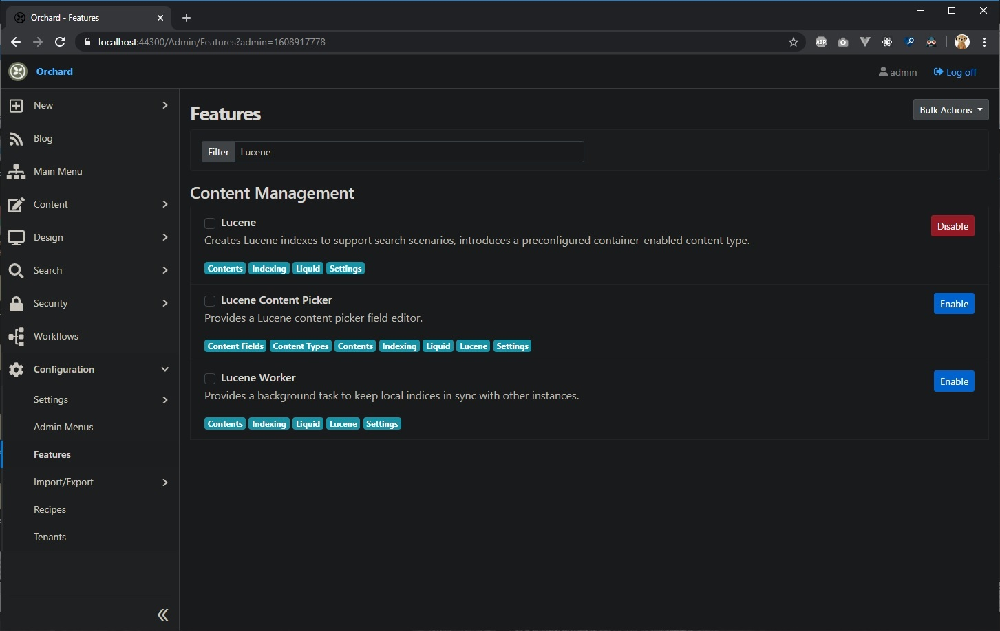
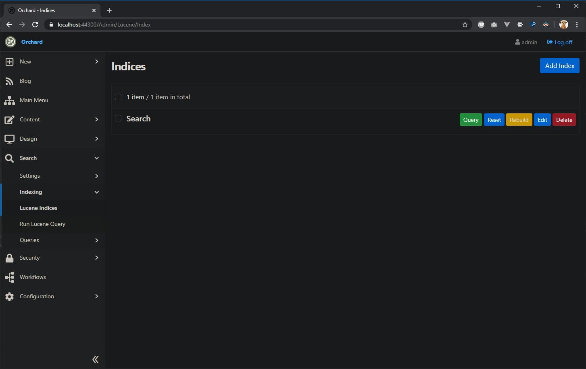
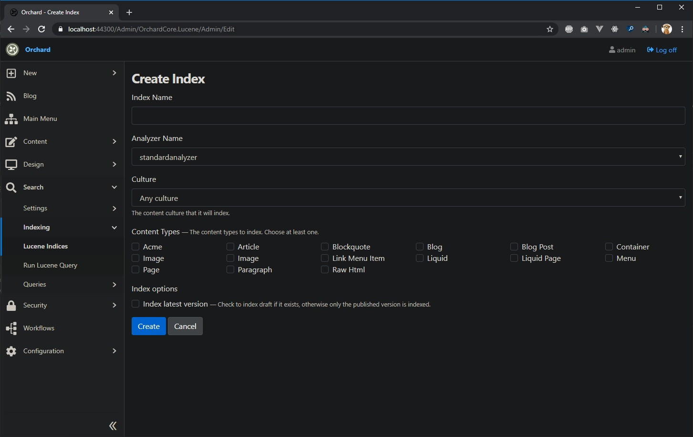
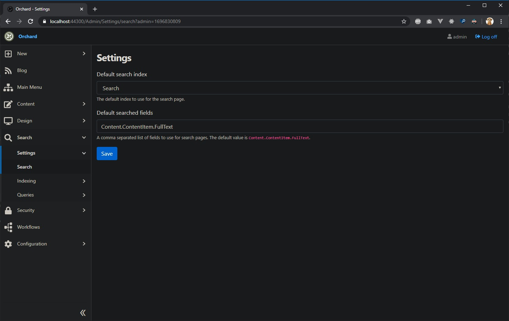
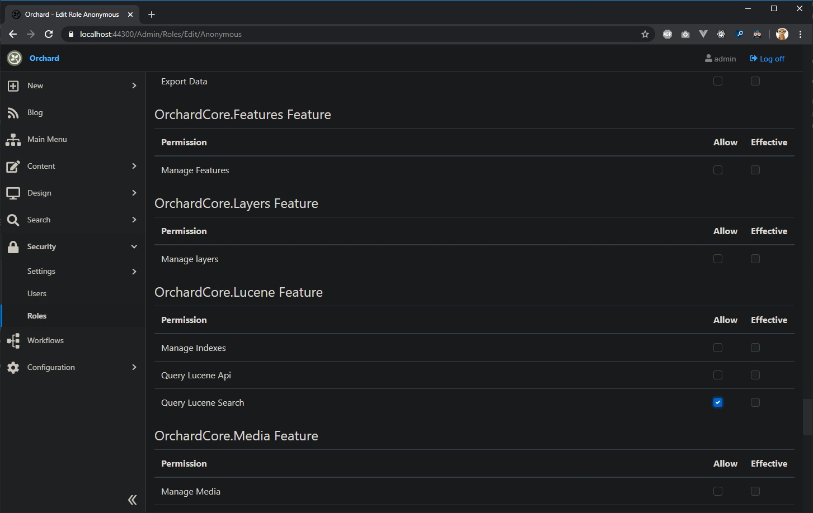
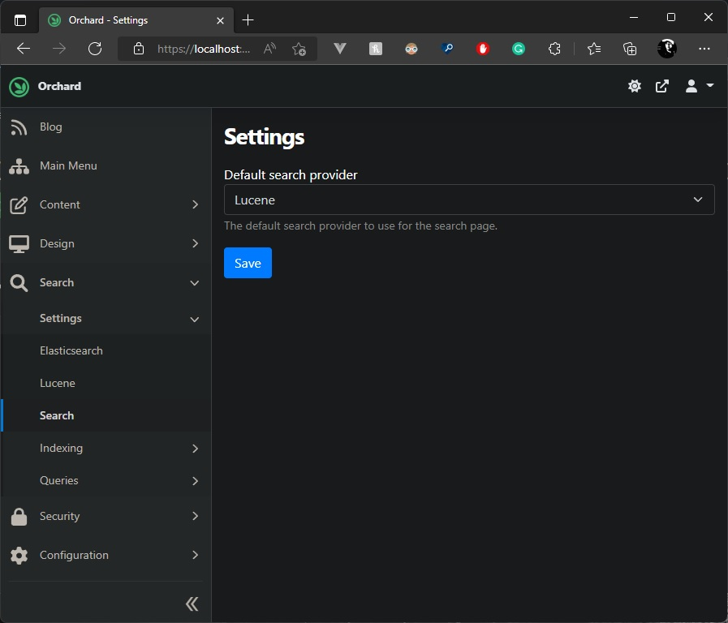
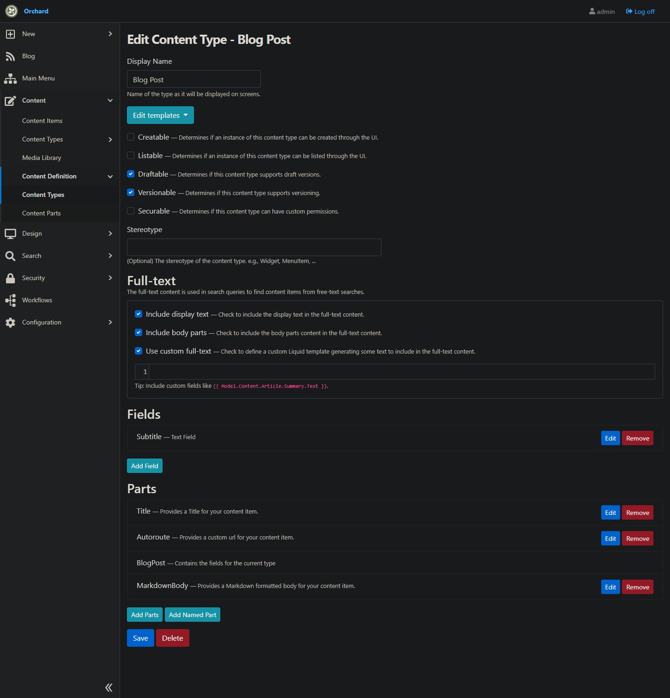

# How to implement a website full-text search

Orchard Core provides a [Lucene](../../reference/modules/Lucene/README.md) and [Elasticsearch](../../reference/modules/Elasticsearch/README.md) module/feature that allows you to do full-text search on your websites. Most of the time, when building a website you will require to search mostly within your pages content. Though, in Orchard Core it is also possible to configure which text/data you want to index in the `Content Type` configuration by using `Liquid`. The steps in this guide have been written for `Lucene` but the same goal is also achievable with `Elasticsearch`.

Before going further, please notice that `TheBlogTheme` includes a recipe which will configure all of this for you without any required knowledge.

Let's see how to make this available for you step by step.

## 1st step : Enable the Lucene or Elasticsearch feature in Orchard Core.



There are 3 different `Lucene` and `Elasticsearch` features in Orchard Core. You will require to enable the `Lucene` feature in order to create `Lucene` indices. You will require to enable the `Elasticsearch` feature in order to create `Elasticsearch` indices.

## 2nd step : Create a `Lucene` or `Elasticsearch` index



Click on "Add Index" button.



Options that are available on a `Lucene` Index:

The *Index Name* is used for identifying your index.  
It will create a folder in `/App_Data/Sites/{YourTenantName}/Lucene/{IndexName}` which will contain all the files created by `Lucene` when indexing. 

The second option is the *Analyzer Name* used for this Index.  
The analyzer is a more complex feature for advanced users. It allows you to fine tune how your text is stemmed when it is indexed. For example, when you are searching for "Car", you might also want to have results when people are typing "car" which is in lower case. In that case the Analyzer could be programmed with a Lower case filter which will index all text in lower case. For more details about analyzers, please refer to Lucene.NET documentation. By default, the *Analyzer Name* in Orchard Core has only the *standardanalyzer* available which is optimized for "English" culture chars. Analyzers are extensible so that you can add your own by using one of the provided analyzers in Lucene.NET or by implementing your own.  

See:

https://github.com/apache/lucenenet/tree/master/src/Lucene.Net.Analysis.Common/Analysis

You can register for example a custom analyzer with the DI using this example from a startup.cs file in your custom module: 

```csharp
using Microsoft.Extensions.DependencyInjection;
using OrchardCore.Search.Lucene.Model;
using OrchardCore.Search.Lucene.Services;
using OrchardCore.Modules;

namespace OrchardCore.Search.Lucene.FrenchAnalyzer
{
    [Feature("OrchardCore.Search.Lucene.FrenchAnalyzer")]
    public class Startup : StartupBase
    {
        public override void ConfigureServices(IServiceCollection services)
        {
            services.Configure<LuceneOptions>(o =>
                o.Analyzers.Add(new LuceneAnalyzer("frenchanalyzer",
                    new MyAnalyzers.FrenchAnalyzer(LuceneSettings.DefaultVersion))));
        }
    }
}
```

The third option is the *Culture*.  
By default, *Any culture* will be selected. Here, the option is made for being able to define that this index should be only indexing content items of a specific culture or any of them.

*Content Types* : You can pick any content types that should be parsed by this index.

*Index latest version* : This option will allow you to index only published items or also index drafts which could be useful if you want to search for content items in a custom frontend dashboard or even in an admin backend custom module.  
By default, if we don't check this option, it will only index published content items.

*Store source data* (Elasticsearch only): This option will by default set to true so that the "_source" data in Elasticsearch be stored. Unchecking this will allow to disable storing any data in the "_source" field by disabling it. [See documentation](https://www.elastic.co/guide/en/elasticsearch/reference/current/mapping-source-field.html#disable-source-field)

## 3rd step : Configure search settings



By enabling the `Lucene` module, we also added a new route mapping to `/search` which will require some settings to work properly. First thing to do after creating a new Lucene index is to go configure the search settings in Orchard Core. Here, we can define which index should be used for the `/search` page on our website and also define which Index fields should be used by this search page. Usually, we are using by default `Content.ContentItem.FullText`.

## 4th step : Set index permissions



By default, each indexes are permission protected so that no one can query them if you don't set which ones should be public. To make the "Search" `Lucene` index available for *Anonymous* users on your website, you will require to go and edit this user role and add the permission to it. Each index will be listed here in that `OrchardCore.Search.Lucene Feature` section.

## 5th step : Set your search provider



Starting from OC 1.5 you can now use the "Search" feature to enable your website frontend search. By enabling this feature it will add a new admin menu option to select which indexing provider you want to use for your frontend search. Orchard Core will allow to use `Lucene` or `Elasticsearch`.

## 6th step : Test search page


Here for this example I used `TheBlogTheme` recipe to automatically configure everything. So the above screenshot is an example of a search page result from that theme.

## 7th step : Fine tune full-text search



Here, we are seeing the `Blog Post` content type definition. We have now a section for every content type to define which part of this content item should be indexed as part of the `FullText`. By default, content items will index the "display text" and "body part" but we also added an option for you to customize the values that you would like to index as part of this `FullText` index field. By clicking on the "Use custom full-text", we allow you to set any Liquid script. As the example states, you could add `{{ Model.Content.BlogPost.Subtitle.Text }}` if you would like to also find this content item by its *Subtitle* field. You can do many things with this Liquid field: Index identifiers, fixed text or numeric values, etc.

We can use the "Use custom full-text" to include the content of widgets or bags inside the full-text search index. For example, for widgets inside a FlowPart we should use this Liquid script:

```html

  {{ contentItem | full_text_aspect }}

```

Or simply use:

```html
{{ Model.Content.FlowPart.Widgets | full_text_aspect }}
```

## Optional : Search templates customization

Also, you can customize these templates for your specific needs in your theme by overriding these files : 

`/Views/Shared/Search.liquid or .cshtml` (general layout)  
`/Views/Search-Form.liquid or .cshtml` (form layout)  
`/Views/Search-Results.liquid or .cshtml` (results layout)   

For example, you could simply customize the search result template to suit your needs by changing "Summary" to "SearchSummary" and create the corresponding shape templates.

SearchResults.liquid: 
```html

    <ul class="list-group">
        
            <li class="list-group-item">
                {{ item | shape_build_display: "SearchSummary" | shape_render }}
            </li>
        
    </ul>

    <p class="alert alert-warning">{{"There are no such results." | t }}</p>

```
