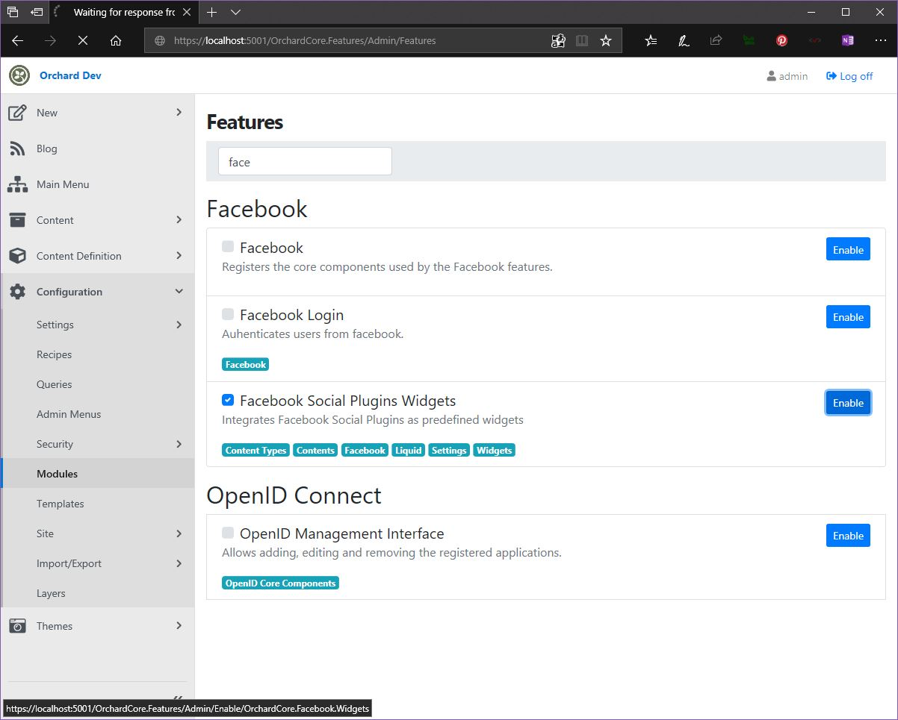
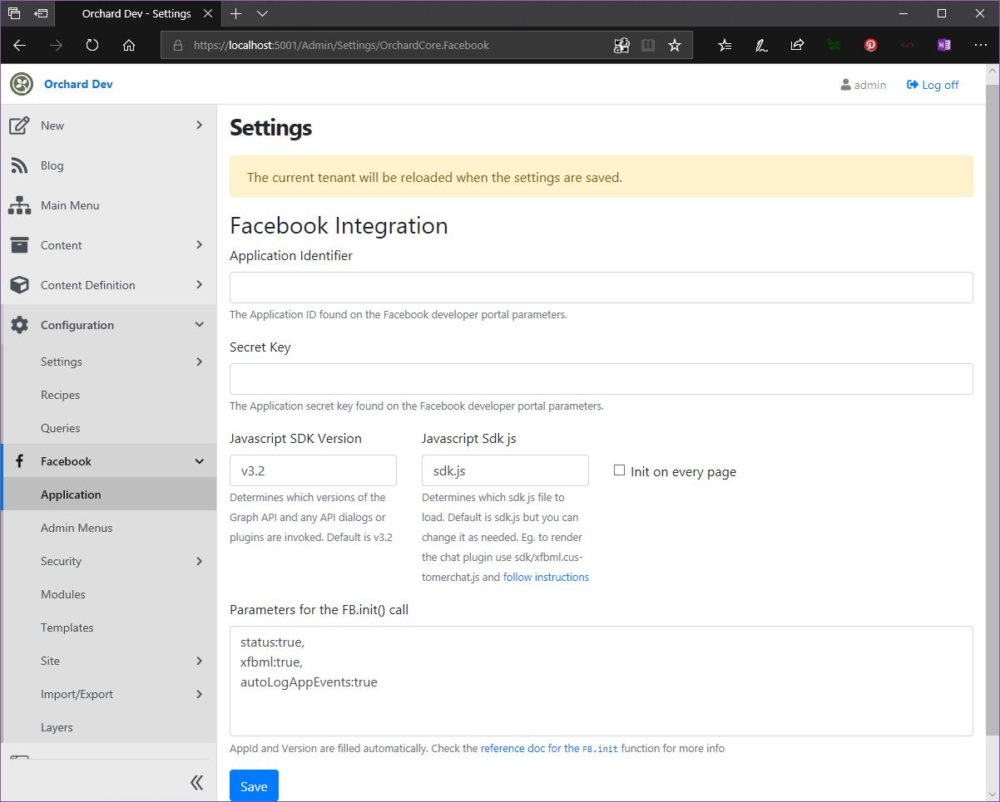
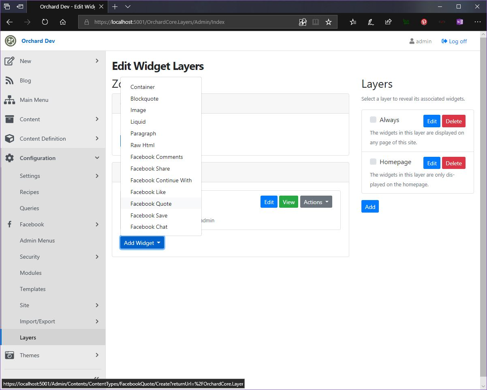
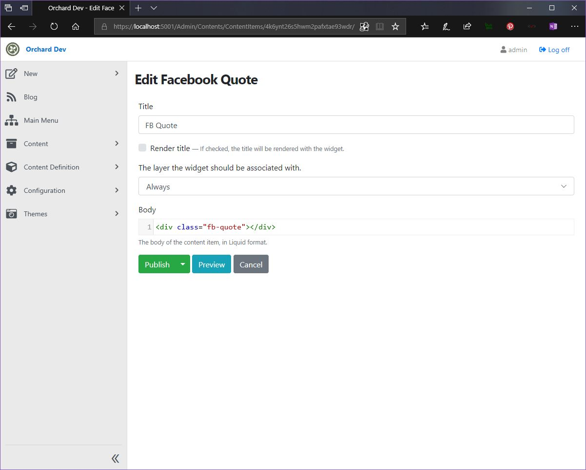

# Integrate Facebook Social Plugins

In order to integrate Social plugins from Facebook, you must enable and configure The `OrchardCore.Facebook.Widgets` module. You can learn more about [here](../../reference/modules/Facebook/README.md)

## What you will build

You will build a Blog and give the ability to your readers to share quotes using the [Quote Plugin](https://developers.facebook.com/docs/plugins/quote).

## What you will need

Follow the guide to [create a new Orchard Core CMS website](../../guides/create-cms-application/README.md)

## Login to admin and enable Facebook Social Plugins Widgets Feature

Navigate to <https://localhost:5001/admin> and enable the Facebook Social Plugins Widgets.

Create a new application at <https://developers.facebook.com/apps/> and copy the appid and app secret to <https://localhost:5001/Admin/Settings/OrchardCore.Facebook>

## Add the Facebook Quote widget to Footer Layer

Navigate to <https://localhost:5001/OrchardCore.Layers/Admin/Index>. At the Footer Zone Press Add Widget and Select `Facebook Quote` from the list.

Give a title and publish the widget.

## Check the result

Navigate to a blog post eg. <https://localhost:5001/blog/post-1> and select the title. Now you can share is as a Quote.

## Summary

You just integrated the "Facebook Quote" Social Plugin to your Blog!
