# Lucene Query Syntax
The search form in Orchard Core uses Lucene's query syntax, which allows you to search for specific terms, perform wildcard searches, approximate searches, proximity searches, range searches, and combine conditions using Boolean operators.

## Boolean Operators
Boolean operators allow you to combine query terms using logical operators. These Boolean operators are compatible.

### AND
The *AND* operator can be used to find terms anywhere in the text.

To search for documents containing both "lorem" and "man", use the following query:

`lorem and man`

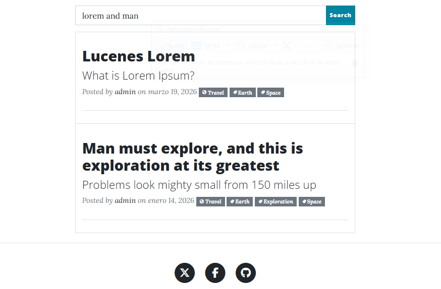

### +
The *+* operator requires that the term following the "+" symbol exists somewhere in a single document's field. To search for documents that must contain "Man" and may contain "explore", use the following query:

`+Man explore`

### NOT
The *NOT* operator is used to exclude documents that contain the term after the word NOT. You can use the symbol ! or the symbol "-" instead of the word NOT.

To find documents that contain "Lucene" but not "Lorem", use the following query:
`Lucene NOT Lorem`   

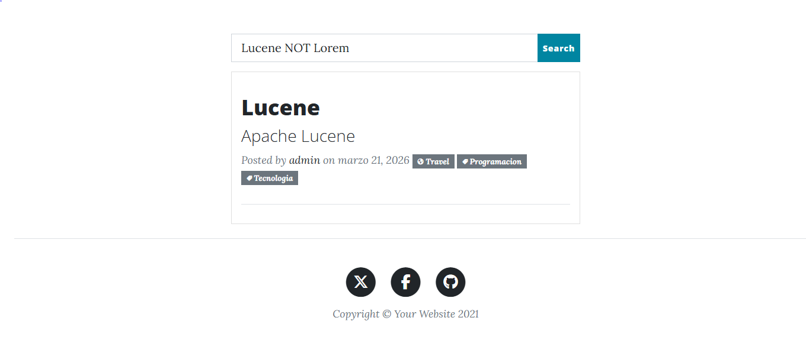

### - 
The *-* or prohibition operator excludes documents containing the term that appears after the hyphen.

To search for documents containing "Lucene" but not "Lorem", use the following query:

`Lucene-Lorem`

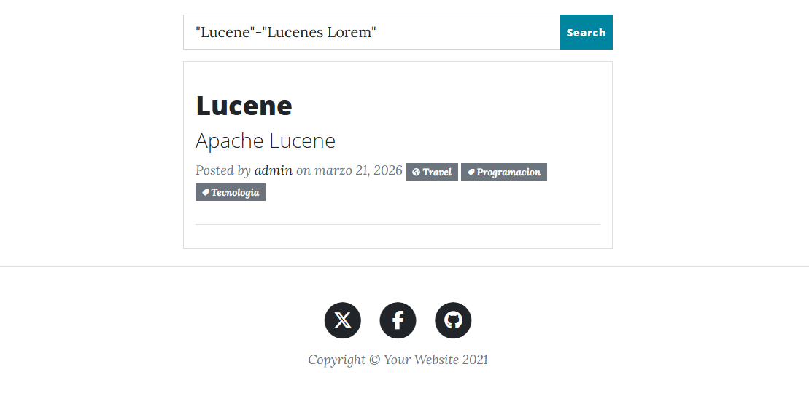

## MATCH ALL
The expression * *:* * is a search query that returns all documents in the index.

`*:*`

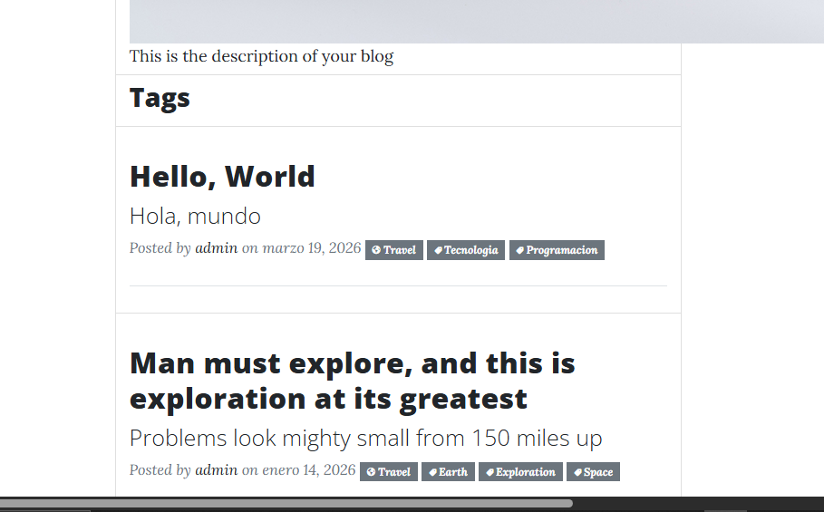

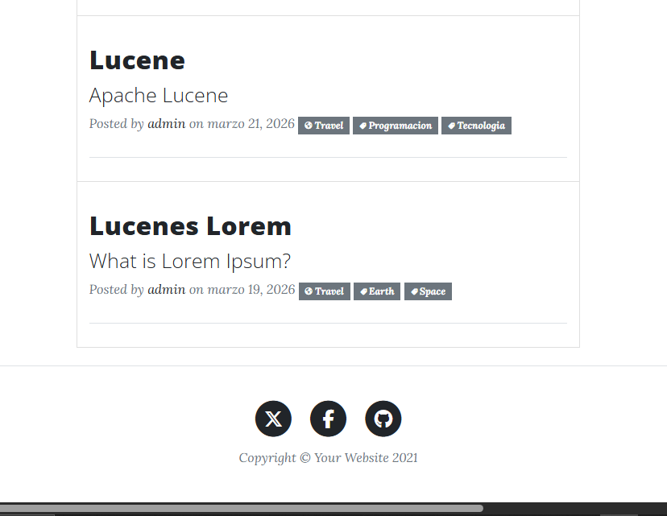

## Fuzzy Searches
The *~* operator performs a fuzzy search that matches similar terms, including misspelled words.

To search for terms that match the word "Lucen", use the approximate search:

`Lucen~`

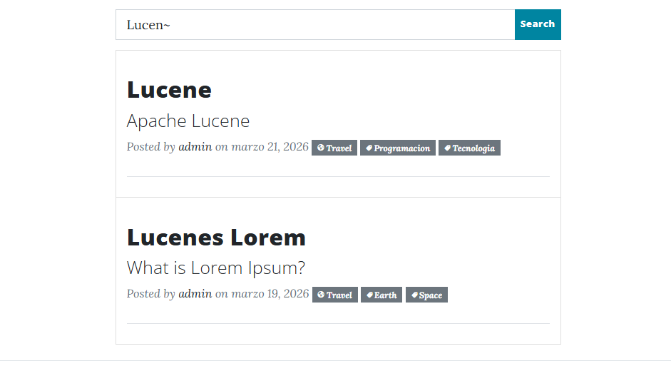

## Text field
Lucene supports field searches. You can specify a field or use the default field. Field names are text-based, for example: Title, Subtitle.

To search, type the field name (e.g., Subtitle) followed by a colon ":".

`Subtitle:What is Lorem Ipsum?`

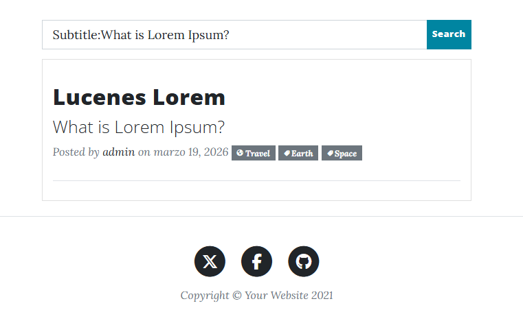

## Wildcard Searches
It allows you to search for terms using patterns or wildcard characters (*, ?) in any position.

- The symbol `*` performs a search that represents multiple characters.

- The symbol `?` performs a search that represents only a single character.

The single-character wildcard search "?" looks for terms that match the length and the substituted character:
`lu?ene`

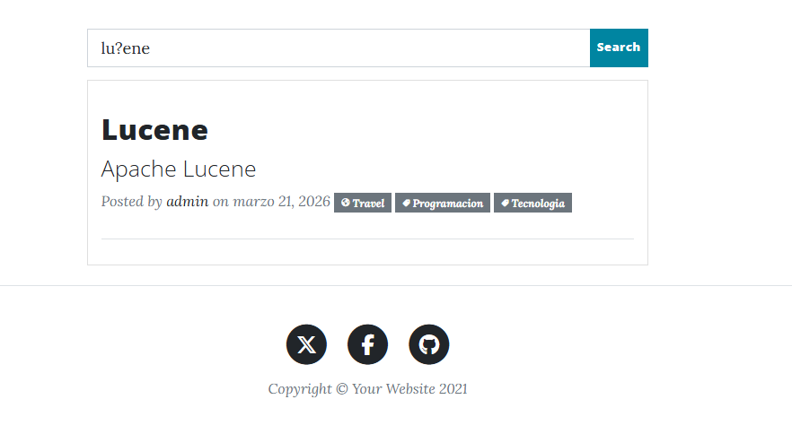

The multi-character wildcard search "*" looks for terms that match any character:
`Lucene*`

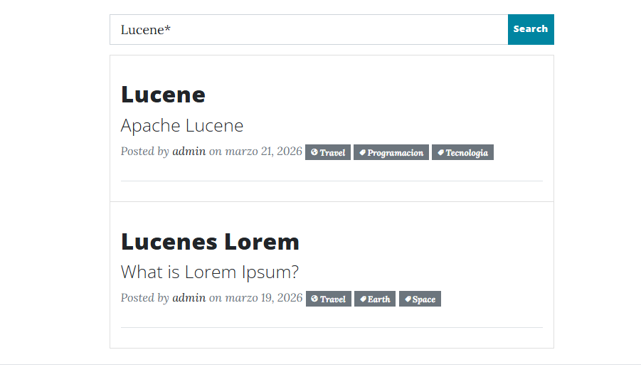

## Range Searches
They allow you to search for documents within a range of field values ​​that fall between the lower and upper limits specified by the query.

The search will find documents whose titles are greater than "A" and less than "P":

`A TO P`

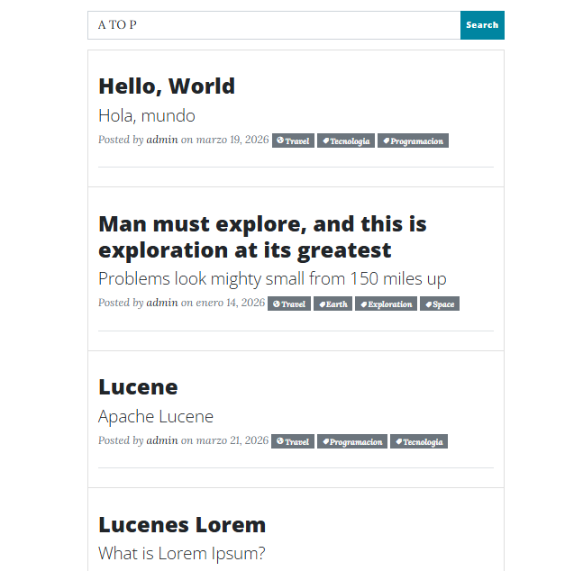

## Regular expressions
They allow you to search for documents using regular expressions, enclosed within forward slashes (/regex/). The pattern must match the entire term, not just a substring within it, unless specified with wildcards.

The search will find terms that begin with "type" and end with "ing" or "services", ignoring anything in between. 

`/type.*ing?/`

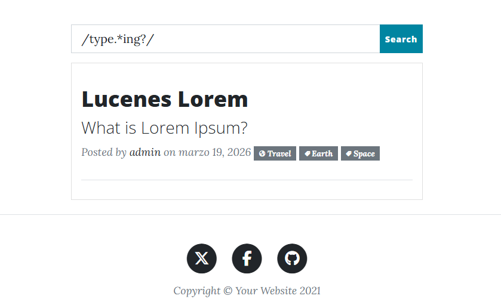

