# Use Microsoft Entra ID (Azure AD) as an external identity provider

In order to authenticate users with Microsoft Entra ID (Azure AD), you must enable and configure The `OrchardCore.MicrosoftAuthentication.AzureAD` (you can learn more about [here](../../reference/modules/Microsoft.Authentication/README.md)) and the `OrchardCore.Users.Registration` features

## What you will build

You will build a blog that allow users to login with their AzureAD account and get assigned roles based on the Security Groups they belong

## What you will need

Follow the guide to [create a new Orchard Core CMS website](../../guides/create-cms-application/README.md)

An Azure Account with Microsoft Entra ID configured.

## Login to OrchardCore Admin and enable the required Features

Navigate to <https://localhost:5001/Admin/Features> and enable the Microsoft Entra ID Authentication and the Users Registration features

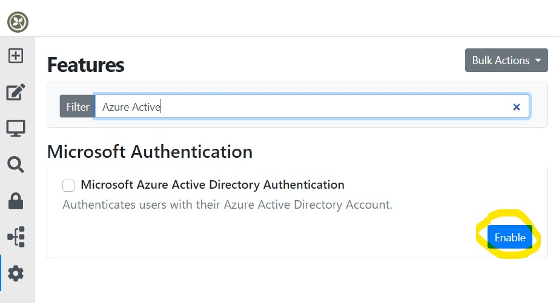

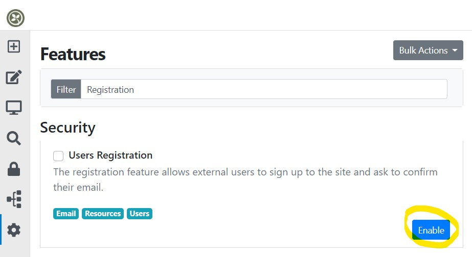

## Login to Azure Portal to configure the Directory

Create the Orchard Core roles you want to manage/assign as Security Groups at [Azure Portal](https://portal.azure.com/#blade/Microsoft_AAD_IAM/GroupsManagementMenuBlade/AllGroups). Copy the Object Id's as you will need it later to make the mapping.

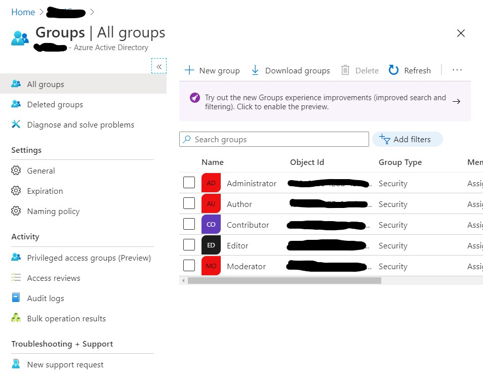

[Register a new application](https://portal.azure.com/#blade/Microsoft_AAD_IAM/ActiveDirectoryMenuBlade/RegisteredApps) and configure authentication,

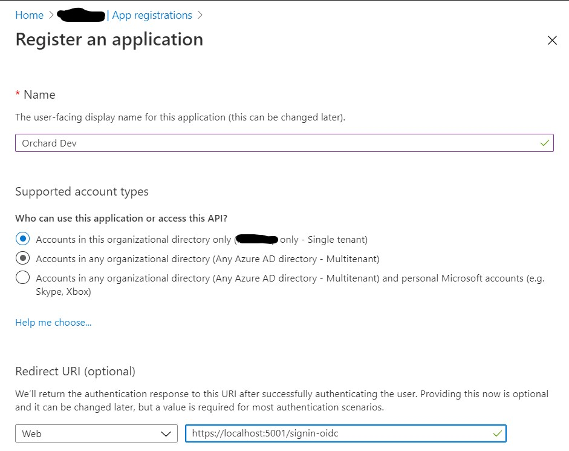

make sure to provide a redirect URI and enable at least ID tokens to be issued.

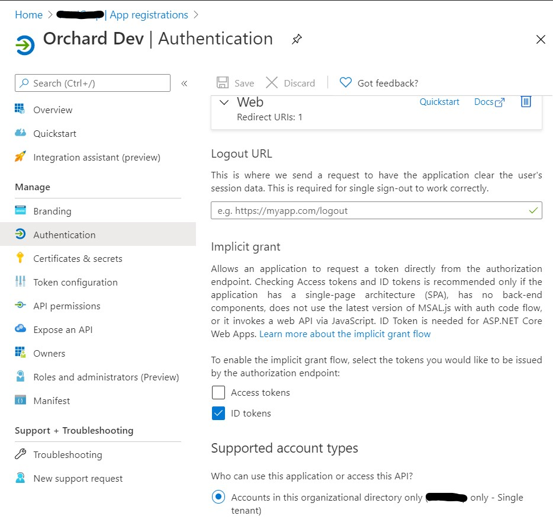

Navigate to Token configuration and add the groups token as shown below.

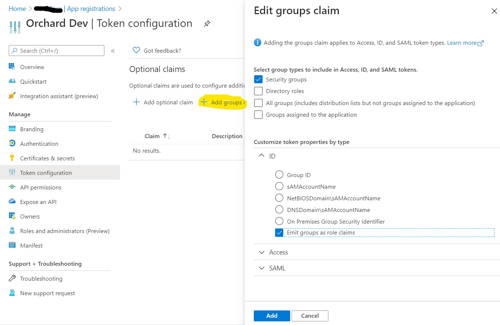

On the same screen, click on `Add optional claim`, select `ID`, check `email` as shown below and then click Add:

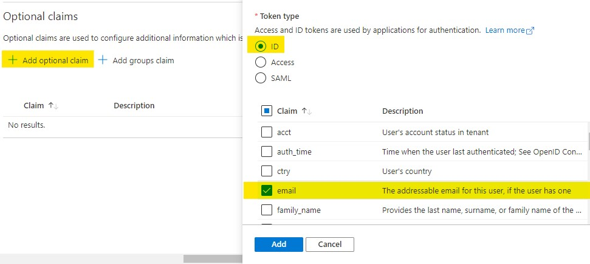

A popup may appear to authorize the call to the Graph API. Check `Turn on the Microsoft Graph email permission` as shown below and then click Add:

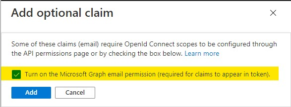

The last step is to copy Application Id and Tenant Id from Azure Portal

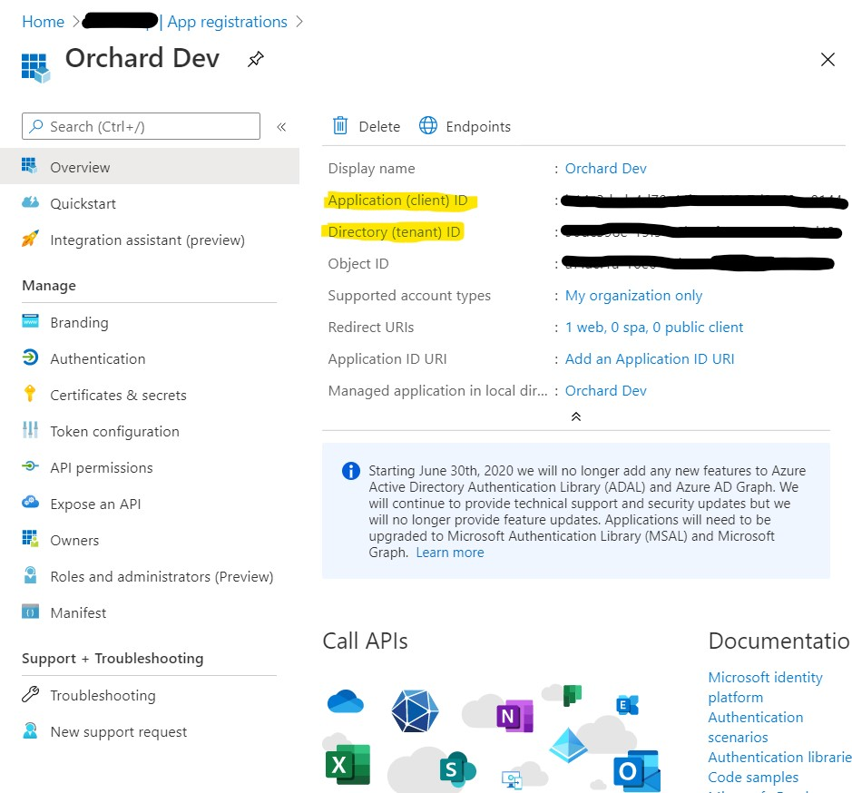

[Navigate to Security/Microsoft Entra ID](https://localhost:5001/Admin/Settings/OrchardCore.Microsoft.Authentication.AzureAD) in OrchardCore Admin to configure the AzureAD app.

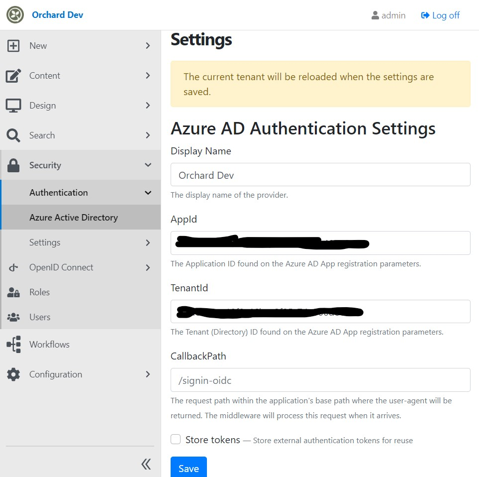

## Configure registration settings

[Navigate to Security/Settings/Registration](https://localhost:5001/Admin/Settings/RegistrationSettings) and enable registration as shown

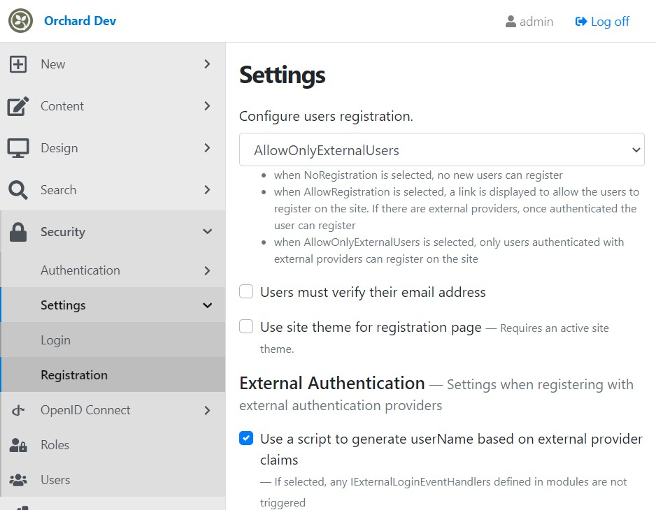

check Use a script to generate userName based on external provider claims and copy the following script to discover and use the user principal name as username if the user does not exist

```javascript
switch (context.loginProvider) {
    case "AzureAd":
        context.externalClaims.forEach(claim => {
            if (claim.type === "http://schemas.xmlsoap.org/ws/2005/05/identity/claims/upn") {
                context.userName = claim.value;
            }
        });
        if (!context.userName){
            context.userName = "azad" + Date.now().toString();
        }
    break;
    default:
        log("Warning", "Provider {loginProvider} was not handled", context.loginProvider);
    break;
}
```

also check the settings to disable asking user info on first registration

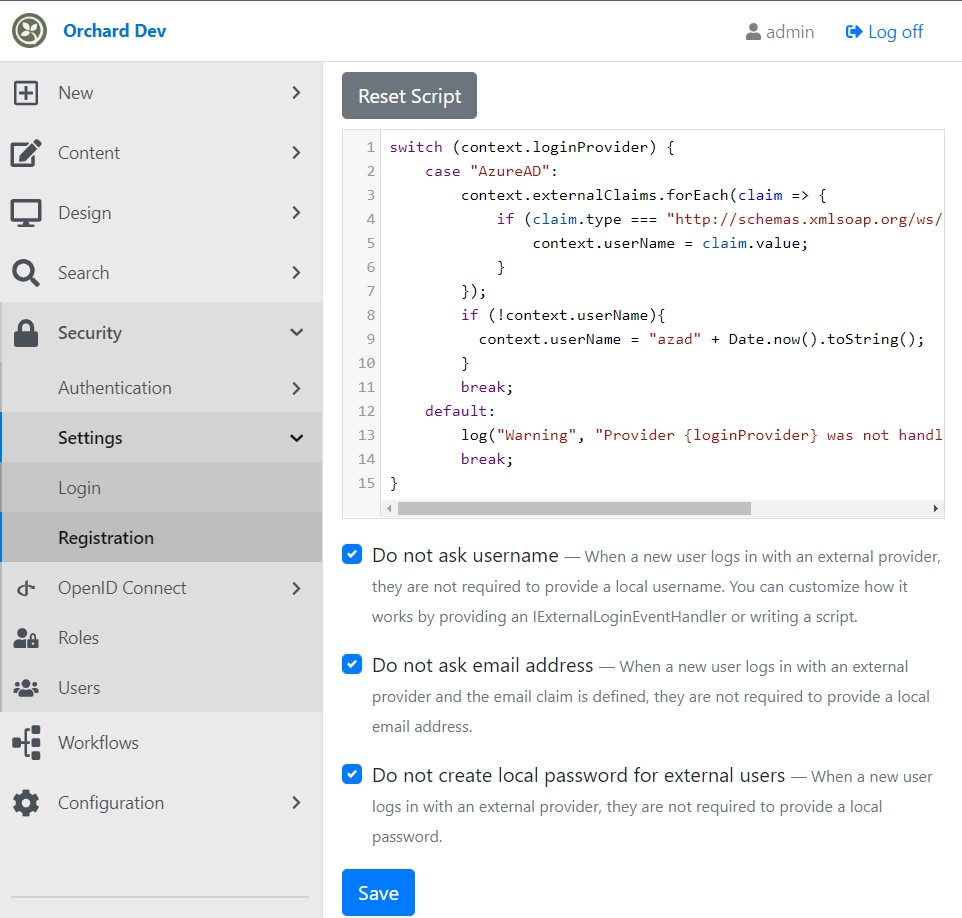

## Configure login settings

[Navigate to Security/Settings/Login](https://localhost:5001/Admin/Settings/LoginSettings) and check Use a script to set user roles based on external provider claims and copy the following script

```javascript
switch (context.loginProvider) {
    case "AzureAd":
        context.externalClaims.forEach(claim => {
            if (claim.type === "http://schemas.microsoft.com/ws/2008/06/identity/claims/role") {
                switch (claim.value) {
                    case "<replace AdministratorObjectId>":
                        context.rolesToAdd.push("Administrator");
                        break;
                    case "<replace ModeratorObjectId>":
                        context.rolesToAdd.push("Moderator");
                        break;
                    case "<replace EditorObjectId>":
                        context.rolesToAdd.push("Editor");
                        break;
                    case "<replace ContributorObjectId>":
                        context.rolesToAdd.push("Contributor");
                        break;
                    case "<replace AuthorObjectId>":
                        context.rolesToAdd.push("Author");
                        break;
                    default:
                        log("Warning", "Role {role} was not handled", claim.value);
                }
            }
        });
        context.userRoles.forEach(role => {
          if (!context.rolesToAdd.includes(role)){
              context.rolesToRemove.push(role);
          };
        });
        break;
    default:
        log("Warning", "Provider {provider}  was not handled",context.loginProvider);
        break;
}
```

## Check the result

Logout from OrchardCore. Navigate to <https://localhost:5001/admin> and use the external provider button to login.

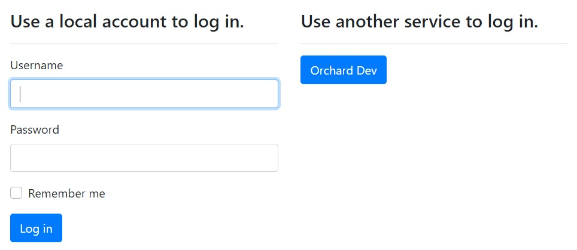

## Summary

You just integrated Microsoft Entra ID to the admin of your Blog! You can experiment with other login settings, such as disabling local login and challenging the AzureAD provider instead of showing the login screen.
