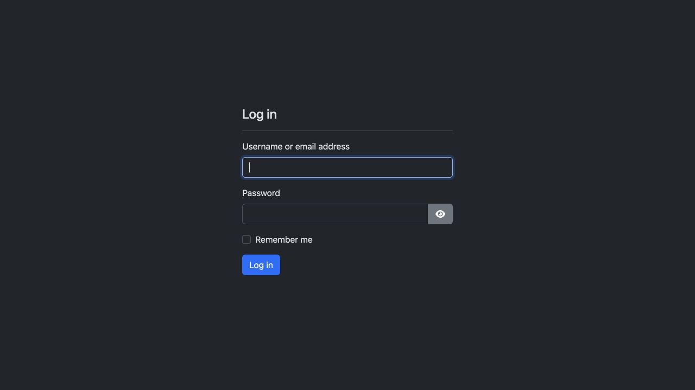
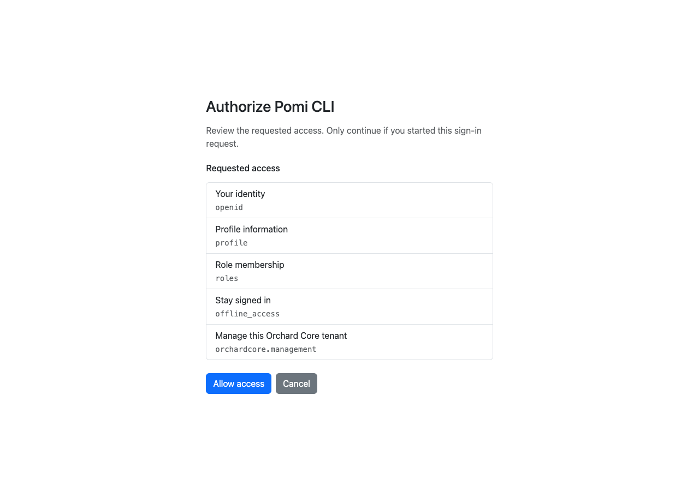
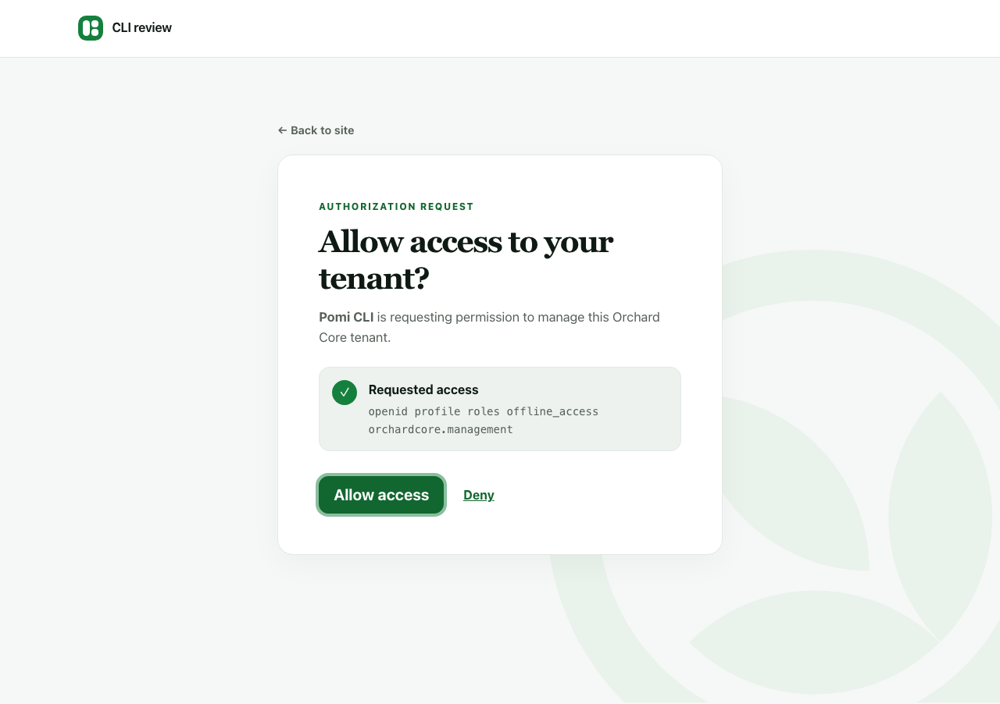
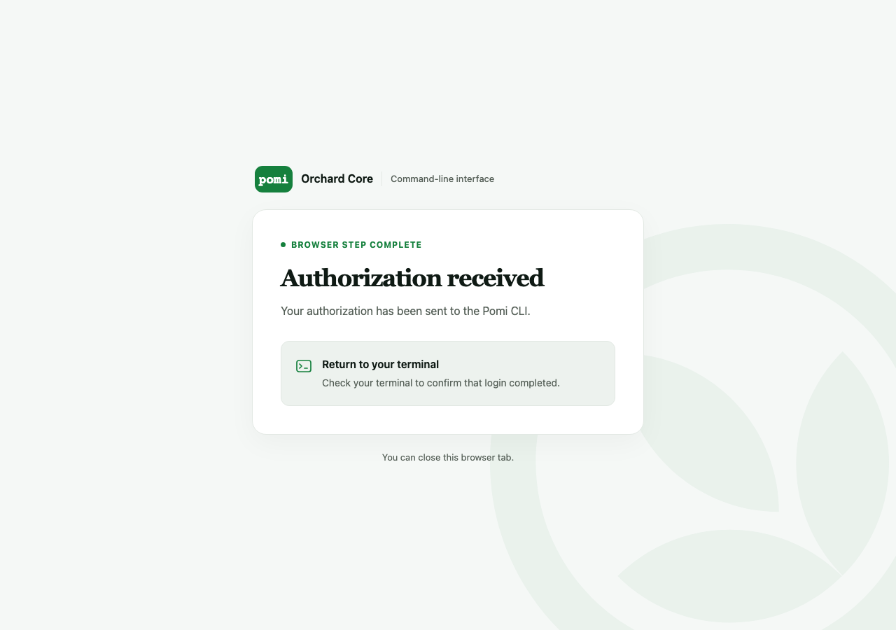
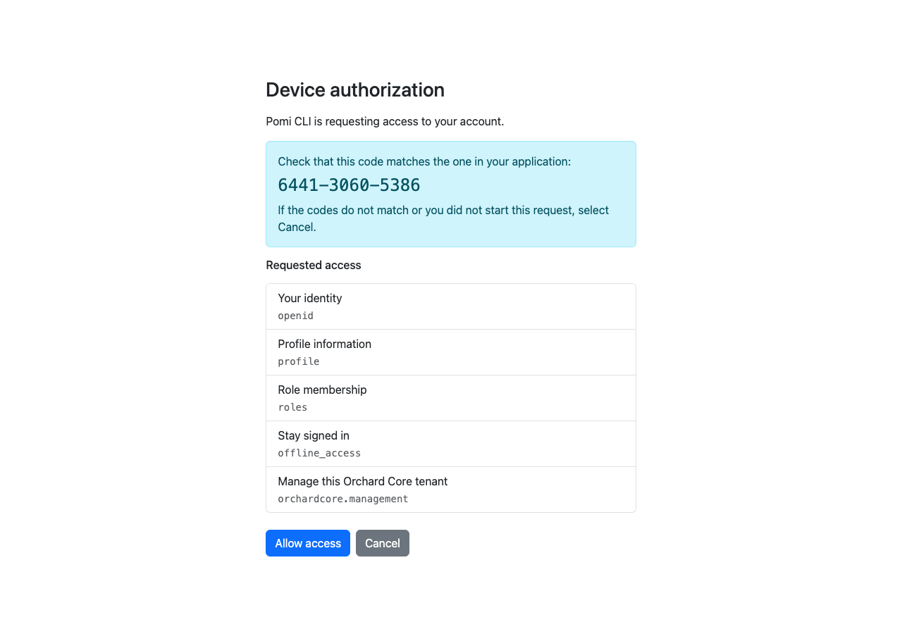

# Manage your first tenant with `pomi`


The Pomi CLI brings tenant management to your terminal. Sign in once,
select a tenant, and discover the commands that its enabled features provide.
This walkthrough starts with a read-only content listing, then creates and
validates an unpublished article.

## 1. Download or build the CLI

### Install as a .NET tool

Install an [official release](https://github.com/OrchardCMS/OrchardCore/releases)
as a .NET tool, or download its standalone native archive and checksum:

```bash
dotnet tool install --global OrchardCore.Cli --version <release-version>
pomi --version
```

The tool installer requires the .NET 10 SDK or later. Running the native binary
needs no separate .NET runtime. Linux, Windows, and macOS each support x64 and
Arm64. Use `dotnet tool update --global OrchardCore.Cli --version <release-version>`
to upgrade, or `dotnet tool uninstall --global OrchardCore.Cli` to remove it.

### Development artifacts

[Main CI](https://github.com/OrchardCMS/OrchardCore/actions/workflows/main_ci.yml)
builds and validates native artifacts for all six platforms on main and release
branch code changes. These builds do not publish native packages to a registry.
Download `pomi-<rid>` for a standalone archive or `pomi-tool-<rid>` for a tool
installer and native implementation, using one of these runtime identifiers:
`linux-x64`, `linux-arm64`, `win-x64`, `win-arm64`, `osx-x64`, `osx-arm64`.
GitHub sign-in is required for workflow downloads, which are retained for 30 days.

Extract the standalone archive and put its directory on `PATH`. For a tool
artifact, extract both `.nupkg` files together and use the version in `INSTALL.md`:

```bash
dotnet tool install --global OrchardCore.Cli --add-source ./pomi-packages --version <artifact-version>
```

Development artifacts use a validation-only version. Their embedded site template
references that same version, so `pomi install` needs matching locally built server
packages; the native CI version is not a Cloudsmith preview version. Use an official
release for a published, consistently versioned CLI and server package set.

### Project templates and libraries

Released templates and libraries are available on NuGet.org. Main's libraries,
modules, themes, and templates follow the existing Preview CI publication schedule
to [Cloudsmith](https://nuget.cloudsmith.io/orchardcore/preview/v3/index.json).
Native Pomi tools are published only by Release CI.

```bash
dotnet new install OrchardCore.ProjectTemplates@<preview-version> --add-source https://nuget.cloudsmith.io/orchardcore/preview/v3/index.json
dotnet new occms -o MyOrchardSite
cd MyOrchardSite
dotnet new nugetconfig
dotnet nuget add source https://nuget.cloudsmith.io/orchardcore/preview/v3/index.json --name OrchardCorePreview
dotnet restore
dotnet run
```

The template defaults to its matching Orchard package version. Use a release
version and omit the extra source when installing released templates.

### Build from source

From a checkout containing `src/OrchardCore.Cli`, with the .NET SDK selected by
`global.json`, publish a native executable:

```bash
dotnet publish src/OrchardCore.Cli -c Release -r osx-arm64 -o artifacts/pomi
./artifacts/pomi/pomi --version
```

Replace `osx-arm64` with your runtime identifier: `osx-x64`, `linux-x64`,
`linux-arm64`, `win-x64`, or `win-arm64`. Native publishing also requires the
platform's native compiler toolchain. Windows produces `pomi.exe`.
Add the output directory to your `PATH`; the examples below use `pomi`.

For development without native compilation, use
`dotnet run --project src/OrchardCore.Cli -- <command>`.

To create installable NativeAOT tool packages on your own computer:

```bash
dotnet pack src/OrchardCore.Cli -c Release -p:PackAsTool=true -o artifacts/tool
dotnet pack src/OrchardCore.Cli -c Release -p:PackAsTool=true -r osx-arm64 -o artifacts/tool
dotnet tool install --tool-path ./artifacts/bin OrchardCore.Cli --add-source ./artifacts/tool --version 1.0.0
./artifacts/bin/pomi --version
```

Replace the runtime identifier for your platform. The first pack command
creates the installer package; the second builds the native implementation
on the matching operating system. Use the same `-p:Version=<version>` on both
pack commands when assigning a different package version. See the
[.NET NativeAOT tool packaging documentation](https://learn.microsoft.com/en-us/dotnet/core/tools/rid-specific-tools)
for details.

## Create and set up a local site

`pomi install` creates a new CMS application and initializes its **Default**
tenant. It uses the `occms` template embedded in the CLI executable from the
same source build, with matching Orchard package versions. No template package
download, selected tenant context, or remote authentication is needed.
Other project templates remain available through `dotnet new`.

1. Install the stable .NET SDK matching the template's target framework
   (currently **.NET 10**), and make `dotnet` available on your `PATH`.
   `pomi doctor` reports the selected SDK or a warning when it is unavailable.
   This SDK requirement applies to local site creation; remote management
   commands still work without .NET installed.
2. Choose a new or empty directory and create your site:

   ```bash
   pomi install ./MyOrchardSite \
     --site-name "My Orchard Site" \
     --user-name admin \
     --email admin@example.com \
     --run
   ```

3. Enter the administrator password at the masked prompt. The CLI creates the
   project, restores dependencies, builds it, and uses
   [Auto Setup](../../reference/modules/AutoSetup/README.md) to initialize the
   site. Defaults are the `SaaS` recipe, SQLite, and the UTC time zone.
4. With `--run`, open the HTTPS URL printed when setup finishes. Pomi selects
   an available random localhost port by default. Sign in with
   the administrator account you just created. Press **Ctrl+C** to stop the
   foreground server. Use `--urls https://localhost:5080` to select another
   listening address.

### Optional unattended remote management

Add `--enable-remote-management` when the installed site should be managed by Pomi:

```bash
pomi install ./MyOrchardSite --site-name "My Orchard Site" \
  --email admin@example.com --recipe-name Blank --enable-remote-management --run
```

The option enables **Remote Management CLI** and its OpenID dependencies after
setup, creates a dedicated confidential application with the tenant administrator
role, and saves a uniquely named Pomi context with its client credentials. Pomi
obtains an access token automatically when the site is running and an authenticated
command is issued. No browser or device login is needed. An existing current
context is preserved; use the context name returned by the command.

Without the option, setup follows the selected recipe and creates the normal
administrator account. Pomi does not enable additional remote management features
or save application credentials. A recipe such as SaaS may already include those
features. Both modes keep the administrator's supplied password unchanged.

The same option is available on `pomi tenants install`:

```bash
pomi --context host tenants install Blog --site-name Blog --user-name admin \
  --email admin@example.com --recipe-name Blog --request-url-prefix blog \
  --enable-remote-management
```

For a tenant that is already running, use:

```bash
pomi --context host tenants enable-remote-management Blog --provision-client
```

Without `--provision-client`, that command only enables and configures remote
management. Feature profiles must allow the required features. If provisioning
fails after installation, the installed site is preserved; fix the feature or
OpenID configuration and provision through `enable-remote-management` rather than
repeating installation.

Application secrets are stored using Pomi's credential store: Windows Credential
Manager on Windows, and an owner-only plaintext credentials file on macOS/Linux.
They are omitted from normal Pomi output and `config.json`. Treat the credential
store as administrative access to the tenant. `pomi logout` deletes these local
credentials; delete the application in the tenant's OpenID administration to revoke
its ability to obtain tokens. Repeating `--provision-client` creates a new application
and a new context; it does not rotate or remove previous applications.

HTTPS requires a certificate. For local development, create and trust the
.NET development certificate before using `--run`:

```bash
dotnet dev-certs https --trust
```

`--urls` accepts one address or a **quoted, semicolon-separated list** in a
single argument, following [ASP.NET Core's URL binding syntax](https://learn.microsoft.com/en-us/aspnet/core/fundamentals/servers/kestrel/endpoints?view=aspnetcore-10.0).
For example, to listen on both HTTPS and HTTP:

```bash
pomi install ./MySite --site-name "My Site" --email admin@example.com \
  --run --urls "https://localhost:5001;http://localhost:5000"
```

Use HTTP(S) addresses with a hostname or IP address and an optional port, without
credentials, paths, queries, or fragments. Use `--request-url-prefix` for a site
path. The result's `url` selects the first HTTPS address, or the first address
when all use HTTP; `listenUrl` contains the complete semicolon-separated list.
Explicit ports are checked before password prompts and reserved during installation;
a busy or unavailable address fails with a message to choose another `--urls`.
The default reserves a random port on IPv4 and, where available, IPv6 localhost.
Pomi saves the selected URLs in `appsettings.json` and the generated project launch
profiles, so `dotnet run` and `dotnet run --no-launch-profile` reuse them.
The reservation is released before starting the server; another process could
still claim a port afterward. Startup rechecks availability, but no preflight can
guarantee a port remains free between checking it and the server binding it.
For local HTTP without a certificate, specify `--urls http://localhost:5000`.

Installation shows concise progress messages. Add `--verbose` to see template,
build, and setup logs as they happen. On failure, the CLI prints recent
installation diagnostics automatically. Progress and logs go to standard error,
keeping JSON results on standard output usable by scripts. With `--run`, the
completed site's application logs stream to standard error.

The CLI initializes the Default tenant on a temporary loopback-only server
(`127.0.0.1` with an automatically chosen port). This address is internal to
setup; you do not need to open it. That server stops when setup finishes, before
`--run` starts the site at your chosen `--urls` address. Its startup logs appear
only with `--verbose` or in failure diagnostics. Without `--run`, no server is
left running. In JSON output, `tenantState:
"Running"` means the tenant is initialized; it does not mean a server was left
running. Start the site later with:

```bash
dotnet run --project ./MyOrchardSite --no-launch-profile
```

The generated `global.json` pins the selected stable SDK, allowing later patches
in that SDK feature band. A project-local `NuGet.Config` adds **nuget.org** by
default while retaining sources from parent and user-level NuGet configuration.
Both installation and subsequent `dotnet restore`/`dotnet run` use that normal
configuration hierarchy. `--clear-sources` opts out of inherited package sources:
it writes `<clear />`, leaving only nuget.org and any explicit `--source`. Orchard dependencies retain
their original package IDs. Dependency restore still needs network access or
a populated package cache; embedding the template does not embed the runtime
or the site's packages. `--source` adds an explicit Orchard dependency feed
alongside nuget.org, using an HTTPS NuGet URL or local package directory. It
does not replace the embedded template or change the Orchard version.

When restoring a build that references official preview packages, configure
Cloudsmith in a parent/user NuGet configuration or pass it explicitly:

```bash
pomi install ./MyPreviewSite --site-name "My Preview Site" --email admin@example.com \
  --source https://nuget.cloudsmith.io/orchardcore/preview/v3/index.json
```

For an isolated source list, add `--clear-sources` to that command. This clears
inherited **package sources**, not other NuGet settings such as source mappings
or credentials. Existing sites generated with `<clear />` keep it until you
remove that element from their `NuGet.Config`.

`--site-time-zone` uses a case-sensitive [IANA/TZDB time zone ID](https://nodatime.org/TimeZones), as resolved
by Orchard's Noda Time database on every operating system. Examples are `UTC`
(the default), `America/Los_Angeles`, `America/New_York`, `Europe/Paris`, and
`Asia/Tokyo`. Use these identifiers rather than Windows names such as
`Pacific Standard Time`, abbreviations such as `PST`, or offsets such as `-08:00`.
Region IDs account for daylight saving time automatically. For example:

```bash
pomi install ./ParisSite --site-name "Paris Site" --email admin@example.com \
  --site-time-zone Europe/Paris
```

Use the same argument names as tenant creation and setup, including
`--recipe-name`, `--database-provider`, `--table-prefix`, `--schema`,
`--site-time-zone`, `--request-url-prefix`, and `--request-url-host` (one host
name). For example, select `--recipe-name Blog` to initialize a blog.
`--setup-timeout` controls the initialization timeout in seconds (default 300).

For automation, supply the administrator password using exactly one of:

```bash
pomi install ./MySite --site-name "My Site" --email admin@example.com --password-env OC_SITE_PASSWORD
pomi install ./MySite --site-name "My Site" --email admin@example.com --password-file /run/secrets/site-password
printf '%s' "$OC_SITE_PASSWORD" | pomi install ./MySite --site-name "My Site" --email admin@example.com --password-stdin
```

These are alternative commands for separate installations. Inject the secret
environment variable through your CI or secret manager. For a database that
requires a connection string, use `--connection-string-env`,
`--connection-string-file`, or `--connection-string-stdin`; only one secret can
consume stdin. There is no inline password or connection-string argument.

Auto Setup credentials are passed through the temporary process environment.
The administrator password is not written into generated settings, launch
profiles, or CLI output. Orchard stores the resulting account normally; it
also persists database connection settings needed to run the site. On macOS
and Linux, `pomi install` creates `App_Data` with owner-only directory permissions.
If you deploy under another identity, grant that identity the access it needs.

The command refuses to overwrite existing content. On failure or cancellation,
it stops its child processes and preserves the project for inspection; it does
not silently retry a partially initialized database. Use a fresh directory for
a new attempt, or repair the preserved project manually. Creating a site does
not configure Remote Management automatically; follow the next section to
manage it through `pomi`.

SQLite is recommended when you have no database preference; `Sqlite` is the
installation default. For another provider, use a table prefix unique to the
site or tenant in its destination database/schema with `--table-prefix`.
A short site name plus a fresh random suffix helps avoid collisions; use only
letters, digits, and underscores. Keep the same prefix through creation and
setup. Existing host database presets and prefix patterns take precedence.

Setup administrator passwords require at least six characters, with uppercase,
lowercase, a digit, and a non-alphanumeric character under the standard policy.
Pomi validates these requirements before local site creation or a tenant setup
request. See the [setup password policy and generator](../../agents/skills/orchardcore-cli/references/setup-password.md)
for a 24-character password that always includes all four character groups.
Custom server policies can impose additional requirements.

## 2. Prepare the tenant

Sign into the tenant's administration dashboard as an administrator. Enable
**Remote Management CLI** under **Configuration → Features**, then open
**Settings → Remote Management → Configure Pomi CLI**. Select **Configure CLI
authentication** or **Repair CLI configuration**.

This configures shared authentication, the management scope, the public
`orchardcore-cli` application, PKCE, device authorization, refresh tokens, and
local token validation. Unrelated OpenID settings are preserved. For automation,
the **Orchard Core Remote Management CLI** recipe (`RemoteManagementCli`) performs
the same configuration for the current tenant.

Your identity needs **Access remote management API** and the permissions for
the resources you will use. A production automation account should receive
only the permissions its job requires.

For a non-administrator identity, grant `AccessRemoteManagement` and the
permissions for the resources it will manage. If OpenAPI document access is
protected, also grant `ViewOpenApiContent` so the CLI can discover commands.
A readable management manifest followed by a 403 during `pomi api refresh` can
indicate that this document permission is missing; signing in again does not
grant it.

## 3. Save the exact tenant URL

Context names are shared across sessions and working directories. After either
`pomi install` or `pomi tenants install`, inspect the saved names first:

```bash
pomi context list --output json
```

Choose an unused site-specific name, checking `contexts[].name` without regard
to case. Append a suffix if needed. The `Default` tenant does not require a
context named `default`. Set `CONTEXT` to your chosen unused name and `SITE_URL`
to the exact URL returned for the site or tenant, then run:

```bash
pomi context add "$CONTEXT" "$SITE_URL" --current
```

Include the tenant path prefix; do not use the admin or login URL. `context add`
can update an existing record, so never reuse another site's name or overwrite
an older context when a newly initialized site happens to use the same URL.
Recheck the list before saving if other work intervened. For agent sessions,
use `--context "$CONTEXT"` explicitly afterward, because another session can
change the globally current context.

Both the context name and tenant URL are required. If either is omitted, the
CLI identifies the missing argument and displays the command's usage. Use
`pomi context add --help` to view that help without creating a context.

Remote connections require HTTPS. HTTP is accepted for loopback development,
for example `http://127.0.0.1:5000/news`. To switch to another tenant URL, create
a new context name; existing credentials cannot follow a changed tenant URL.

## 4. Sign in once

```bash
pomi --context "$CONTEXT" login
```

The CLI opens the tenant's login page in your browser. Sign in as the intended
tenant-local user and approve the request. Return to the terminal to verify
that login completed.



On the authorization page, verify that the application is **Pomi CLI**
and select **Allow access**. The requested scopes include management access and
`offline_access`, which allows later commands to refresh your login silently.
Choose **Cancel** if you did not start this request. The page follows the
tenant's login theme; this example uses the default admin theme.
See [customizing authorization pages](../../reference/modules/OpenId/README.md#customizing-authorization-pages)
to apply your site's branding.



With **The SaaS Theme** selected as the site theme and **Use site theme for
login page** enabled, the same consent request uses green accents, softer
cards, and locally available serif headings. It follows your browser's light
or dark color preference. **Allow access** receives focus, so Enter approves
the request; Tab moves to **Deny**.



The callback page confirms **Authorization received** and directs you back to
the terminal. You can close that browser tab. The terminal reports
`Grant type: browser` and the tenant issuer when the token exchange succeeds;
receiving the authorization alone does not mean login has finished. The CLI
serves this page locally, with light and dark appearances and no external
assets. It is separate from the tenant's themeable consent page.

The callback shares the SaaS theme's Orchard-inspired palette but keeps its
CSS and icons inline and uses system fonts. It does not download theme files,
fonts, scripts, or images from the tenant or another website.
Both pages include a subtle decorative leaf watermark rendered as inline SVG.
The CLI callback's browser-tab icon uses the Pomi terminal-and-leaf symbol,
embedded in the executable and included in the page as a PNG data URL.



### Choose a login flow

| Where you run the CLI | Command | Where you sign in |
| --- | --- | --- |
| Your desktop or laptop with a browser | `pomi login` | The browser opens on that computer; authorization code with PKCE is the default. |
| The same computer, but you want to open the browser yourself | `pomi login --no-browser` | Copy the printed URL into a browser on that same computer. |
| An SSH session on a server without a desktop | `pomi login --grant device` | Open the printed verification URL on your laptop or phone. |
| An interactive shell in a container or remote development environment | `pomi login --grant device` | Use a browser outside that environment that can reach the tenant. |

Device authorization is still an interactive user login. For unattended CI
or scheduled jobs, configure a dedicated application identity and use
[client credentials](../../reference/api/authentication/README.md#client-credentials).
The CLI defaults to browser login; select device flow explicitly when needed.

### Sign in from another device

On the computer running the CLI, use:

```bash
pomi login --grant device
```

The CLI prints a verification URL and a user code without opening a browser.
QR output is disabled by default. Add `--qr auto` to display a QR code in a
compatible terminal: scan it with your phone's camera to open the same
verification URL. The QR code is generated locally.
When the server supplies a URL containing the user code, that complete URL is
encoded; otherwise you enter the displayed code after scanning.

Control the terminal QR output with:

```bash
pomi login --grant device --qr auto    # Opt in: show in a compatible terminal
pomi login --grant device --qr always  # Force ANSI/Unicode QR output
pomi login --grant device --qr never   # Default: keep just the URL and user code
```

For terminal rendering, automatic mode skips QR output when standard error is redirected, the output
encoding is not UTF-8, `TERM=dumb`, or `NO_COLOR` is set to a nonempty value.
QR codes that do not fit the terminal width are omitted. The URL and code remain available, and terminal QR output goes
to standard error so it does not mix with JSON results on standard output.
QR output applies only to device login, since the browser login flow requires
its callback on the same computer.

To receive an image for a script or application, combine an opt-in QR mode with
JSON output:

```bash
pomi login --grant device --qr always --output json
```

Before waiting for approval, the CLI writes and flushes a JSON record to stdout:

```json
{
  "status": "authorization_pending",
  "context": "production",
  "verificationUri": "https://cms.example.com/team/connect/verify?user_code=6738-0585-5256",
  "userCode": "6738-0585-5256",
  "expiresAt": "2026-09-10T18:00:00+00:00",
  "qrCode": {
    "mediaType": "image/png",
    "base64": "iVBORw0KGgo..."
  }
}
```

The example image data is abbreviated. Decode `qrCode.base64` to PNG bytes, or
display it as `data:image/png;base64,` followed by that value. Keep the CLI running
while the user authenticates. The normal login result follows on stdout after
success, so consume a **stream of JSON values**, not a single JSON document.
The pending record does not mean login succeeded; check the final exit code.
Failure diagnostics remain on stderr.

This also works with `--qr auto --output json` or redirected `--output auto`
when QR output is explicitly enabled. PNG rendering ignores terminal width and
color settings. URLs over 2,048 UTF-8 bytes omit the image (`qrCode: null`), while
retaining the URL and code. Without `--qr` (or with `--qr never`), there is no
pending JSON record or image. Private device codes and tokens are never included
in the pending record.

For example, against a tenant reachable at `https://cms.example.com/team/`:

```text
Open https://cms.example.com/team/connect/verify?user_code=6738-0585-5256 and enter code 6738-0585-5256.
```

1. Keep the CLI command running.
2. Open the printed URL on your phone or another computer (or scan the QR code if enabled). Both the CLI and
   that browser must be able to reach the tenant; a private tenant may require
   VPN access. A `localhost` or `127.0.0.1` tenant URL points to the device
   opening it and cannot be used from your phone to reach the CLI computer.
3. Sign in as the intended tenant user. If the URL already includes the code,
   it is filled in for you; otherwise enter the code printed by the CLI.
4. Verify the tenant, **Pomi CLI** application name, requested access,
   and matching code, then select **Allow access**. Only approve a request
   you started.
5. Return to the terminal. The CLI polls the tenant and completes login after
   approval, reporting `grantType: device`. If the code expires, run the login
   command again to obtain a new one.

The phone communicates with the tenant, not with a callback listener on the
CLI computer. Tokens are delivered to and stored on the computer running the
CLI; there is no token to copy from your phone. This is the
[OAuth device authorization grant](https://www.rfc-editor.org/rfc/rfc8628.html).



By comparison, `pomi login` and `pomi login --no-browser` use authorization code
with PKCE and a callback on the CLI computer's loopback interface. Opening
that flow's URL on your phone would direct the callback to the phone's own
loopback interface. Use device flow for this cross-device scenario.

### Start and complete device login separately

For an agent, application, or script that needs to present authorization
instructions before waiting, use the separate device commands. Each invocation
returns a single JSON result with `--output json`.

1. Request authorization for the intended context:

    ```bash
    pomi --context production login device start --output json
    ```

    This contacts the authorization server, saves a pending session locally, and
    exits immediately. The result contains `sessionId`, `status:
    "authorization_pending"`, `verificationUri`, `userCode`, and `expiresAt`.
    Exit code `0` here means the request was created, not that login succeeded.
    Add `--qr always` to include `qrCode.mediaType` and `qrCode.base64` as a PNG.
    QR output is off by default.

2. Present the URL and code to the user. To display the same request again,
   optionally with a QR image, use the returned session ID:

    ```bash
    pomi login device show <session-id> --qr always --output json
    ```

    `show` works offline and does not request a new code or extend its expiry.
    In human output, opt-in QR codes render in the terminal. In JSON output,
    decode `qrCode.base64` into PNG bytes or display it using an
    `image/png` data URI. The image encodes the server-provided verification
    URL, which may already contain the user code.

3. Wait for the user's decision and save the resulting login:

    ```bash
    pomi login device wait <session-id> --output json
    ```

    You can run `wait` before or after approval, as long as the session has not
    expired. It polls at the server's required interval, handles `slow_down`,
    saves credentials, and refreshes tenant API metadata. Success returns the
    normal login result with `grantType: device`. Denial or expiry returns a
    nonzero exit code. The phone must still complete the consent page; possessing
    a session ID alone does not approve authorization.

Use the local **session ID**, not the displayed user code. OAuth uses a separate
private device code for polling. That code is stored in the CLI configuration
directory's `device-logins` folder and is never included in public output.
On Unix-like systems the directory uses mode `0700` and files use `0600`;
Windows restricts the directory and its contents to the current user's account.
No additional secret-store prompt is required for pending sessions.

Sessions belong to the same local CLI configuration (`OC_CONFIG_HOME` when set).
`wait` selects the session's original context even if another context is now
current. An explicit conflicting `--context`, or changes to the original tenant,
authority, client ID, or scopes, cause rejection. A context named `device` can
still use the combined login command via `pomi --context device login`.

Only one process may wait on a given session at a time; `show` remains available
while it waits. After interrupting a wait or a transient connection failure,
run `wait` again with the same ID before expiry. Saved polling timing survives
restarts. Private session state is removed after token saving, denial, or expiry;
starting a new session also removes expired sessions that are not being used.
Empty lock files may remain and contain no authorization data.

`pomi login --grant device` remains the combined flow for interactive use. Its
opt-in QR JSON output is a stream as described above; use `start`, `show`, and
`wait` when each process should produce one JSON result.

### Reuse your login

Later commands reuse the login and refresh expiring tokens automatically.
On macOS and Linux, tokens remain in shared, owner-only files under
`~/.orchardcore/credentials`: directory mode `0700`, file mode `0600`.
They are plaintext and protected by your operating-system account permissions.
Routine commands do not open the OS secret store or prompt for authentication.
Windows uses Windows Credential Manager.

## 5. Run your first command

```bash
pomi content items list --take 10
```

In a terminal, the result is a table. An empty result means there are no items
matching the default published-content filter; it does not mean login failed.
To see drafts:

```bash
pomi content items list --status draft --take 10
```

`--skip` is a zero-based offset. For the next page, use `--skip 10 --take 10`.
Capture a complete, stable response for scripts with explicit JSON output:

```bash
pomi content items list --status draft --output json > drafts.json
```

The default `--output auto` uses human output in a terminal and JSON when
redirected to a pipe or file. Human output reports successful changes in plain language and
shows useful details with complete URLs. For example, `pomi tenants create`
reports the created tenant and its full **Setup URL**, so you can open it to
finish setup. Single-resource responses use readable labels. Lists and search
results remain tables, and `schema` commands retain JSON Schema output.

Use `--output json` explicitly in scripts to select JSON regardless of whether
a terminal is attached. Use `--output human` to retain readable messages when
redirecting output. Other explicit formats include `table`, `csv`, `tsv`,
`yaml`, `toml`, and `none` (no result output). Tables may shorten long non-URL
cells; HTTP and HTTPS URLs remain complete in both human and table output.

```bash
pomi tenants create --name Demo --request-url-prefix demo
pomi tenants create --name Demo --request-url-prefix demo --output json
```

Successful changes receive a completion message. An HTTP 202 response is
described as accepted rather than finished; an API-reported unsuccessful result
does not receive a success message. Errors appear on standard error. In human
output, API failures start with **An error occurred**, followed by the failed
request and the server's explanation, including field validation messages when
provided. HTTP connection and JSON parsing failures also use readable messages.
With `--output json` (or redirected `auto`), API errors retain their structured
JSON envelope and exit codes. `--output none` suppresses results, not errors.

Human output also suggests the next step in tenant onboarding. Hints appear in
cyan when standard output is a terminal. Redirected output stays plain, and
`NO_COLOR=1` or `TERM=dumb` disables hint coloring.

1. `pomi tenants create` suggests `pomi tenants setup` for an uninitialized tenant,
   with its actual name and placeholders for details such as the administrator
   email and an unconfigured recipe. The password is prompted securely. The
   example uses SQLite if no database provider is configured; adjust it before
   running if needed.
2. Successful setup suggests `pomi tenants enable-remote-management`.
3. Enabling remote management suggests `pomi context add` with the exact tenant
   URL and `--current`. Existing contexts for the URL are reused; name collisions
   with other tenants receive a numbered suffix.
4. Adding the context suggests `pomi login` targeting that named context.
5. Login suggests context-specific `pomi --help` to explore available commands.

The setup and enablement suggestions explicitly retain the parent context that
manages tenants. Login targets the new tenant's context. Suggestions follow the
returned tenant state, so an already initialized tenant skips setup. Missing
URLs are shown as placeholders rather than guessed. Replace placeholders and
review the settings before copying a command. Suggestions use POSIX shell
quoting on macOS/Linux and PowerShell quoting on Windows. They are shown only in
human output; `--output json` and other explicit data formats are unchanged.

## 6. Discover before writing

Run `pomi` or `pomi --help` to see the same help: built-in commands and the selected
context's tenant commands from the local OpenAPI cache. Neither form contacts
the tenant or requires authentication. Expired cached commands remain visible
with a stale-cache warning. If no cached metadata is available, only built-in
commands appear; authenticate and run `pomi api refresh` to populate the cache.

```bash
pomi --help
pomi content items --help
pomi content types schema --output json
pomi content items schema Article --output json
```

The last command requires an existing `Article` content type. If it is absent,
create the simple type below. If it already exists, inspect its schema and
adapt the article payload to that model instead of replacing the definition.
This example needs the Contents, Content Types, and Title features.

Save this as `article-type.json`:

```json
{
  "name": "Article",
  "displayName": "Article",
  "settings": {
    "ContentTypeSettings": {
      "creatable": true,
      "listable": true,
      "draftable": true,
      "versionable": true
    }
  },
  "parts": [
    { "name": "TitlePart", "partName": "TitlePart", "settings": {} }
  ]
}
```

```bash
pomi content types create --body-file article-type.json
pomi content items schema Article --output json
```

Definition DTOs use camelCase. Content-item parts and properties preserve their
schema casing, including `ContentType`, `TitlePart`, and `Title`.

## 7. Create and check a draft

Save this as `article.json`:

```json
{
  "ContentType": "Article",
  "TitlePart": { "Title": "My first CLI article" }
}
```

```bash
pomi content items validate --body-file article.json
pomi content items create-draft --body-file article.json --output json
```

Validation should return `isValid: true`. Copy the returned `ContentItemId`
into the commands below:

```bash
pomi content items show <content-item-id> --version draft --output json
pomi content items render <content-item-id> --version draft
pomi content items validate-update <content-item-id> --body-file article.json
```

The item remains unpublished. `validate-update` validates a detached candidate;
it does not save it or run update workflows. Reading `--version draft` never
creates a draft; it returns `404` when no draft exists. To publish intentionally:

```bash
pomi content items publish <content-item-id>
```

To inspect or recover an older version, use its version ID:

```bash
pomi content versions list <content-item-id>
pomi content versions show <content-item-version-id>
pomi content versions restore <content-item-version-id>
```

Restoration creates a new unpublished draft and preserves the published version.
The [version management reference](../../reference/api/content-items/README.md#manage-specific-versions)
explains rendering, replacing an existing draft, and permanently deleting archived versions.


Do not retry creation blindly after a connection failure: a request may have
succeeded before its response was lost. Read back the state first. Consult the
[content API retry contract](../../reference/api/content-items/README.md) for
updates, lifecycle operations, and deletes.

## 8. Use contexts and secrets deliberately

Use `pomi --context production <command>` to make the destination explicit.
Destructive commands marked for confirmation ask in an interactive terminal;
noninteractive callers must supply `--force`. This flag skips confirmation;
it does not override server permissions or dependency checks. If a discovered
API itself has a `force` parameter, it is exposed separately as `--api-force`
(with an explicit value such as `true`). For example:

```bash
pomi features disable OrchardCore.Media --force
# Also disable dependent features, when that broader change is intended:
pomi features disable OrchardCore.Media --force --api-force true
```

`pomi context clear --force` removes
all saved contexts and their credentials, so use it only for an intentional reset.

For a complete setup walkthrough, see [Client credentials for automation](../../reference/modules/RemoteManagement/README.md#client-credentials-for-automation).

For unattended jobs, register a separate **confidential** OpenID application
with client-credentials flow, the `orchardcore.management` scope, and minimal
roles. Inject `OC_CLIENT_ID` and `OC_CLIENT_SECRET` through your CI secret
facility, then run ordinary commands:

```bash
pomi --context production content items list --output json
```

Do not use the public `orchardcore-cli` application for this grant.
Client credentials and their tokens are not persisted. For user provisioning,
use `--password-env`, `--password-file`, or `--password-stdin` with individual
property options; alternatively supply the entire request in a protected
`--body-file` or `--stdin`. Do not combine a complete body with property options.

## Upload custom styles and other assets

Use the Media library for custom assets so the CLI and Orchard admin UI share
files and permissions. After signing in, inspect `pomi media constraints show`
and choose a folder convention for your project. For example, with local
`site.css` ready to upload:

```bash
pomi media constraints show --output json
pomi media folders create --name assets
pomi media folders create --path assets --name styles
pomi media files upload site-v1.css --path assets/styles --file ./site.css
pomi media files show assets/styles/site-v1.css --output json
```

Media file results include both the store path (for later CLI commands) and a
direct, absolute URL (for opening or embedding the file). `pomi media items list`
and `pomi media files list` show both columns in a terminal. Upload, copy, and move
results also include the destination URL. Configured CDN mappings are preserved;
the URL does not bypass any media access restrictions.

Create the folders only if they do not already exist. The upload needs Media
management and destination-folder permission. By default CSS, JavaScript, and
SVG additionally require **Upload media file extensions requiring additional
permission** (`UploadRestrictedMedia`);
ask your administrator for the appropriate access if the extension is absent
from your constraints. Use the returned `url` to reference the stylesheet and
`filePath` for Media fields or Liquid's `asset_url` filter. You can also find the
file in the admin Media library. Uploads reject existing names, so choose a new
versioned name when updating an asset.

See [Media and custom assets](../../reference/modules/RemoteManagement/README.md#media-and-custom-assets)
for shared storage across nodes and the [Media API](../../reference/api/media/README.md)
for the complete contract. Tenant static files are deployment assets and have no
management API.

## Troubleshooting and next steps

| Symptom | Next step |
| --- | --- |
| Command missing from help | Check the selected context and enabled features; run `pomi api refresh --force` |
| `401` | Verify the context and sign in again, or check injected client credentials |
| `403` | Check both management access and the resource-specific tenant permissions |
| Remote Management discovery not found (`404` during `pomi context add`) | Check the exact tenant URL and path prefix. Enable `OrchardCore.RemoteManagement` in **Configuration → Features**, then configure it in **Settings → Remote Management**. If unavailable, use a server version containing the feature. The failed command does not save or select a context. |
| `404` for a draft | Verify the ID and whether a draft exists; inspect the latest version |
| Validation failure | Correct the named property using the live schema and exact casing |
| Local storage or cache problem | Run `pomi doctor` to inspect paths and storage availability |
| Protocol mismatch | Run `pomi api compatibility` and use a compatible CLI version |

Help and shell completion use cached metadata without contacting the server.
After feature changes, successful mutations expire discovery caches so the next
online command can refresh them. `pomi --version` prints the CLI version number.
`pomi doctor` reports the CLI version, platform, and local
storage and cache state without contacting the tenant. Use
`pomi doctor --output json` for structured diagnostics in scripts.
For Bash completion, run `pomi completion --shell bash > pomi-completion.bash` and
source the file. Other supported shells are `zsh`, `fish`, and `pwsh`.

Sign out of the current context with `pomi logout`. It attempts token revocation
and removes stored human credentials on success. Disconnecting a terminal or
closing a shell does not log you out.

Continue with the [complete management API reference](../../reference/api/README.md),
[CLI reference](../../reference/modules/RemoteManagement/README.md), and
[verification scripts](https://github.com/OrchardCMS/OrchardCore/tree/main/.scripts/remote-management).
The agent plugin includes a workflow router, independently usable specialists,
and shared authentication, context, and output guidance. Essential references
are bundled; longer manuals use official Orchard Core links that require network access.

Download the plugin or skills-only package and follow the installation steps
in [Use Pomi with an agent](../../agents/index.md).

## Query GraphQL directly

The built-in `pomi graphql` commands reuse your context and login while sending
requests directly to the tenant's GraphQL endpoint. Enable
`OrchardCore.Apis.GraphQL`; no OpenAPI refresh is needed for these commands.

```bash
pomi graphql execute --query '{ __typename }'
pomi graphql schema --output json > graphql-schema.json
pomi graphql execute --file query.graphql --variables-file variables.json
```

GraphQL execution requires its own `ExecuteGraphQL` permission, and mutations
also require `ExecuteGraphQLMutations`. Results retain the GraphQL envelope.
A response containing errors returns exit code 4, including with HTTP 200. See
the [GraphQL CLI reference](../../reference/modules/Apis.GraphQL/README.md#use-graphql-from-the-cli)
for variables, operation names, introspection, and partial-result handling.
