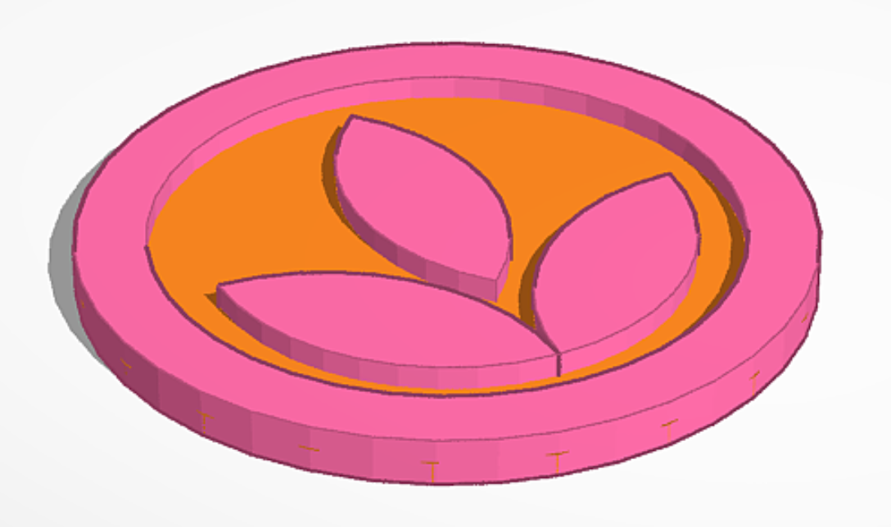

# Orchard Core Branding

Here you can find some guidelines and graphic assets for Orchard Core's branding.

# Branding Guidelines

When referring to Orchard Core, please use one of the logo variations, without altering anything apart from the resolution (so don't change the colors, aspect ratio, graphics, or anything else). For further information on how to use these assets and colors, see the [Branding Guidelines (PDF)](assets/orchard-core-branding-guidelines.pdf) (and [here's the AI version](assets/orchard-core-branding-guidelines.ai)).

# Logo Variations

## Color Logo

Other formats:

- [AI](assets/logo/color/orchard-core-logo-color.ai)
- [PDF](assets/logo/color/orchard-core-logo-color.pdf)
- [PNG, high-resolution](assets/logo/color/orchard-core-logo-color-high-resolution.png)
- [SVG](assets/logo/color/orchard-core-logo-color.svg)

## Dark Logo

Other formats:

- [AI](assets/logo/dark/orchard-core-logo-dark.ai)
- [PDF](assets/logo/dark/orchard-core-logo-dark.pdf)
- [PNG, high-resolution](assets/logo/dark/orchard-core-logo-dark-high-resolution.png)
- [SVG](assets/logo/dark/orchard-core-logo-dark.svg)

## Light Logo

The background of this logo in the display below is set to black so it's actually visible, but otherwise it has a transparent background.

Other formats:

- [AI](assets/logo/light/orchard-core-logo-light.ai)
- [PDF](assets/logo/light/orchard-core-logo-light.pdf)
- [PNG, high-resolution](assets/logo/light/orchard-core-logo-light-high-resolution.png)
- [SVG](assets/logo/light/orchard-core-logo-light.svg)

## Color Symbol Logo

Other formats:

- [AI](assets/logo/symbol/color/orchard-core-symbol-logo-color.ai)
- [PDF](assets/logo/symbol/color/orchard-core-symbol-logo-color.pdf)
- [SVG](assets/logo/symbol/color/orchard-core-symbol-logo-color.svg)

## Dark Symbol Logo

Other formats:

- [AI](assets/logo/symbol/dark/orchard-core-symbol-logo-dark.ai)
- [PDF](assets/logo/symbol/dark/orchard-core-symbol-logo-dark.pdf)
- [SVG](assets/logo/symbol/dark/orchard-core-symbol-logo-dark.svg)

## Light Symbol Logo

The background of this logo in the display below is set to black so it's actually visible, but otherwise it has a transparent background.

Other formats:

- [AI](assets/logo/symbol/light/orchard-core-symbol-logo-light.ai)
- [PDF](assets/logo/symbol/light/orchard-core-symbol-logo-light.pdf)
- [SVG](assets/logo/symbol/light/orchard-core-symbol-logo-light.svg)

# Printable 3D Logo

A printable 3D model of the Orchard Core symbol logo is available below.

- [STL](assets/stl/OrchardCoreLogo3D.stl)
- [Orca Slicer project file](assets/stl/OrchardCoreLogo3D.3mf) that contains the model with colored surfaces.

# Pomi CLI logo

Use the Pomi terminal-and-leaf symbol and wordmark for the Pomi CLI (`pomi`).
The transparent SVG logos below adapt to this documentation's light and dark themes.
All lettering is outlined, so no fonts or external assets are required.

Use the icon alone where the wordmark would be too small to read:

| Background / use | Logo | Icon |
| --- | --- | --- |
| Light | [SVG](assets/logo/pomi/svg/pomi-terminal-logo-light.svg) · [PNG](assets/logo/pomi/png/pomi-terminal-logo-light.png) | [SVG](assets/logo/pomi/svg/pomi-terminal-icon-light.svg) · [PNG](assets/logo/pomi/png/pomi-terminal-icon-light.png) |
| Dark | [SVG](assets/logo/pomi/svg/pomi-terminal-logo-dark.svg) · [PNG](assets/logo/pomi/png/pomi-terminal-logo-dark.png) | [SVG](assets/logo/pomi/svg/pomi-terminal-icon-dark.svg) · [PNG](assets/logo/pomi/png/pomi-terminal-icon-dark.png) |
| Black, single color | [SVG](assets/logo/pomi/svg/pomi-terminal-logo-black.svg) · [PNG](assets/logo/pomi/png/pomi-terminal-logo-black.png) | [SVG](assets/logo/pomi/svg/pomi-terminal-icon-black.svg) · [PNG](assets/logo/pomi/png/pomi-terminal-icon-black.png) |
| White, single color | [SVG](assets/logo/pomi/svg/pomi-terminal-logo-white.svg) · [PNG](assets/logo/pomi/png/pomi-terminal-logo-white.png) | [SVG](assets/logo/pomi/svg/pomi-terminal-icon-white.svg) · [PNG](assets/logo/pomi/png/pomi-terminal-icon-white.png) |

Choose SVG for scalable layouts and PNG for applications that do not support SVG.
`light` and `dark` name the intended background. Preserve the supplied colors,
aspect ratio, and clear space. See the
[CLI walkthrough](../../guides/remote-management/README.md) for usage.

# Fonts

We use the [Open Sans font family](https://fonts.google.com/specimen/Open+Sans). You can find all the font files in [the `assets/fonts` folder](https://github.com/OrchardCMS/OrchardCore/tree/main/src/docs/reference/branding/assets/fonts) of this documentation page. Be sure to adhere to [the font's license](assets/fonts/LICENSE.txt).

# Screensaver

Displays a bouncing (DVD-style) Orchard Core logo, with the logo being encoded into the file, i.e. it is self-contained and offline-compatible. Double-clicking anywhere displays a dialog to set up (or remove) a countdown in the middle of the screen.

- [Orchard Core Screensaver with Countdown](assets/orchard-core-screensaver.html)
