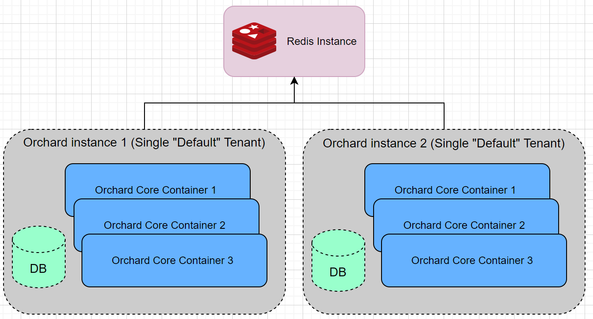

# Auto Setup (`OrchardCore.AutoSetup`)

The auto-setup module allows to automatically install the application/tenants on the first request.

## JSON Configuration Parameters

Auto-Setup parameters are defined in appsettings.json. Example excerpt:
```json
"OrchardCore": {
    "OrchardCore_AutoSetup": {
    "AutoSetupPath": "",
    "Tenants": [
        {
            "ShellName": "Default",
            "SiteName": "AutoSetup Example",
            "SiteTimeZone": "Europe/Amsterdam",
            "AdminUsername": "admin",
            "AdminEmail": "info@orchardproject.net",
            "AdminPassword": "OrchardCoreRules1!",
            "DatabaseProvider": "Sqlite",
            "DatabaseConnectionString": "",
            "DatabaseTablePrefix": "",
            "RecipeName": "SaaS"
        },
        {
            "ShellName": "AutoSetupTenant",
            "SiteName": "AutoSetup Tenant",
            "SiteTimeZone": "Europe/Amsterdam",
            "AdminUsername": "tenantadmin",
            "AdminEmail": "tenant@orchardproject.net",
            "AdminPassword": "OrchardCoreRules1!",
            "DatabaseProvider": "Sqlite",
            "DatabaseConnectionString": "",
            "DatabaseTablePrefix": "tenant",
            "RecipeName": "Agency",
            "RequestUrlHost": "",
            "RequestUrlPrefix": "tenant"
        }
    ]
}
```

| Parameter | Description |
| --- | --- |
| `AutoSetupPath` | The URL To Trigger AutoSetup For Each Tenant. If empty, auto-setup will be triggered on first tenant request e.g: /, /tenant-prefix |
| `Tenants` | The list of the tenants to install. |

| Parameter | Description |
| --- | --- |
| `ShellName` | The technical shell / tenant name. It can not be empty and must contain characters only. Use "Default" for the default tenant. |
| `SiteName` | The name of the site. |
| `AdminUsername` | The tenant username of the super user. |
| `AdminEmail` | The email of the tenant super user. |
| `AdminPassword` | The password of the tenant super user. |
| `DatabaseProvider` | The database provider. |
| `DatabaseConnectionString` | The connection string. |
| `DatabaseTablePrefix` | The database table prefix. Can be used to install a tenant on the same database. |
| `RecipeName` | The tenant installation Recipe name. |
| `RequestUrlHost` | The tenant host url. |
| `RequestUrlPrefix` | The tenant url prefix. |

!!! note
    Tenants array must contain the root tenant with `ShellName` equals to `Default`.  
    Each tenant will be installed on demand (on the first tenant request).  
    If AutoSetupPath is provided, it must be used to trigger the installation for each tenant e.g:
    `/autosetup` - trigger installation of the Root tenant.
    `/mytenant/autosetup` - auto-install mytenant.

### Environment Variables

Since JSON configuration contains admin-sensitive information, it is recommended to use environment variables instead.

```
"OrchardCore__OrchardCore_AutoSetup__AutoSetupPath": ""

"OrchardCore__OrchardCore_AutoSetup__Tenants__0__ShellName": "Default"
"OrchardCore__OrchardCore_AutoSetup__Tenants__0__SiteName": "AutoSetup Example"
"OrchardCore__OrchardCore_AutoSetup__Tenants__0__SiteTimeZone": "Europe/Amsterdam"
"OrchardCore__OrchardCore_AutoSetup__Tenants__0__AdminUsername": "admin"
"OrchardCore__OrchardCore_AutoSetup__Tenants__0__AdminEmail": "info@orchardproject.net"
"OrchardCore__OrchardCore_AutoSetup__Tenants__0__AdminPassword": "OrchardCoreRules1!"
"OrchardCore__OrchardCore_AutoSetup__Tenants__0__DatabaseProvider": "Sqlite"
"OrchardCore__OrchardCore_AutoSetup__Tenants__0__DatabaseConnectionString": ""
"OrchardCore__OrchardCore_AutoSetup__Tenants__0__DatabaseTablePrefix": ""
"OrchardCore__OrchardCore_AutoSetup__Tenants__0__RecipeName": "SaaS"

"OrchardCore__OrchardCore_AutoSetup__Tenants__1__ShellName": "AutoSetupTenant"
"OrchardCore__OrchardCore_AutoSetup__Tenants__1__SiteName": "AutoSetup Tenant"
"OrchardCore__OrchardCore_AutoSetup__Tenants__1__SiteTimeZone": "Europe/Amsterdam"
"OrchardCore__OrchardCore_AutoSetup__Tenants__1__AdminUsername": "tenantadmin"
"OrchardCore__OrchardCore_AutoSetup__Tenants__1__AdminEmail": "tenant@orchardproject.net"
"OrchardCore__OrchardCore_AutoSetup__Tenants__1__AdminPassword": "OrchardCoreRules1!"
"OrchardCore__OrchardCore_AutoSetup__Tenants__1__DatabaseProvider": "Sqlite"
"OrchardCore__OrchardCore_AutoSetup__Tenants__1__DatabaseConnectionString": ""
"OrchardCore__OrchardCore_AutoSetup__Tenants__1__DatabaseTablePrefix": ""
"OrchardCore__OrchardCore_AutoSetup__Tenants__1__RecipeName": "Agency"
"OrchardCore__OrchardCore_AutoSetup__Tenants__1__RequestUrlHost": ""
"OrchardCore__OrchardCore_AutoSetup__Tenants__1__RequestUrlPrefix": "tenant"
```

For testing purposes, you may add the above environment variables into a "web" profile in the launchSettings.json file of the OrchardCore.Cms.Web project.  
Then, start the web app project with the following command:

```
dotnet run -f net5.0 --launch-profile web
```

or 

```
dotnet run -f netcoreapp3.1 --launch-profile web
```

## Enabling Auto Setup Feature

To enable the Auto Setup feature, it is necessary to add it in the Web project's Startup file:

```csharp
    public void ConfigureServices(IServiceCollection services)
    {
        services
            .AddOrchardCms()
            .AddSetupFeatures("OrchardCore.AutoSetup");
    }
```

This feature is enabled by default in the default project included in the source code, but
is not with the application templates to prevent any unexpected behavior when a custom project
is created.

## Using Distributed Lock For Auto Setup

If multiple OrchardCore instances sharing the same database are launched, you might need a distributed lock for an atomic auto setup.

You should enable the Redis Lock feature in the startup file.

```csharp
    public void ConfigureServices(IServiceCollection services)
    {
        services
            .AddOrchardCms()
            .AddSetupFeatures("OrchardCore.Redis.Lock", "OrchardCore.AutoSetup");
    }
```
Make sure you set the Redis configuration string via an environment variable or a configuration file.

```
"OrchardCore__OrchardCore_Redis__Configuration": "192.168.99.100:6379,allowAdmin=true"
```

Optional Distributed Lock Parameters.

| Parameter | Description | Default Value |
| --- | --- |
| `LockTimeout` | The timeout in milliseconds to acquire a distributed auto setup lock. | 60 seconds |
| `LockExpiration` | The expiration in milliseconds of the distributed setup lock. | 60 seconds |

Lock configuration parameters are optional and can be set via environment variables or a configuration file.

```
"OrchardCore__OrchardCore_AutoSetup__LockOptions__LockTimeout": "10000"
"OrchardCore__OrchardCore_AutoSetup__LockOptions__LockExpiration": "10000"
```

## Additional information
Please refer to separate sections for additional information on setup:

- [OrchardCore.Setup - setting up an empty site](../Setup/README.md)
