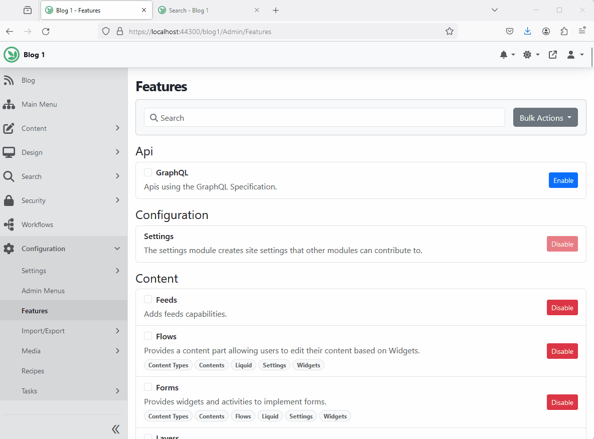

# Azure AI Search (`OrchardCore.Search.AzureAI`)

The Azure AI Search module allows you to manage Azure AI Search indices.

Before enabling the service, you'll need to configure the connection to the service. By default, you can navigate to `Configurations` >> `Settings` >> `Azure AI Search` and provide the Azure Search AI service info.

Alternatively, you can configure the Azure Search AI service for all your tenants using one of the configuration providers. For example, you can add the following to the `appsettings.json`:

```json
{
  "OrchardCore":{
    "OrchardCore_AzureAISearch":{
      "Endpoint":"https://[search service name].search.windows.net",
      "IndexesPrefix":"", // Specify value to prefix all indexes. If using the same instance for production and staging, provide the environment name here to prevent naming conflicts.
      "AuthenticationType":"ApiKey", // Use 'Default' for default authentication, 'ManagedIdentity' for managed-identity authentication, or 'ApiKey' for  key-based authentication.
      "IdentityClientId":null, // If you do not want to use system-identity, optionally, you may specify a client id to authenticate for a user assigned managed identity.
      "DisableUIConfiguration":false, // Enabling this option will globally disable per-tenant UI configuration. This implies that all tenants will utilize the settings specified in the appsettings.
      "Credential":{
        "Key":"the server key goes here"
      }
    }
  }
}
```

Then navigate to `Search` > `Indexes` to add an index.


## Indexing custom data

The indexing module supports multiple sources for indexing. This allows you to create indexes based on different data sources, such as content items or custom data.

To register a new source, you can add the following code to your `Startup.cs` file:

```csharp
services.AddAzureAISearchIndexingSource("CustomSource", o =>
{
    o.DisplayName = S["Custom Source in Provider"];
    o.Description = S["Create a Provider index based on custom source."];
});
```

Next, you need to implement the `IIndexProfileHandler` interface. In the `CreatingAsync` and `UpdatingAsync` methods, populate or update the `context.Model.Put(new AzureAISearchIndexMetadata() { IndexMappings = new ElasticsearchIndexMap() })` to define the index fields and their types. You may use `IndexProfileHandlerBase` to simplify your implementation. 

If you want the UI to capture custom data related to your source, implement `DisplayDriver<IndexEntity>`.  

## Recipes 

### Creating Azure AI Search Index Step

The `Create Index Step` create an Azure AI Search index if one does not already exists. It will also index all the content items starting at the beginning. 

```json
{
  "steps":[
    {
      "name":"azureai-index-create",
      "Indices":[
        {
            "Source": "Contents",
            "IndexName": "articles",
            "IndexLatest": false,
            "IndexedContentTypes": [
                "Article"
            ],
            "AnalyzerName":"standard.lucene",
            "Culture": "any"
        },
        {
            "Source": "Contents",
            "IndexName": "blogs",
            "IndexLatest": false,
            "IndexedContentTypes": [
                "Blog"
            ],
            "AnalyzerName":"standard.lucene",
            "Culture": "any"
        }
      ]
    }
  ]
}
```

!!! note
    It's recommended to use the `CreateOrUpdateIndexProfile` recipe step instead as the `azureai-index-create` step is obsolete. 

Here is an example of how to create `AzureAISearch` index profile using the `IndexProfile` for Content items.

```json
{
  "steps":[
    {
      "name":"CreateOrUpdateIndexProfile",
      "indexes": [
	    {
		    "Name": "BlogPostsAI",
		    "ProviderName": "AzureAISearch",
		    "Type": "Content",
		    "Properties": {
			    "ContentIndexMetadata": {
				    "IndexLatest": false,
				    "IndexedContentTypes": ["BlogPosts"],
				    "Culture": "any"
			    },
                "AzureAISearchIndexMetadata": {
                    "AnalyzerName": "standard"
                },
                "AzureAISearchDefaultQueryMetadata": {
                    "QueryAnalyzerName": "standard.lucene",
                    "DefaultSearchFields": [
                        "Content__ContentItem__FullText"
                    ]
                }
		    }
	    }
      ]
    }
  ]
}
```

### Reset Azure AI Search Index Step

The `Reset Index Step` resets an Azure AI Search index. Restarts the indexing process from the beginning in order to update current content items. It doesn't delete existing entries from the index.

```json
{
  "steps":[
    {
      "name":"azureai-index-reset",
      "Indices":[
        "IndexName1",
        "IndexName2"
      ]
    }
  ]
}
```

To reset all indices:

```json
{
  "steps":[
    {
      "name":"azureai-index-reset",
      "IncludeAll":true
    }
  ]
}
```

!!! note
    It's recommended to use the `ResetIndexProfile` recipe step instead as the `azureai-index-reset` step is obsolete. 

### Rebuild Azure AI Search Index Step

The `Rebuild Index Step` rebuilds an Azure AI Search index. It deletes and recreates the full index content.

```json
{
  "steps":[
    {
      "name":"azureai-index-rebuild",
      "Indices":[
        "IndexName1",
        "IndexName2"
      ]
    }
  ]
}
```

To rebuild all indices:

```json
{
  "steps":[
    {
      "name":"azureai-index-rebuild",
      "IncludeAll":true
    }
  ]
}
```

!!! note
    It's recommended to use the `RebuildIndexProfile` recipe step instead as the `azureai-index-rebuild` step is obsolete. 

## Search Module (`OrchardCore.Search`)

When the Search module is enabled along with Azure AI Search, you'll be able to use run the frontend site search against your Azure AI Search indices.

To configure the frontend site search settings, navigate to `Settings` >> `Search` >> `Site Search`. Select the default index to use.

### Using the Search Feature to Perform Full-Text Search


### Frontend Search Settings

