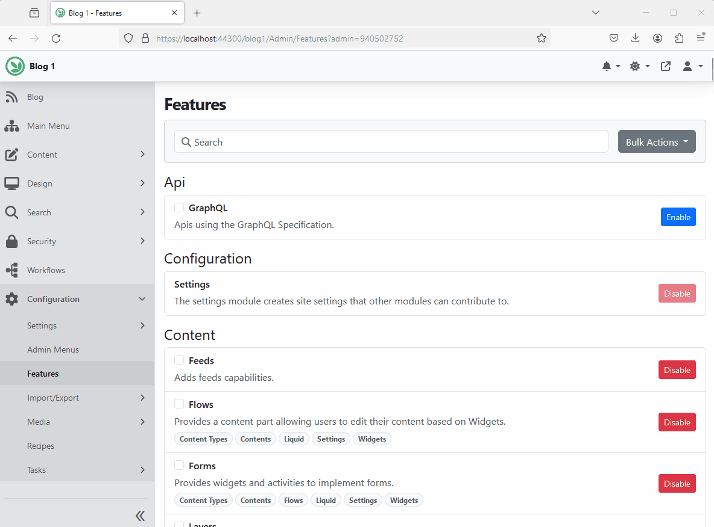

# Azure AI Search (`OrchardCore.Search.AzureAI`)

The Azure AI Search module allows you to manage Azure AI Search indices.

Before enabling the service, you'll need to configure the connection to the server. You can do that by adding the following into `appsettings.json` file

```
{
  "OrchardCore":{
    "OrchardCore_AzureAISearch":{
      "Endpoint":"https://[search service name].search.windows.net",
      "IndexesPrefix":"",
      "Credential":{
        "Key":"the server key goes here"
      }
    }
  }
}
```

Then navigate to `Search` > `Indexing` > `Azure AI Indices` to add an index.



## Recipes 

### Reset Azure AI Search Index Step

The `Reset Index Step` resets an Azure AI Search index. Restarts the indexing process from the beginning in order to update current content items. It doesn't delete existing entries from the index.

```json
{
  "steps":[
    {
      "name":"azureai-index-reset",
      "Indices":[
        "IndexName1",
        "IndexName2"
      ]
    }
  ]
}
```

To reset all indices:

```json
{
  "steps":[
    {
      "name":"azureai-index-reset",
      "IncludeAll":true
    }
  ]
}
```

### Rebuild Elasticsearch Index Step

The `Rebuild Index Step` rebuilds an Elasticsearch index. It deletes and recreates the full index content.

```json
{
  "steps":[
    {
      "name":"azureai-index-rebuild",
      "Indices":[
        "IndexName1",
        "IndexName2"
      ]
    }
  ]
}
```

To rebuild all indices:

```json
{
  "steps":[
    {
      "name":"azureai-index-rebuild",
      "IncludeAll":true
    }
  ]
}
```

## Search Module (`OrchardCore.Search`)

When the Search module is enabled along with Azure AI Search, you'll be able to use run the frontend site search against your Azure AI Search indices.

To configure the frontend site search settings, navigate to `Search` > `Settings`. On the `Content` tab, change the default search provider to `Azure AI Search`. Then click on the `Azure AI Search` tab select the default search index to use.

### Using the Search Feature to Perform Full-Text Search


### Frontend Search Settings

