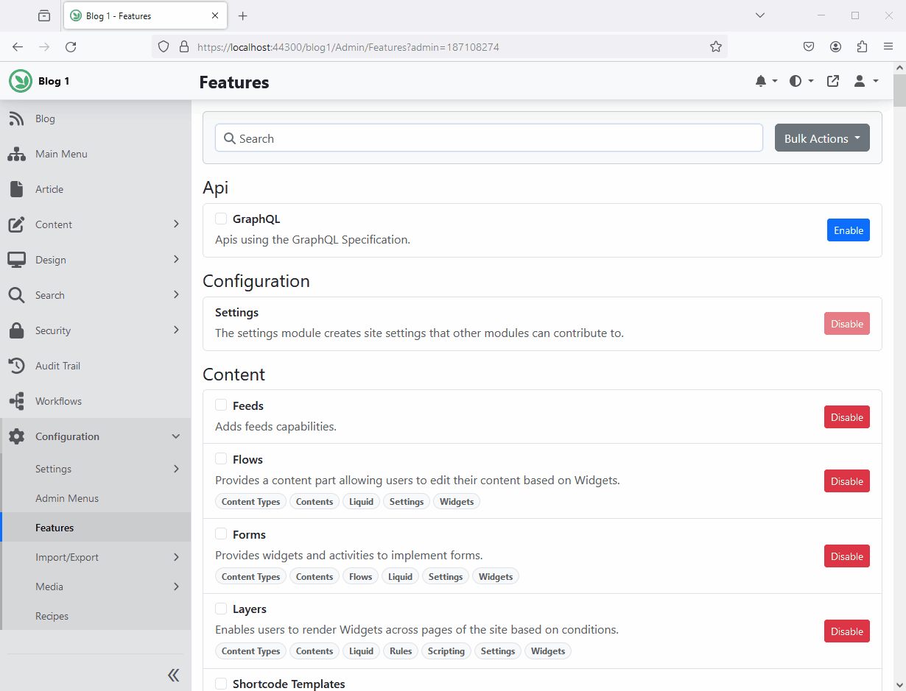

# Azure AI Search (`OrchardCore.Search.AzureAI`)

The Azure AI Search module allows you to manage Azure AI Search indices.

Before enabling the service, you'll need to configure the connection to the service. By default, you can navigate to `Configurations` >> `Settings` >> `Azure AI Search` and provide the Azure Search AI service info.

Alternatively, you can configure the Azure Search AI service for all your tenants using one of the configuration providers. For example, you can add the following to the `appsettings.json`:

```json
{
  "OrchardCore":{
    "OrchardCore_AzureAISearch":{
      "Endpoint":"https://[search service name].search.windows.net",
      "IndexesPrefix":"", // Specify value to prefix all indexes. If using the same instance for production and staging, provide the environment name here to prevent naming conflicts.
      "AuthenticationType":"ApiKey", // Use 'Default' for default authentication, 'ManagedIdentity' for managed-identity authentication, or 'ApiKey' for  key-based authentication.
      "IdentityClientId":null, // If you do not want to use system-identity, optionally, you may specify a client id to authenticate for a user assigned managed identity.
      "DisableUIConfiguration":false, // Enabling this option will globally disable per-tenant UI configuration. This implies that all tenants will utilize the settings specified in the appsettings.
      "Credential":{
        "Key":"the server key goes here"
      }
    }
  }
}
```

Then navigate to `Search` > `Indexing` > `Azure AI Indices` to add an index.


## Custom Sources  

As of version 3, Azure AI Search supports multiple index sources. When the **Contents** feature is enabled, the `Contents` source is automatically added, allowing you to create indexes based on content types.  

If you need to create an index for data that doesn't originate from Orchard's content items, you can do so by registering a custom index source. This gives you full control over where the data comes from and how it is mapped to your index fields.  

For example, let's define a custom source called **CustomSource**:  

```csharp
services.Configure<AzureAISearchOptions>(options =>
{
    options.AddIndexSource("CustomSource", o =>
    {
        o.DisplayName = S["Custom Source"];
        o.Description = S["Create an index based on custom data."];
    });
});
```  

Next, you need to implement the `IAzureAISearchEvents` interface. In the `MappingAsync` method, populate `context.Mappings` to define the index fields and their types.  

If you want the UI to capture custom data related to your source, implement `DisplayDriver<AzureAISearchIndexSettings>`.  

Additionally, you may implement `IAzureAISearchIndexSettingsHandler` to handle events such as data export during deployment, initialization, reset, synchronization, updates, or recipe validation.  


## Recipes 

### Creating Azure AI Search Index Step

The `Create Index Step` create an Azure AI Search index if one does not already exists. It will also index all the content items starting at the beginning. 

```json
{
  "steps":[
    {
      "name":"azureai-index-create",
      "Indices":[
        {
            "Source": "Contents",
            "IndexName": "articles",
            "IndexLatest": false,
            "IndexedContentTypes": [
                "Article"
            ],
            "AnalyzerName":"standard.lucene",
            "Culture": "any"
        },
        {
            "Source": "Contents",
            "IndexName": "blogs",
            "IndexLatest": false,
            "IndexedContentTypes": [
                "Blog"
            ],
            "AnalyzerName":"standard.lucene",
            "Culture": "any"
        }
      ]
    }
  ]
}
```

### Reset Azure AI Search Index Step

The `Reset Index Step` resets an Azure AI Search index. Restarts the indexing process from the beginning in order to update current content items. It doesn't delete existing entries from the index.

```json
{
  "steps":[
    {
      "name":"azureai-index-reset",
      "Indices":[
        "IndexName1",
        "IndexName2"
      ]
    }
  ]
}
```

To reset all indices:

```json
{
  "steps":[
    {
      "name":"azureai-index-reset",
      "IncludeAll":true
    }
  ]
}
```

### Rebuild Azure AI Search Index Step

The `Rebuild Index Step` rebuilds an Azure AI Search index. It deletes and recreates the full index content.

```json
{
  "steps":[
    {
      "name":"azureai-index-rebuild",
      "Indices":[
        "IndexName1",
        "IndexName2"
      ]
    }
  ]
}
```

To rebuild all indices:

```json
{
  "steps":[
    {
      "name":"azureai-index-rebuild",
      "IncludeAll":true
    }
  ]
}
```

## Search Module (`OrchardCore.Search`)

When the Search module is enabled along with Azure AI Search, you'll be able to use run the frontend site search against your Azure AI Search indices.

To configure the frontend site search settings, navigate to `Search` >> `Settings`. On the `Content` tab, change the default search provider to `Azure AI Search`. Then click on the `Azure AI Search` tab select the default search index to use.

### Using the Search Feature to Perform Full-Text Search


### Frontend Search Settings

