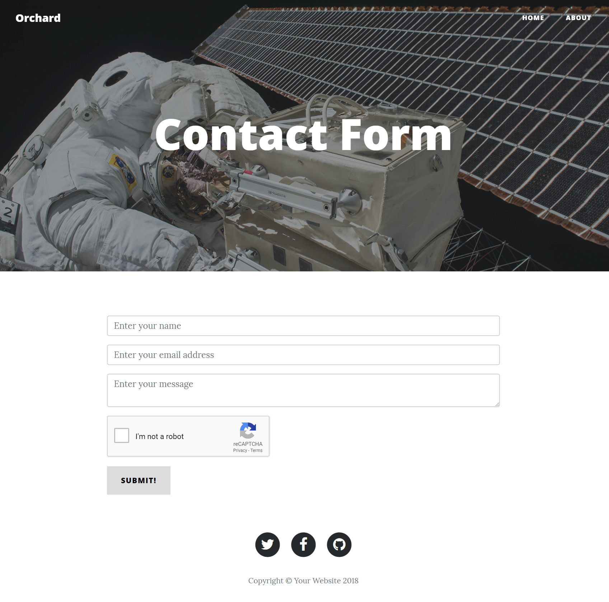

# Forms (`OrchardCore.Forms`)

The Forms module provides components in the form of widgets and workflow activities to create, validate and process forms.

## General Concepts

When building a form, there are primarily two aspects involved:

1. Building the form.
2. Processing the form when submitted.

These parts are independent from one another, so that you can just use the form builder and handle its submissions yourself, or provide the form HTML markup yourself but rely on workflows to handle form submission.  
The form-building part relies on the Form widget. To create a form, add a Form widget to a zone or to a content item that has the `FlowPart` attached.

### Creating a Form

Creating a form typically involves the following steps:

1. Make sure the Forms feature is enabled.
2. Create a new content item that has the `FlowPart` attached. If you used the Blog recipe, there will be a `Page` content type that you can use.
3. Add the Form widget.
4. Because the Form widget has the `FlowPart` attached, you can add other widgets to the Form widget. Add widgets such as Input, Textarea and Button to build up your form.

### Processing Form submissions

Once you have a form in place, you need to handle its submission. The Form widget has a field called **Action**, into which you can enter a URL to where the form should submit to. This could be the path to your own controller, but it can also be the URL pointing to a workflow type.  
Using a workflow is convenient because it doesn't require you to create a custom module.

Creating a workflow and associating it with a form typically involves the following steps:

1. Make sure the **HTTP Workflows Activities** feature is enabled.
2. Click on the Workflows menu item and create a new Workflow Type.
3. Add the **HTTP Request Event** event to the workflow. Make sure the **HTTP Method** field is set to **POST**.
4. Copy the generated workflow URL to your clipboard.
5. Click **Save** to save the changes and return to the workflow editor.
6. Make sure the HTTP Request Event activity is configured as the start activity (on the workflow editor, single-click the activity and click on the on/off icon). The activity will have a green color if it's the starting activity.
7. Add any other activities to validate and process the form submission. We will see a real-world example later on.
8. Click **Save** to save the workflow.
9. Go to the content item where you added a Form widget.
10. Paste the workflow URL into the Action field.
11. Save your content item.

At this point, you should be able to test out your form and its submission.

## Implementing a Contact Form

In the following walkthrough, we'll build an actual contact form and implement a form handler using a workflow.  
The contact form will include the following fields:

* A Validation Summary widget.
* A Name input widget.
* An Email input widget.
* A Message text area widget.
* A Google NoCaptcha widget to protect against automated form submissions.
* A Submit button widget.

The workflow will perform the following actions:

* Validate that the Name, Email and Message fields are not empty. If they are empty, we'll add Model State Validation errors.
* Validate the NoCaptcha.
* Send an email to the site owner that the contact form was submitted. The email will contain the submitted form fields.

### Creating the Contact Form

For this walkthrough, I am assuming you executed the `Blog` recipe when setting up the site, which will automatically create a `Page` content type with the `FlowPart` attached.
When you have a fresh new installation, the first thing we need to do is enable the following features:

* Forms
* HTTP Workflow Activities
* Email

Next, create a new Page content item and give it a title of *Contact Form*. Click the **Add Widget** button to add the **Form** widget.  
Give the Form a title of *Contact* and leave the Action field empty for now.

Add the following widgets to the Form widget:

* Validation Summary widget
* Input widget, Name = "Name", Type = "Text", Placeholder Text = "Enter your name"
* Input widget, Name = "Email", Type = "Email", Placeholder Text = "Enter your email address"
* Textarea widget, Name = "Message", Placeholder Text = "Enter your message"
* NoCaptcha widget (we'll configure the settings momentarily)
* Button widget, Text = "Submit!", Type = "Submit"

### Configuring NoCaptcha

When adding the NoCaptcha widget, a message was displayed that the NoCaptcha settings need to be configured before it will be displayed on the form. Let's do that right away.  
Click on the **NoCaptcha Settings** link that is displayed within the message. Alternatively, go to *Configuration* -> *Settings* -> *Forms*.

The Forms settings shows two fields: **SiteKey** and **Site Secret**. You can get these values for free from [https://developers.google.com/recaptcha/](https://developers.google.com/recaptcha/). The widget uses **reCaptcha V2**, so make sure to create Site Key and Site Secret for that version.  
Once you have generated a Site Key and Site Secret with Google, copy & paste those values in the SiteKey and Site Secret fields, respectively, and click the **Save** button.

The final form configuration should look something like this:


And on the front-end, it will look like this:



### Create the Contact Form Workflow

In order to validate the form input and send an email, we will create a workflow. 

From the admin menu, click the **Workflows** menu item. Next, click on **Create Workflow Type**.  
We're now asked to provide a name for the workflow. Enter "Contact Form Workflow", leave the other options as-is, and click **Save**. When you do, you will be redirected to the Workflow Editor, which is where we'll implement the Contact Form submission logic.

### Adding the Http Request Event

Click on the **Add Event** button and look for the activity named **HTTP Request**.  
For the Title, enter "Contact Form Submitted", and change the **HTTP Method** selection to **POST**.  
Copy the generated URL (without the scheme, host name and port number) to the clipboard, because we will need it to update the form we created.  
Click **Save** to return to the workflow editor.

Back on the workflow editor, we have now a single activity. Single-click this activity and click on the left-most icon to turn this activity into the starting activity.

### Adding the Fork Activity

There are various aspects of the form that we need to validate: we want to make sure the user entered a value for the **Name**, **Email** and **Message** fields, and we want to make sure the **captcha** is valid.  
Although we could perform each field validation sequentially (i.e. one at a time), we are going to do it in parallel. The advantage of doing so is that we can perform form field validation without having to check the result of each validation immediately. Instead, we can simply check the `ModelState.IsValid` property after all form fields have been validated. This keeps the workflow simplified, and works similar to when you would perform this validation from code.  
To execute branches of execution in parallel, we need to add the **Fork** activity, so go ahead and click the **Add Task** button and look for the Fork activity.  
In the Fork activity editor, enter `"Validate Form Fields"` as the Title, and enter the following outcomes: `"Validate Name, Validate Email, Validate Message, Validate Captcha"`.  
Click on **Save** to save the changes and to be returned to the workflow editor.

Connect the **Http Request** activity to the **Fork** activity you just added.

### Adding Name, Email and Message Validation

Next, we will do the following for each of Name, Email and Message:

Add the **Validate Form Field** activity. Enter a title of `"Validate Name"` for the Name field, `"Validate Email"` for the Email field and `"Validate Message"` for the Message field.  
Enter the appropriate field name for the **Field Name** field ("Name", "Email" and "Message", respectively).  
In the **Error Message** field, enter `"<field name here> is required"`.

> The **Validate Form Field** activity in the Beta 2 version of the Forms module only supports checking if the form field is empty or not. The RC version will have support for other kinds of validation, including the ability to provide custom validation.

### Adding NoCaptcha

To add the NoCaptcha validation activity, click **Add Task** and find the **Validate NoCaptcha**. Since there is nothing to configure on this activity, you'll be redirected straight to the workflow editor when you click Add.

Once you have added all 4 validation tasks, connect the Fork activity to the validation activities using the appropriate outcomes. For example, connect the "Validate Name" outcome of the Fork activity to the "Validate Name" activity.

If the specified form field is empty, the **Validate Form Field** activity will *add a model validation error to the ModelState* dictionary. The same goes for the **Validate NoCaptcha** activity if the captcha failed. This is useful, because we now only have to add a single check to see if there are *any* model validation errors.
Before we do that however, we first need to *join* the forked workflow execution back into a single flow.

### Adding the Join Activity

The **Join** activity will merge the forked workflow back into a single flow of execution. There are two modes: **Wait Any** and **Wait All**. In our case, we need the **Wait All** mode, because we need all validation steps to finish before continuing.  
Go ahead and add the Join activity to the workflow, and *make sure to connect the **Done** outcome of each validation task* to the Join activity. The "Done" outcome will execute regardless of whether or not the form field validation step failed or not, which is exactly what we want.

### Adding the Validate Form Activity

The **Validate Form** activity will check if the ModelState is valid or not. If any validation errors occurred, it will return False, and True otherwise.  
Go ahead and add the Validate Form activity and connect it to the Join activity.

Next, we have to implement the two possible outcomes: **Valid** and **Invalid**.

If the outcome is Invalid, we will redirect back to the form. Since the form contains a Validation Summary, it will display all validation errors.  
If the outcome is Valid, we want to send an email and redirect the user to a Thank You page.

Let's implement the Redirect first.

### Adding the First Redirect Activity

Click the **Add Task** button and locate the Redirect activity. Use "Display Form Errors" for the title, and enter the relative path to the Contact Form content item (`/contact-form` if you used the same title as I did).  
Click **Save** and connect the Invalid outcome of the Validate Form activity to the Redirect activity you just added.

### Adding the Email Activity

Click the **Add Task** button and locate the Send Email activity. Enter the following values:

* Title: `Send Email to Site Admin`
* Sender: (leave empty)
* Recipients: `admin@orchardcore.io`
* Subject: `Contact Form submitted by {{ Request.Form.Name }}!`
* Body:

```liquid
<p>The following information was submitted:<p/>
<p>Name: {{ Request.Form.Name }}</p>
<p>Email: {{ Request.Form.Email }}</p>
<p>Message: {{ Request.Form.Message }}</p>
```

#### Configuring SMTP

In order to try out sending emails, you will need to configure the SMTP settings. You can do so via *Configuration* -> *Settings* -> *Smtp*. For development purposes, I am a big fan of [Smtp4Dev](https://github.com/rnwood/smtp4dev), which makes it super easy to try out sending emails *without actually sending them*. It's basically an SMTP host that intercepts emails being sent that you can then inspect.  
When configuring the SMTP settings in Orchard, make sure to provide the **Sender email address**, which will be used by default (remember, we didn't specify a Sender in the Send Email activity). Enter `system@orchardcore.io` or any other valid email address you like.  
If you're using Smtp4Dev, make sure to enter `localhost` in the Host name field, and the configured port number.

### Adding the Second Redirect Activity

After the email is sent, we want to redirect the user to a "Thank You" page. Go ahead and add a Redirect activity, using `Display Thank You Page` as the title and `/thank-you` as the URL. Make sure to connect the *Done* outcome of the Send Email activity to this new Redirect activity.

### Adding a Thank You Page

Create a new Page content item with a title of `Thank You!`, and make sure its Permalink is `thank-you` after saving. Add any widgets to this page that you like. For example, add the **Paragraph** widget with the following text: `Thank you for reaching out! We'll get back to you soon.`

### Updating the Contact Form widget

Now that our workflow is done, we need to update the Contact Form widget with the Workflow URL that was generated for us in the **HTTP Request** activity. Unless you have that URL still on your clipboard, go back to the first activity on the workflow, double-click it to get to its activity editor, and copy the URL (without the scheme, host and port number; just the path).  
Go back to the Contact Form page content item, expand the Contact Form widget and paste in the URL into the **Action** field and save your changes.

### Try it out!

Go ahead and try it out. Navigate to <https://localhost:44300/contact-form> and fill out the form. If all went well, you should see an email coming in and be redirected to the Thank You page.  
If you leave any field empty or do not pass the captcha, you should be redirected to the Contact Form page and see the validation errors.

### Fixing the Lost Field Values Issue

There's one issue with the form that I left out intentionally to the very last. To see the problem, try entering some values in the form, except for one (e.g. leave Email empty, or do not check the captcha checkbox). When you submit the form, notice that the values you entered have disappeared.  
Normally what happens when you submit a form to an MVC controller, the model binder will bind the fields to some view model. During the model binding phase, MVC will add model state entries. However, we are not invoking model binding anywhere. We only add model validation errors when we identify a missing value.  
To fix this, we must add the **Bind Form Model State** activity to the workflow, and connect it in between the first activity (Http Request) and the second activity (the Fork activity). This will cause all Form fields to be copied into `ModelState`, which is used when displaying the form again.

The final workflow should look like this:


## Future Improvements

Implementing a workflow that handles form submissions is easy, but the workflow becomes big quite quickly as soon as you start adding validation logic to the mix. In the next version of the Forms module, there will be an easier way to validate Form submissions in combination with the Form widget. The Form widget will contain all of the validation settings, and there will be a single workflow activity that validates the submitted values against those settings.  
The low-level validation activities will remain part of the toolbox to support workflow validation for forms that are not built with the Form widget, but implemented as raw HTML for example.
