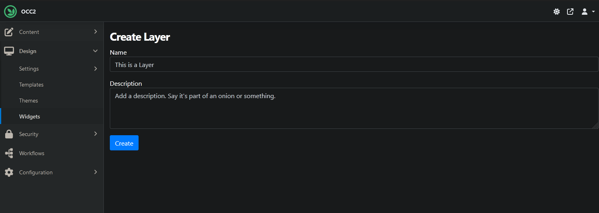
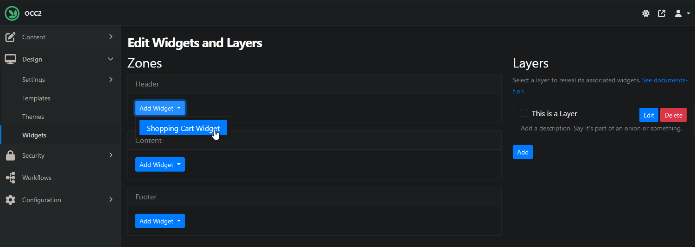
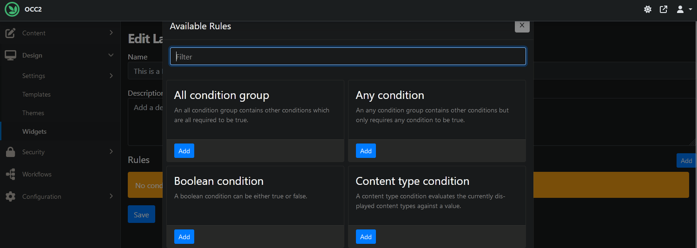

# Layers (`OrchardCore.Layers`)

The Layers can be managed from the `Design > Widgets` page in the admin.

A Layer has a name, a description and a rule in which you specify a condition to render the widgets that will be associated to this Layer.



_The Layer needs to be saved first to reveal the Rule option._

When you add a widget into a zone, you must also select a Layer to associate the widget with. The widget is displayed if the Layer's corresponding display rule evaluates to true.



You can select the checkbox next to each Layer in order to highlight the associated Widgets on the left.

In the rule you may specify multiple conditions which must evaluate to true, or you can use condition groups, `All` or `Any`, to vary the rule.



_There can be multiple Rules in place for one Layer._

!!! note
    Layer rules have been upgraded from a single JavaScript rule to conditions during RC2, so this document may differ depending on your version.
    A migration converts existing JavaScript rules into either matching conditions or JavaScript conditions.

## Conditions

Here are some available conditions:

| Condition | Description |
| -------- | ----------- |
| `Homepage` | Whether the current page is the site homepage |
| `Is anonymous` | Whether the current user is anonymous, i.e. not authenticated. |
| `Is authenticated` | Whether the current user is authenticated. |
| `Role` | A role condition evaluates the current users roles against a value. |
| `Url` | A url condition evaluates the current url against a value. |
| `Culture` | A culture condition evaluates the current ui culture against a value. |
| `Content Type` | A content type condition evaluates the currently displayed content types against a value. |
| `Javascript` | A script condition written in JavaScript. |
| `All` | An all condition group contains other conditions which are all required to be true. |
| `Any` | An any condition group contains other conditions but only requires any condition to be true. |
| `Boolean` | A boolean condition evaluating to `true` or `false`. |

Ex: The `Always` Layer has a `Boolean Condition` set to `true`, so widgets on this Layer will always be shown.

Refer to [Rules](../Rules/README.md) for more information about creating custom conditions.

Refer to [Scripting](../Scripting/README.md#layers-orchardcorelayers) for more information about the available JavaScript methods.

## Zones

The zones that are listed can be set in the `Design > Settings > Zones` admin page.

You must have declared the corresponding zones as sections in your theme:

=== "Liquid"

    ``` liquid
    
    ```

=== "Razor"

    ``` html
    @await RenderSectionAsync("Header", required: false)
    ```

## Video

<iframe width="560" height="315" src="https://www.youtube-nocookie.com/embed/NCvytsdED_o" title="YouTube video player" frameborder="0" allow="accelerometer; autoplay; clipboard-write; encrypted-media; gyroscope; picture-in-picture" allowfullscreen></iframe>
