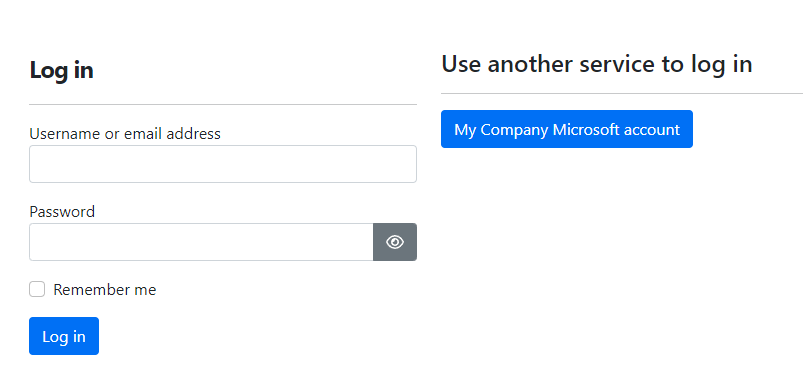

# Microsoft Authentication (`OrchardCore.Microsoft.Authentication`)

This module configures Orchard to support Microsoft Account and/or Microsoft Microsoft Entra ID (Azure Active Directory) accounts.

## Microsoft Account

Authenticates users with their Microsoft Account.
If the site allows to register new users, a local user is created and the Microsoft Account is linked.
If a local user with the same email is found, then the external login is linked to that account, after authenticating.

You should create an app in the [Application Registration Portal](https://apps.dev.microsoft.com) and add the web platform.

Give a name for your App, create a secret that you will use it as AppSecret in Orchard, and allow the implicit flow. The default callback at Orchard is [tenant]/signin-microsoft or can be set as needed.

Configuration can be set through the _Microsoft Authentication -> Microsoft Account_ settings menu in the admin dashboard.

Available settings are:

- AppId: Application id in the Application Registration Portal.
- AppSecret: The application secret that will be used by Orchard.
- CallbackPath: The request path within the application's base path where the user-agent will be returned. The middleware will process this request when it arrives.
If no value is provided, setup Microsoft Account app to use the default path /signin-microsoft.

## Microsoft Entra ID (Azure Active Directory)

Authenticates users with their Microsoft Entra ID Account, like Microsoft work or school accounts. If the site allows to register new users, a local user is created and the Microsoft Entra ID account is linked. If a local user with the same email is found, then the external login is linked to that account, after authenticating.

First, you need to create an Microsoft Entra ID app on the [Azure Portal](https://portal.azure.com) for your Microsoft Entra ID tenant.

1. Go to the "Azure Active Directory" menu, which will open your organization's Active Directory settings.
2. Open "App registrations" and click "New registration" to start creating a new app registration.
3. Use the following settings:
    - Name: We suggest the name of your web app, e.g. "My App". This is not the same display name that you need to specify for the login later and it doesn't need to match anything else.
    - Supported account types: The feature supports both single and multitenant Microsoft Entra ID, but not personal accounts.
    - Redirect URI: While supposedly optional, you have to specify one for the login flow to work with web apps. Add the URL that will handle Microsoft Entra ID login redirects; by default, this is `/signin-oidc` under your app's root URL, e.g. "https://example.com/signin-oidc" (upon login, users will be redirected to the page they visited previously, this isn't for that).
4. Once the app is created, note the following details of it, as displayed in the Azure Portal, which will be necessary to configure in Orchard Core later:
    - Application (client) ID
    - Directory (tenant) ID
5. Configure the rest of the authentication settings of the app under its "Authentication" menu. There, under "Implicit grant and hybrid flows", enable both "Access tokens (used for implicit flows)" and "ID tokens (used for implicit and hybrid flows)". Without these, login will fail with errors.
6. Configure the `email` claim under the "Token configuration" menu. Click "Add optional claim", as "Token type" select "ID", then select "email" and click "Add". Without this, Orchard can't match logins based on the user's email, and thus existing users won't be able to log in.

You are now ready to configure Microsoft Entra ID login in Orchard too. After enabling the "Microsoft Entra ID (Azure Active Directory) Authentication" feature, you will see the "Security" → "Microsoft Entra ID" menu in the admin. We recommend to configure at least the following settings:

- Display Name: The text that will be displayed on the Orchard login screen. We recommend something like "My Company Microsoft account".
- AppId: Use the above-mentioned "Application (client) ID" from the Azure Portal.
- TenantId: Use the above-mentioned "Directory (tenant) ID" from the Azure Portal.
- CallbackPath: We recommend not changing this unless you want to handle the login callback from your custom code, or if the `/signin-oidc` path is used by something else. This is the path within the application's base path where the user-agent will be returned after login. The middleware will process this request when it arrives. If no value is provided, the default `/signin-oidc` is used, which requires no further setup. If you change this, you will also need to use it under "Redirect URIs" of the app in the Azure Portal.

Now, the login screen will display a button for Microsoft Entra ID login:



Existing users who have the same e-mail address in Orchard and in Microsoft Entra ID will be able to log in and attach their two accounts. New users will be able to register if registration is otherwise enabled and set up, see below.

### Recipe Step

The Microsoft Entra ID can be set during recipes using the settings step. Here is a sample step:

```json
{
"name": "azureADSettings",
"appId": "86eb5541-ba2b-4255-9344-54eb73cec375",
"tenantId": "4cc363b6-5254-4b8c-bc1b-e951a5fc85ac",
"displayName": "Orchard Core AD App",
"callbackPath": "/signin-oidc"
}
```

## User Registration

- If you want to enable new users to register to the site through their Microsoft Account and/or Microsoft Microsoft Entra ID login, the `OrchardCore.Users.Registration` feature must be enabled and setup accordingly.
- Apart from during login, existing users can link their account to their Microsoft Account and/or Microsoft Microsoft Entra ID login through the External Logins link from User menu.

## Microsoft Account & Microsoft Entra ID (Azure Active Directory) Settings Configuration

The `OrchardCore.Microsoft.Authentication` module allows the user to use configuration values to override the settings configured from the admin area by calling the `ConfigureMicrosoftAccountSettings()` or `ConfigureAzureADSettings()` extension methods on `OrchardCoreBuilder` when initializing the app.

The following configuration values can be customized:

```json
    "OrchardCore_Microsoft_Authentication_MicrosoftAccount": {
      "AppId": "",
      "AppSecret": "",
      "CallbackPath": "/signin-microsoft",
      "SaveTokens": false
    }
```

```json
    "OrchardCore_Microsoft_Authentication_AzureAD": {
      "DisplayName": "",
      "AppId": "",
      "TenantId": "",
      "CallbackPath": "/signin-oidc",
      "SaveTokens": false
    }
```

For more information please refer to [Configuration](../../core/Configuration/README.md).
