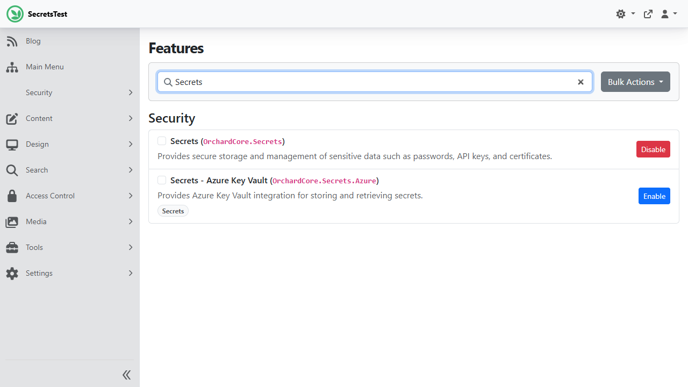
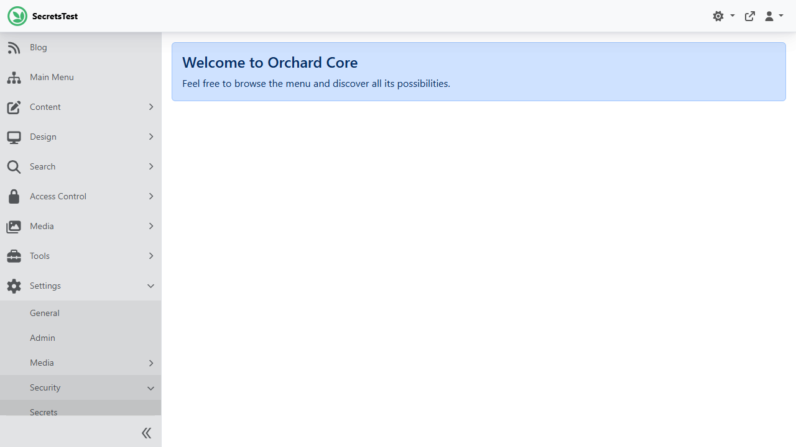
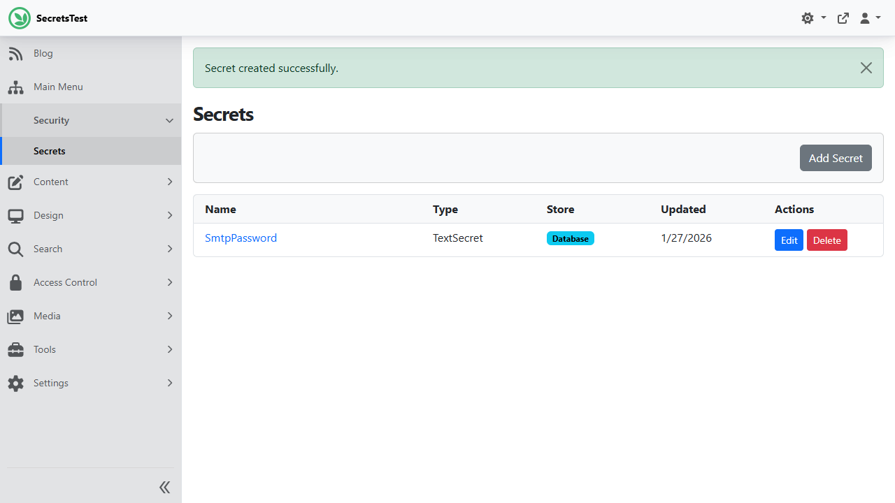
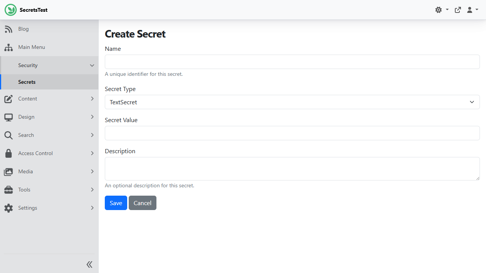
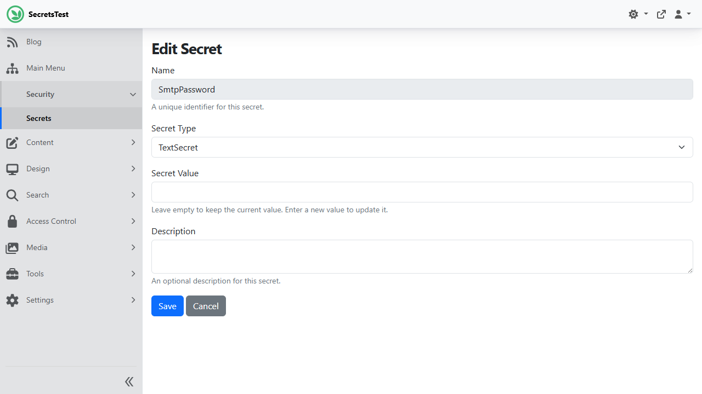

# Secrets (`OrchardCore.Secrets`)

The Secrets module provides a secure, centralized way to store and manage sensitive data such as passwords, API keys, connection strings, and certificates. It addresses common challenges in managing secrets across development, staging, and production environments.

## Why Use the Secrets Module?

### The Problem

Managing sensitive configuration in web applications presents several challenges:

1. **Security Risks**: Storing passwords and API keys in `appsettings.json` or environment variables can lead to accidental exposure through source control, logs, or configuration dumps.

2. **Deployment Complexity**: When using deployment plans or recipes to set up new tenants, secrets cannot be included directly without compromising security.

3. **Multi-Environment Management**: Different environments (development, staging, production) often need different secrets, making configuration management complex.

4. **Certificate Management**: Storing certificates for OpenID Connect, signing tokens, or SSL can be problematic, especially in multi-server deployments where file-based certificates aren't accessible.

5. **Audit and Rotation**: Without a centralized secret store, it's difficult to track who accessed secrets or rotate them across all services.

### The Solution

The Secrets module provides:

- **Encrypted Storage**: All secrets are encrypted using ASP.NET Core Data Protection before being stored in the database.
- **Centralized Management**: A single admin UI to view, create, update, and delete all secrets.
- **Multiple Backends**: Support for database storage (default) and Azure Key Vault for enterprise scenarios.
- **Deployment Support**: Export secret metadata (not values) and import secrets from environment variables during setup.
- **Type Safety**: Different secret types (text, RSA keys, X.509 certificates) with appropriate handling for each.

## Common Use Cases

### 1. SMTP Email Credentials

Store your email server password securely instead of in configuration files:

```csharp
// In your email service
var passwordSecret = await _secretManager.GetSecretAsync<TextSecret>("Email.SmtpPassword");
var password = passwordSecret?.Text;
```

### 2. Third-Party API Keys

Manage API keys for services like payment gateways, analytics, or social media:

```csharp
// Store API keys with descriptive names
await _secretManager.SaveSecretAsync("Stripe.SecretKey", new TextSecret { Text = "sk_live_..." });
await _secretManager.SaveSecretAsync("SendGrid.ApiKey", new TextSecret { Text = "SG...." });
await _secretManager.SaveSecretAsync("Google.MapsApiKey", new TextSecret { Text = "AIza..." });
```

### 3. OpenID Connect Signing Keys

Store RSA keys for JWT token signing without filesystem dependencies:

```csharp
// Generate and store signing keys
var rsaSecret = new RsaKeySecret 
{ 
    IncludesPrivateKey = true,
    PublicKey = Convert.ToBase64String(rsa.ExportRSAPublicKey()),
    PrivateKey = Convert.ToBase64String(rsa.ExportRSAPrivateKey())
};
await _secretManager.SaveSecretAsync("OpenId.SigningKey", rsaSecret);
```

### 4. Database Connection Strings

Protect database credentials, especially for production environments:

```csharp
var connectionSecret = await _secretManager.GetSecretAsync<TextSecret>("Database.ConnectionString");
var connectionString = connectionSecret?.Text ?? defaultConnectionString;
```

### 5. Multi-Tenant SaaS Deployments

When deploying new tenants with recipes, define which secrets are needed without exposing values:

**Recipe file (safe to commit):**
```json
{
  "steps": [
    {
      "name": "Secrets",
      "Secrets": [
        { "Name": "Smtp.Password" },
        { "Name": "Payment.ApiKey" },
        { "Name": "Analytics.TrackingId" }
      ]
    }
  ]
}
```

**Environment variables (set during deployment):**
```bash
export OrchardCore_Secrets__Smtp__Password="actual-password"
export OrchardCore_Secrets__Payment__ApiKey="actual-api-key"
export OrchardCore_Secrets__Analytics__TrackingId="UA-12345"
```

### 6. Azure Key Vault for Production

For production environments, use Azure Key Vault for hardware-backed security and centralized secret management:

```json
{
  "OrchardCore": {
    "OrchardCore_Secrets_Azure": {
      "VaultUri": "https://mycompany-prod.vault.azure.net/"
    }
  }
}
```

With Managed Identity, no credentials are needed in configuration—Azure handles authentication automatically.

## Features

- Secure storage of sensitive data using ASP.NET Core Data Protection
- Multiple secret store providers (database, Azure Key Vault)
- Three secret types: Text, RSA Keys, and X.509 Certificates
- Admin UI for managing secrets
- ViewComponent for selecting secrets in other module UIs
- Recipe support for importing secrets during setup
- Deployment step for exporting secret metadata

## Getting Started

### Enabling the Feature

1. Navigate to **Admin → Configuration → Features**
2. Search for "Secrets"
3. Click **Enable** on the "Secrets" feature



### Accessing the Secrets Admin

Once enabled, the Secrets admin is available under the **Settings → Security** menu:

1. In the admin sidebar, click **Settings** to expand the menu
2. Click **Security** to see the security settings
3. Click **Secrets** to open the secrets management page



### Managing Secrets

#### Viewing Secrets

The Secrets index page displays all stored secrets with their name, type, store, and last updated date.



#### Creating a Secret

1. Click **Add Secret** on the Secrets index page
2. Fill in the required fields:
   - **Name**: A unique identifier for the secret (e.g., `SmtpPassword`, `ApiKey`)
   - **Secret Type**: Select the type of secret (e.g., `TextSecret`)
   - **Secret Value**: The actual secret value (will be encrypted before storage)
   - **Description**: Optional description for documentation purposes
3. Click **Save**



#### Editing a Secret

1. Click **Edit** next to the secret you want to modify
2. Update the fields as needed
   - Note: The secret value field is empty for security. Leave it empty to keep the existing value, or enter a new value to update it.
3. Click **Save**



#### Deleting a Secret

1. Click **Delete** next to the secret you want to remove
2. Confirm the deletion in the dialog

## Configuration

### Database Store (Default)

The database store is enabled by default when the Secrets module is enabled. It uses ASP.NET Core Data Protection to encrypt secrets before storing them in the database.

### Azure Key Vault Store

To use Azure Key Vault as a secret store, enable the `OrchardCore.Secrets.Azure` feature and configure it in your `appsettings.json`:

```json
{
  "OrchardCore": {
    "OrchardCore_Secrets_Azure": {
      "VaultUri": "https://your-vault.vault.azure.net/",
      "TenantId": "your-tenant-id",
      "ClientId": "your-client-id",
      "ClientSecret": "your-client-secret"
    }
  }
}
```

If running in Azure with Managed Identity, you can omit the `TenantId`, `ClientId`, and `ClientSecret` - the module will use `DefaultAzureCredential` which supports managed identities automatically.

## Using Secrets Programmatically

### Retrieving a Secret

```csharp
public class MyService
{
    private readonly ISecretManager _secretManager;

    public MyService(ISecretManager secretManager)
    {
        _secretManager = secretManager;
    }

    public async Task UseSecretAsync()
    {
        var secret = await _secretManager.GetSecretAsync<TextSecret>("MyApiKey");
        if (secret != null)
        {
            var apiKey = secret.Text;
            // Use the API key
        }
    }
}
```

### Saving a Secret

```csharp
var secret = new TextSecret { Text = "my-secret-value" };
await _secretManager.SaveSecretAsync("MyApiKey", secret);
```

### Saving to a Specific Store

```csharp
// Save to Azure Key Vault specifically
await _secretManager.SaveSecretAsync("MyApiKey", secret, "AzureKeyVault");
```

## Recipe Step

Secrets can be imported using a recipe step. Note that for security reasons, you should provide secret values via environment variables rather than directly in the recipe file.

### Recipe Format

```json
{
  "steps": [
    {
      "name": "Secrets",
      "Secrets": [
        {
          "Name": "SmtpPassword",
          "Store": "Database"
        },
        {
          "Name": "ApiKey",
          "Store": "AzureKeyVault"
        }
      ]
    }
  ]
}
```

### Providing Secret Values

Secret values should be provided via environment variables using one of these patterns:

- `OrchardCore_Secrets__SecretName` (double underscore)
- `OrchardCore:Secrets:SecretName` (colon-separated)

For example:
```bash
export OrchardCore_Secrets__SmtpPassword=mypassword
export OrchardCore_Secrets__ApiKey=myapikey
```

## Secret Types

The module supports three built-in secret types, each designed for specific use cases:

### Choosing Between RsaKeySecret and X509Secret

Both `RsaKeySecret` and `X509Secret` can be used for cryptographic operations, but they serve different deployment models:

| Aspect | RsaKeySecret | X509Secret |
|--------|--------------|------------|
| **Storage** | Key material stored in database (encrypted) | Reference to OS certificate store |
| **Portability** | ✅ Travels with database backup | ❌ Cert must exist on each machine |
| **Container-friendly** | ✅ Works without mounting certs | ❌ Requires cert pre-installed |
| **Key generation** | ✅ Generate in Admin UI | ❌ Create cert externally |
| **Cross-platform** | ✅ Works identically everywhere | ⚠️ Enumeration varies by OS |
| **Certificate metadata** | ❌ No issuer, expiry, subject | ✅ Full X.509 metadata |
| **CA-issued certs** | ❌ Not applicable | ✅ Works with CA certs |
| **Security model** | Key stored encrypted in DB | Key never leaves OS secure store |

**When to use RsaKeySecret:**
- OpenID Connect signing keys that must persist across container restarts
- JWT signing for APIs (self-contained, portable)
- Multi-server deployments where keys should auto-sync via database
- Development/testing without certificate infrastructure

**When to use X509Secret:**
- CA-issued certificates (SSL/TLS, client authentication)
- Azure App Service certificates uploaded via portal
- Enterprise PKI where certificates are managed by IT
- Scenarios requiring certificate metadata (issuer validation, expiry checking)

### TextSecret

The most common secret type for storing string values like passwords, API keys, and connection strings.

```csharp
public class TextSecret : SecretBase
{
    public string Text { get; set; }
}
```

**Use cases:**
- SMTP passwords
- API keys (Stripe, SendGrid, etc.)
- Database connection strings
- OAuth client secrets

**Example:**
```csharp
// Store an API key
var secret = new TextSecret { Text = "sk_live_abc123..." };
await _secretManager.SaveSecretAsync("Stripe.SecretKey", secret);

// Retrieve and use
var retrieved = await _secretManager.GetSecretAsync<TextSecret>("Stripe.SecretKey");
var apiKey = retrieved?.Text;
```

### RsaKeySecret

For storing RSA cryptographic keys directly in the secrets store. The key material is encrypted and stored in the database, making it portable across deployments.

```csharp
public class RsaKeySecret : SecretBase
{
    public string PublicKey { get; set; }      // Base64-encoded RSA public key
    public string PrivateKey { get; set; }     // Base64-encoded RSA private key
    public bool IncludesPrivateKey { get; set; }
    public int KeySize { get; set; } = 2048;
}
```

**Use cases:**
- OpenID Connect signing keys (addresses issues #7137, #13205)
- JWT token signing/validation
- Data encryption/decryption
- Digital signatures
- Any scenario requiring portable RSA keys

**Benefits over X509Secret:**
- Key travels with database backup/restore
- Works in containers without cert mounting
- Can generate keys directly in Admin UI
- Works identically on Windows/Linux/macOS
- Automatically shared across servers via database

**Example:**
```csharp
// Generate and store a new RSA key pair
using var rsa = RSA.Create(2048);
var secret = new RsaKeySecret
{
    PublicKey = Convert.ToBase64String(rsa.ExportRSAPublicKey()),
    PrivateKey = Convert.ToBase64String(rsa.ExportRSAPrivateKey()),
    IncludesPrivateKey = true,
    KeySize = 2048
};
await _secretManager.SaveSecretAsync("OpenId.SigningKey", secret);

// Retrieve and use for signing
var retrieved = await _secretManager.GetSecretAsync<RsaKeySecret>("OpenId.SigningKey");
using var signingKey = RSA.Create();
signingKey.ImportRSAPrivateKey(Convert.FromBase64String(retrieved.PrivateKey), out _);
```

### X509Secret

For referencing X.509 certificates from the operating system's certificate store. The secret stores only the certificate reference (thumbprint, location, store name) - the actual certificate remains in the OS certificate store.

```csharp
public class X509Secret : SecretBase
{
    public StoreLocation StoreLocation { get; set; }  // CurrentUser or LocalMachine
    public StoreName StoreName { get; set; }          // My, Root, etc.
    public string Thumbprint { get; set; }            // Certificate thumbprint
    
    public X509Certificate2 GetCertificate();         // Loads cert from OS store
}
```

**Use cases:**
- CA-issued SSL/TLS certificates
- Code signing certificates
- Azure App Service certificates (uploaded via portal)
- Client authentication certificates
- Enterprise PKI scenarios
- Any certificate managed by IT infrastructure

**How it works:**
1. Certificate is installed in OS certificate store (manually, via Azure, or via deployment)
2. X509Secret stores the thumbprint and store location as a "binding"
3. At runtime, `GetCertificate()` loads the actual certificate from the OS store

**Cross-platform notes:**
- **Windows:** Full access to CurrentUser and LocalMachine stores; Admin UI shows available certs
- **Linux:** Limited to CurrentUser store (~/.dotnet/corefx/cryptography); Admin UI may be empty
- **macOS:** Keychain access; may require permissions for LocalMachine

**Example:**
```csharp
// Reference a certificate by thumbprint
var secret = new X509Secret
{
    StoreLocation = StoreLocation.LocalMachine,
    StoreName = StoreName.My,
    Thumbprint = "ABC123DEF456..."
};
await _secretManager.SaveSecretAsync("Ssl.Certificate", secret);

// Retrieve and use the certificate
var retrieved = await _secretManager.GetSecretAsync<X509Secret>("Ssl.Certificate");
var certificate = retrieved?.GetCertificate();
if (certificate != null)
{
    // certificate is an X509Certificate2 instance
    // Use for SSL, signing, encryption, etc.
}
```

## Using the SelectSecret ViewComponent

When building custom modules that need to reference secrets, you can use the `SelectSecret` ViewComponent to provide a dropdown of available secrets:

```html
@await Component.InvokeAsync("SelectSecret", new { 
    secretType = "TextSecret",      // Filter by type (optional)
    selectedSecret = Model.SecretName,
    htmlId = "SecretName",
    htmlName = "SecretName",
    required = true
})
```

This renders a dropdown populated with all secrets of the specified type, making it easy to let administrators select which secret to use for a particular configuration.

## Permissions

| Permission | Description |
|------------|-------------|
| `ManageSecrets` | Allows managing (create, edit, delete) secrets |
| `ViewSecrets` | Allows viewing the list of secrets (but not their values) |

## Implementing a Custom Secret Store

You can implement a custom secret store by implementing `ISecretStore`:

```csharp
public class MyCustomSecretStore : ISecretStore
{
    public string Name => "MyCustomStore";
    public bool IsReadOnly => false;

    public Task<T> GetSecretAsync<T>(string name) where T : class, ISecret
    {
        // Implementation
    }

    public Task SaveSecretAsync<T>(string name, T secret) where T : class, ISecret
    {
        // Implementation
    }

    public Task RemoveSecretAsync(string name)
    {
        // Implementation
    }

    public Task<IEnumerable<SecretInfo>> GetSecretInfosAsync()
    {
        // Implementation
    }
}
```

Register your store in `Startup.cs`:

```csharp
public override void ConfigureServices(IServiceCollection services)
{
    services.AddSecretStore<MyCustomSecretStore>();
}
```

**Potential custom store implementations:**
- HashiCorp Vault
- AWS Secrets Manager
- Google Cloud Secret Manager
- CyberArk
- 1Password Connect

## Security Considerations

### How Secrets Are Encrypted

The Secrets module uses **ASP.NET Core Data Protection** to encrypt all secrets before storing them in the database. Here's how it works:

1. **Encryption Process**: When you save a secret, it's serialized to JSON and then encrypted using the Data Protection API
2. **Key Management**: Data Protection automatically generates and manages encryption keys
3. **Storage**: Encrypted secrets are stored in the `SecretsDocument` in the database

The encryption is transparent - you work with plain text values in the Admin UI and code, but the actual stored data is always encrypted.

### Configuring Data Protection Keys (Important for Production)

By default, Data Protection stores keys in a local folder, which works for development but **will cause problems in production** because:

- Keys are lost when containers restart
- Multiple server instances can't share keys
- Secrets encrypted on one server can't be decrypted on another

#### For Azure App Service / Azure Deployments

Use Azure Blob Storage and Azure Key Vault for key persistence:

```csharp
// In Program.cs or Startup.cs
services.AddDataProtection()
    .PersistKeysToAzureBlobStorage(new Uri("https://yourstorage.blob.core.windows.net/dataprotection/keys.xml"))
    .ProtectKeysWithAzureKeyVault(new Uri("https://yourvault.vault.azure.net/keys/DataProtectionKey"), new DefaultAzureCredential());
```

Or use the `OrchardCore.DataProtection.Azure` module:

```json
{
  "OrchardCore": {
    "OrchardCore_DataProtection_Azure": {
      "ConnectionString": "DefaultEndpointsProtocol=https;AccountName=...;AccountKey=...;EndpointSuffix=core.windows.net",
      "ContainerName": "dataprotection",
      "BlobName": "keys.xml",
      "CreateContainer": true
    }
  }
}
```

#### For Docker / Kubernetes

Mount a persistent volume for keys:

```csharp
services.AddDataProtection()
    .PersistKeysToFileSystem(new DirectoryInfo("/app/keys"))
    .SetApplicationName("OrchardCore");
```

Or use Redis:

```csharp
services.AddDataProtection()
    .PersistKeysToStackExchangeRedis(redis, "DataProtection-Keys");
```

#### For Multi-Server Deployments

All servers must share the same Data Protection keys. Options:

1. **Azure Blob Storage** (recommended for Azure)
2. **Redis** (recommended for Kubernetes)
3. **Database** (using `PersistKeysToDbContext`)
4. **Shared file system** (NFS, Azure Files)

### Encryption at Rest

All secrets stored in the database are encrypted using ASP.NET Core Data Protection. This means:

- Secrets are encrypted before being written to the database
- Encryption keys are managed by the Data Protection system
- In production, configure Data Protection to persist keys securely (Azure Blob Storage, Redis, etc.)

### Access Control

- Only users with the `ManageSecrets` permission can create, edit, or delete secrets
- The `ViewSecrets` permission allows viewing secret metadata (names, types) but not actual values
- Secret values are never returned to the browser after creation (edit forms show empty password fields)

### Deployment Security

- Never include secret values directly in recipe files or deployment plans
- Use environment variables to provide secret values during deployment
- Deployment exports include only metadata (name, type, store) not actual values

### Azure Key Vault Benefits

For production environments, consider Azure Key Vault for:

- Hardware Security Module (HSM) backed key storage
- Centralized access policies and audit logging
- Automatic secret rotation capabilities
- Managed Identity support (no credentials in configuration)

### Best Practices

1. **Use descriptive names**: Name secrets clearly (e.g., `Smtp.Password`, `Stripe.LiveSecretKey`)
2. **Separate by environment**: Use different Azure Key Vaults for dev/staging/production
3. **Rotate regularly**: Implement secret rotation policies
4. **Audit access**: Enable logging to track who accesses secrets
5. **Principle of least privilege**: Grant only necessary permissions to users and services
6. **Configure Data Protection**: Always configure key persistence for production deployments

## Related Issues

This module addresses several long-standing issues in Orchard Core:

| Issue | Problem | How Secrets Module Helps |
|-------|---------|-------------------------|
| [#7137](https://github.com/OrchardCMS/OrchardCore/issues/7137) | "Keyset does not exist" crash with OpenID certificates | Store signing keys as `RsaKeySecret` instead of file-based certificates |
| [#13205](https://github.com/OrchardCMS/OrchardCore/issues/13205) | External storage needed for OpenID certificates | Use Azure Key Vault or database storage for certificates |
| [#5558](https://github.com/OrchardCMS/OrchardCore/issues/5558) | Deployment steps can't handle secrets | Secrets recipe step imports from environment variables |
| [#3259](https://github.com/OrchardCMS/OrchardCore/issues/3259) | Certificate selection in Azure App Service | `X509Secret` can reference certificates from the certificate store |

## Migration Guide

### From appsettings.json Passwords

If you're currently storing passwords in configuration:

**Before:**
```json
{
  "OrchardCore": {
    "OrchardCore_Email_Smtp": {
      "Password": "my-smtp-password"
    }
  }
}
```

**After:**
1. Enable the Secrets module
2. Create a secret named `Smtp.Password` with the password value
3. Update your code to retrieve the password from the secret store
4. Remove the password from configuration files

### From Environment Variables

Environment variables are still useful for providing initial secret values during deployment, but the Secrets module provides a better runtime storage mechanism:

1. Keep environment variables for deployment/setup
2. Use the Secrets recipe step to import values during site setup
3. After setup, secrets are stored encrypted in the database or Key Vault

## Module Integrations

The Secrets module provides optional integration modules for common use cases.

### SMTP Email Secrets (`OrchardCore.Email.Smtp.Secrets`)

This feature allows you to store SMTP passwords as secrets instead of in settings.

**Prerequisites:**
- `OrchardCore.Email.Smtp` - SMTP email provider
- `OrchardCore.Secrets` - Core secrets module

**Setup:**
1. Enable the `OrchardCore.Email.Smtp.Secrets` feature
2. Create a `TextSecret` with your SMTP password
3. Go to **Configuration → Settings → Email**
4. In the SMTP settings, select your password secret from the **Password Secret** dropdown

**Benefits:**
- SMTP password stored encrypted in secrets store
- Can use Azure Key Vault for password storage
- Password not visible in settings export

### OpenID Connect Secrets (`OrchardCore.OpenId.Secrets`)

This feature allows you to store OpenID Connect signing and encryption keys as secrets instead of using auto-generated certificates.

**Prerequisites:**
- `OrchardCore.OpenId.Server` - OpenID Connect server
- `OrchardCore.Secrets` - Core secrets module

**Setup:**
1. Enable the `OrchardCore.OpenId.Secrets` feature
2. Create an `RsaKeySecret` for signing (with private key)
3. Optionally create a separate `RsaKeySecret` for encryption
4. Go to **Security → OpenID Connect → Server Settings**
5. In the **RSA Keys from Secrets** card, select your secrets

**Benefits:**
- Keys persist across deployments and container restarts
- Can share signing keys across multiple instances
- Keys stored in Azure Key Vault for HSM-backed security
- Addresses issues #7137 and #13205

**Generating RSA Keys:**
```csharp
using var rsa = RSA.Create(2048);
var secret = new RsaKeySecret
{
    PublicKey = Convert.ToBase64String(rsa.ExportRSAPublicKey()),
    PrivateKey = Convert.ToBase64String(rsa.ExportRSAPrivateKey()),
    IncludesPrivateKey = true
};
await _secretManager.SaveSecretAsync("OpenId.SigningKey", secret);
```

Or use the Admin UI to create an RSA secret with auto-generated keys.
