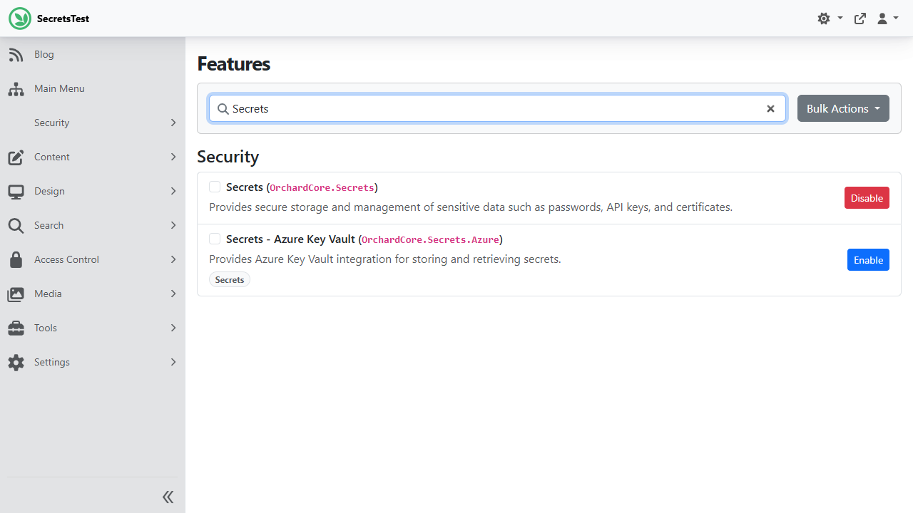
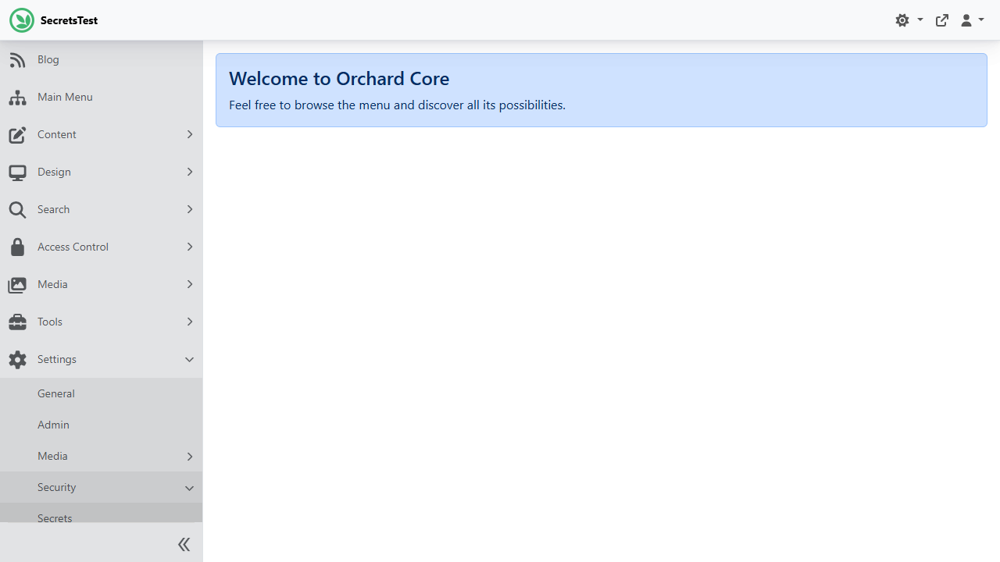
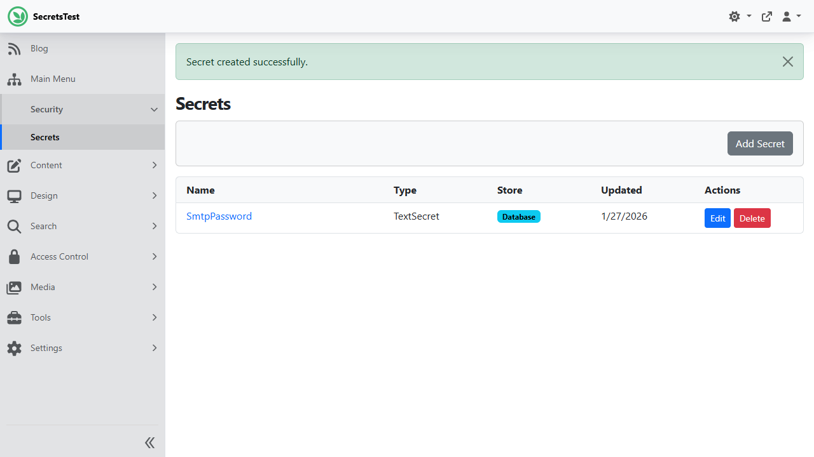
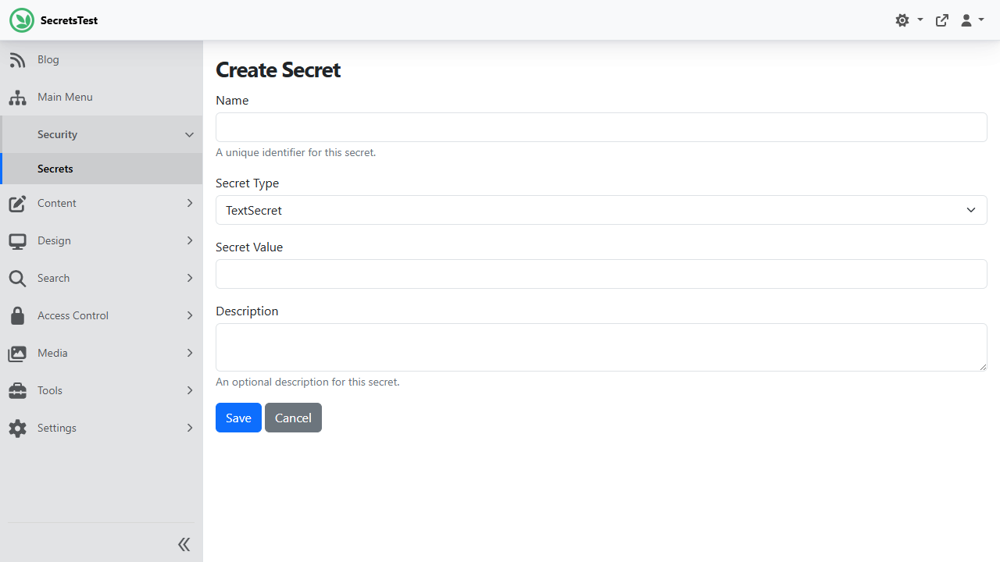
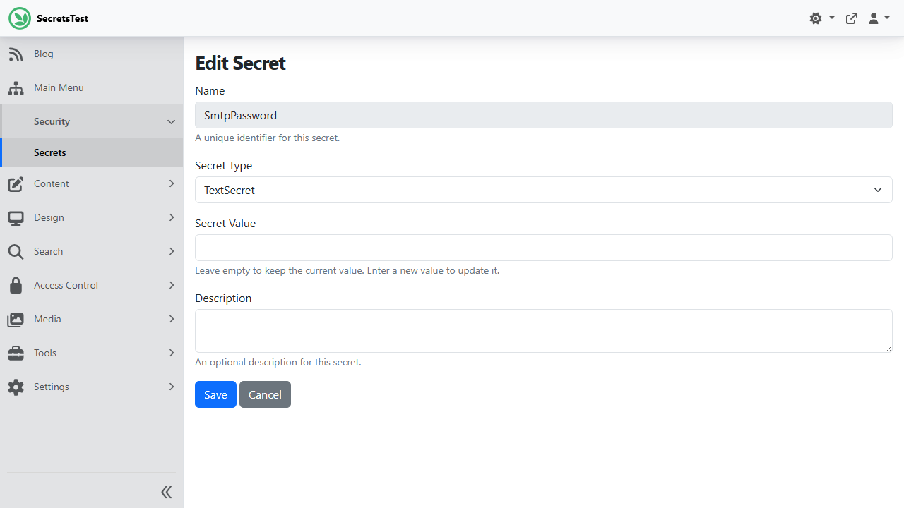

# Secrets (`OrchardCore.Secrets`)

The Secrets module provides a secure, centralized way to store and manage sensitive data such as passwords, API keys, connection strings, and certificates. It addresses common challenges in managing secrets across development, staging, and production environments.

## Why Use the Secrets Module?

### The Problem

Orchard Core modules need a comprehensive, consistent way to store, retrieve, and manage secrets. Without a shared abstraction, each module must invent its own solution for credential storage, encryption, configuration, and deployment, leading to duplicated code and inconsistent behavior.

Managing sensitive configuration in web applications presents several challenges:

1. **Security Risks**: Storing passwords and API keys in `appsettings.json` or environment variables can lead to accidental exposure through source control, logs, or configuration dumps.

2. **Deployment Complexity**: When using deployment plans or recipes to set up new tenants, secrets cannot be included directly without compromising security.

3. **Multi-Environment Management**: Different environments (development, staging, production) often need different secrets, making configuration management complex.

4. **Certificate Management**: Storing certificates for OpenID Connect, signing tokens, or SSL can be problematic, especially in multi-server deployments where file-based certificates aren't accessible.

5. **Audit and Rotation**: Without a centralized secret store, it's difficult to track who accessed secrets or rotate them across all services.

### The Solution

The `OrchardCore.Secrets.Abstractions` project defines the shared contracts for secrets management, including `ISecretManager`, `ISecretStore`, and `ISecretTypeProvider`, along with secret types and metadata. Modules can depend on these abstractions to consume secrets without coupling their code to a particular storage implementation.

The Secrets module provides:

- **Encrypted Storage**: All secrets are encrypted using ASP.NET Core Data Protection before being stored in the database.
- **Centralized Management**: A single admin UI to view, create, update, and delete all secrets.
- **Multiple Backends**: Support for database storage (default) and Azure Key Vault for enterprise scenarios.
- **Deployment Support**: Export secret metadata (not values) and import secrets from environment variables during setup.
- **Type Safety**: Different secret types (text, RSA keys, X.509 certificates) with appropriate handling for each.

## Common Use Cases

### 1. SMTP Email Credentials

Store your email server password securely instead of in configuration files:

```csharp
// In your email service
var passwordSecret = await _secretManager.GetSecretAsync<TextSecret>("Email.SmtpPassword");
var password = passwordSecret?.Text;
```

### 2. Third-Party API Keys

Manage API keys for services like payment gateways, analytics, or social media:

```csharp
// Store API keys with descriptive names
await _secretManager.SaveSecretAsync("Stripe.SecretKey", new TextSecret { Text = "sk_live_..." });
await _secretManager.SaveSecretAsync("SendGrid.ApiKey", new TextSecret { Text = "SG...." });
await _secretManager.SaveSecretAsync("Google.MapsApiKey", new TextSecret { Text = "AIza..." });
```

### 3. OpenID Connect Signing Keys

Store RSA keys for JWT token signing without filesystem dependencies:

```csharp
// Generate and store signing keys
var rsaSecret = new RsaKeySecret 
{ 
    IncludesPrivateKey = true,
    PublicKey = Convert.ToBase64String(rsa.ExportRSAPublicKey()),
    PrivateKey = Convert.ToBase64String(rsa.ExportRSAPrivateKey())
};
await _secretManager.SaveSecretAsync("OpenId.SigningKey", rsaSecret);
```

### 4. Database Connection Strings

Protect database credentials, especially for production environments:

```csharp
var connectionSecret = await _secretManager.GetSecretAsync<TextSecret>("Database.ConnectionString");
var connectionString = connectionSecret?.Text ?? defaultConnectionString;
```

### 5. Multi-Tenant SaaS Deployments

When deploying new tenants with recipes, define which secrets are needed without exposing values:

**Recipe file (safe to commit):**
```json
{
  "steps": [
    {
      "name": "Secrets",
      "Secrets": [
        { "Name": "Smtp.Password" },
        { "Name": "Payment.ApiKey" },
        { "Name": "Analytics.TrackingId" }
      ]
    }
  ]
}
```

**Environment variables (set during deployment):**
```bash
env 'OrchardCore__Secrets__Smtp.Password=actual-password' \
    'OrchardCore__Secrets__Payment.ApiKey=actual-api-key' \
    'OrchardCore__Secrets__Analytics.TrackingId=UA-12345' \
    dotnet OrchardCore.Cms.Web.dll
```

### 6. Azure Key Vault for Production

For production environments, use Azure Key Vault for hardware-backed security and centralized secret management:

```json
{
  "AzureClients": {
    "SecretClient": {
      "VaultUri": "https://mycompany-prod.vault.azure.net/",
      "Credential": {
        "CredentialSource": "ManagedIdentityCredential",
        "ManagedIdentityIdKind": "SystemAssigned"
      }
    }
  },
  "OrchardCore": {
    "Secrets": {
      "AzureKeyVault": {
        "AzureClient": "SecretClient",
        "NamePrefix": "mycompany"
      }
    }
  }
}
```

Register the named client in the host as shown in [Azure Key Vault Store](#azure-key-vault-store). With Managed Identity, no credential secrets are needed in configuration—Azure handles authentication automatically.

## Features

- Secure storage of sensitive data using ASP.NET Core Data Protection
- Multiple secret store providers (database, Azure Key Vault)
- Three secret types: Text, RSA Keys, and X.509 Certificates
- Admin UI for managing secrets
- ViewComponent for selecting secrets in other module UIs
- Recipe support for importing secrets during setup
- Deployment step for exporting secret metadata

## Getting Started

### Enabling the Feature

1. Navigate to **Admin → Configuration → Features**
2. Search for "Secrets"
3. Click **Enable** on the "Secrets" feature



### Accessing the Secrets Admin

Once enabled, the Secrets admin is available under the **Settings → Security** menu:

1. In the admin sidebar, click **Settings** to expand the menu
2. Click **Security** to see the security settings
3. Click **Secrets** to open the secrets management page



### Managing Secrets

#### Viewing Secrets

The Secrets index page displays all stored secrets with their name, type, store, and last updated date.



#### Creating a Secret

1. Click **Add Secret** on the Secrets index page
2. Fill in the required fields:
   - **Name**: A unique identifier for the secret (e.g., `SmtpPassword`, `ApiKey`)
   - **Secret Type**: Select the type of secret (e.g., `TextSecret`)
   - **Secret Value**: The actual secret value (will be encrypted before storage)
   - **Description**: Optional description for documentation purposes
3. Click **Save**



#### Editing a Secret

1. Click **Edit** next to the secret you want to modify
2. Update the fields as needed
   - Note: The secret value field is empty for security. Leave it empty to keep the existing value, or enter a new value to update it.
3. Click **Save**



#### Deleting a Secret

1. Click **Delete** next to the secret you want to remove
2. Confirm the deletion in the dialog

#### Moving Secrets and Retiring a Store

Use **Move** on an individual entry, or **Manage Stores → Move all active secrets** to transfer every active entry in one source store. Select a different writable destination and confirm. The operation retains logical names, types, descriptions, and expiration dates, verifies the committed destination value and metadata, and then removes only the selected source copy. Values never pass through the management form, response, or an export file. X.509 entries move references only.

Destination collisions are rejected, not overwritten. Bulk transfers are not atomic: review each result, especially failures with a saved destination copy, before retrying or deleting a remaining source. Verification failures retain the source. Normal secret-manager writes and store operations share a tenant lock; configure a distributed lock provider for multiple instances and pause direct store writes, rotation, and provider changes while transferring.

**Manage Stores** displays the active-secret count for the selected tenant/store. Successful moves remove the source using the provider's existing `RemoveSecretAsync` operation. The existing **Delete** action also removes only the selected secret/store and can break consumers if no destination copy exists. No new purge interface or purge action is provided.

Inspect every affected tenant, ensure the active-secret count is zero, and verify destination consumers after restart before disabling an optional provider. If inspection fails, cleanup status is unknown, not empty. The database store cannot be disabled independently of the base Secrets feature. Transfers do not change the default writable store: select the destination explicitly when creating or saving later secrets and recheck the source before retirement.

Key Vault deletion remains recoverable under its soft-delete policy and retains old versions; Orchard does not purge those values. Database removal does not erase backups or transaction logs. External copies, audit history, and provider retention also remain outside this operation. Rotate/revoke credentials when historical copies must no longer work. See the [4.0 store cleanup instructions](../../../releases/4.0.0.md#cleaning-up-a-provider-before-disabling-it).

Programmatic operations return metadata-only per-secret results:

```csharp
// Resolve ISecretStoreOperations from the current tenant's services.
var result = await operations.MoveSecretAsync("Payment.ApiKey", "Database", "AzureKeyVault");
var results = await operations.MoveAllSecretsAsync("Database", "AzureKeyVault");
// Delete one remaining source copy only after reviewing a partial transfer.
await secretManager.RemoveSecretAsync("Payment.ApiKey", "Database");
```

Store `SaveSecretAsync` and `RemoveSecretAsync` implementations must complete only after persistence, not after merely staging a write. Built-in database mutations use a separate tenant scope to commit the secret change before releasing the mutation lock, without committing unrelated caller changes.

### Secret Expiration

Secrets can have an optional expiration date. This is an **informational** feature designed to help with secret rotation planning:

- **Purpose**: Track when secrets should be rotated or renewed
- **Behavior**: Expired secrets **continue to work** - expiration does not automatically disable them
- **Admin-Wide Warning**: Users with the Manage Secrets permission see a warning on admin pages when secrets have expired or expire within 30 days, with counts and a link to review the secrets. The warning uses metadata only and does not expose secret values.
- **List-Page Visual Indicators**:
  - Expired secrets show a red "Expired" badge
  - Secrets expiring within 30 days show a yellow "Expiring" badge
  - The secrets list highlights expired/expiring secrets with colored backgrounds

**Use Cases for Expiration:**

1. **API Key Rotation**: Set expiration to remind when to rotate third-party API keys
2. **Certificate Renewal**: Track when X.509 certificates need to be renewed
3. **Compliance**: Meet regulatory requirements for periodic credential rotation
4. **Automation**: External systems can query secret metadata to trigger rotation workflows

To set an expiration date, use the "Expiration Date" field in the secret editor. Leave it empty for secrets that don't expire.

## Configuration

### Database Store (Default)

The database store is enabled by default when the Secrets module is enabled. It uses ASP.NET Core Data Protection to encrypt secrets before storing them in the database.

### Azure Key Vault Store

To use Azure Key Vault as a secret store, enable the `OrchardCore.Secrets.AzureKeyVault` feature, register a named `SecretClient` in the application host, and select its service key in `OrchardCore:Secrets:AzureKeyVault:AzureClient`:

```json
{
  "AzureClients": {
    "SecretClient": {
      "VaultUri": "https://your-vault.vault.azure.net/",
      "Credential": {
        "CredentialSource": "ManagedIdentityCredential",
        "ManagedIdentityIdKind": "SystemAssigned"
      },
      "Options": {
        "Retry": {
          "MaxRetries": 3,
          "Delay": "00:00:00.800",
          "MaxDelay": "00:01:00",
          "Mode": "Exponential",
          "NetworkTimeout": "00:01:40"
        },
        "Diagnostics": {
          "ApplicationId": "my-app",
          "IsLoggingEnabled": true,
          "IsTelemetryEnabled": true,
          "IsDistributedTracingEnabled": true,
          "IsLoggingContentEnabled": false,
          "LoggedContentSizeLimit": 4096,
          "AdditionalLoggedHeaderNames": [],
          "AdditionalLoggedQueryParameters": []
        },
        "DisableChallengeResourceVerification": false
      }
    }
  },
  "OrchardCore": {
    "Secrets": {
      "AzureKeyVault": {
        "AzureClient": "SecretClient",
        "NamePrefix": "myapp"
      }
    }
  }
}
```

Register the client before building the host, using the Azure SDK's [configuration and dependency injection support](https://github.com/Azure/azure-sdk-for-net/blob/main/sdk/core/Azure.Core/src/docs/ConfigurationAndDependencyInjection.md):

```csharp
using Azure.Identity;
using Azure.Security.KeyVault.Secrets;

#pragma warning disable SCME0002 // Azure SDK configuration support is experimental.
builder.AddKeyedAzureClient<SecretClient, SecretClientSettings>(
    "SecretClient", "AzureClients:SecretClient");
#pragma warning restore SCME0002
```

Here `builder` is an `IHostApplicationBuilder`. The service key (`SecretClient`) is independent of the configuration path (`AzureClients:SecretClient`); `AzureClient` must match the service key exactly. JSON configuration alone does not register a client. The module only resolves an existing keyed registration; it does not construct clients, choose credentials, or fall back to an unkeyed client. Missing or blank names, unregistered clients, and the reserved alias key `OrchardCore.Secrets.AzureKeyVault` fail explicitly.

`SecretClientSettings` binds the global client configuration, including `VaultUri`, `Credential`, and `Options`. Select an appropriate token credential in the host configuration. Key Vault does not support API-key authentication.

| CredentialSource | Credential settings | Usage |
| --- | --- | --- |
| `ManagedIdentityCredential` | Omit identity settings for system-assigned identity; use `ManagedIdentityIdKind: "ClientId"` and `ManagedIdentityId` for a user-assigned client ID | Azure managed identity. |
| `WorkloadIdentityCredential` | `TenantId`, `ClientId`, and `TokenFilePath` or the corresponding Azure SDK environment | Federated workload identity, such as an Azure Kubernetes Service workload. |
| `EnvironmentCredential` | `TenantId`, `ClientId`, and `ClientSecret`, or equivalent Azure SDK environment variables | Application credentials supplied through secure configuration. |
| `AzureCliCredential` | An authenticated Azure CLI session | Local development using only Azure CLI credentials. |
| `AzurePowerShellCredential` | An authenticated Azure PowerShell session | Local development using only Azure PowerShell credentials. |
| `VisualStudioCredential` | An authenticated Visual Studio account | Local development using only Visual Studio credentials. |

These are common sources; the SDK supports additional sources and explicitly configured chains. See its configuration reference for source-specific properties. `DefaultAzureCredential` is not a `CredentialSource` supported by the SDK's configuration resolver; select the intended source, such as `EnvironmentCredential`, rather than the former module-specific `CredentialType` setting.

For production web applications, use a deterministic provider as recommended in [Azure authentication best practices](https://learn.microsoft.com/en-us/dotnet/azure/sdk/authentication/best-practices). Specific providers do not fall back to another identity after authentication fails. Host-registered singleton clients are shared across tenant containers; each tenant's store retains its own namespace.

For client secret authentication, provide `Credential:ClientSecret` through a secure configuration source, for example the `AzureClients__SecretClient__Credential__ClientSecret` environment variable, rather than storing it in `appsettings.json`.

`Options` is the SDK's `SecretClientOptions` configuration section, including `DisableChallengeResourceVerification`, nested `Retry` settings, and nested `Diagnostics` settings. Credential-specific settings, such as `AuthorityHost` and `DisableInstanceDiscovery`, belong under `Credential`. Omitted settings retain SDK defaults. Do not enable diagnostics content logging for secrets. The underlying SDK configuration APIs are currently experimental (`SCME0002`); host registration must opt in locally.

The feature registers a lazy keyed singleton alias with key `OrchardCore.Secrets.AzureKeyVault`, exposed as `AzureKeyVaultSecretStore.SecretClientServiceKey`. Resolving that alias returns the exact host-registered client selected by the tenant's `AzureClient` option, without changing its credentials or options. Other features can select the same host key to share a client, or select a different key to use another vault. To consume this feature's selected client from a tenant service:

```csharp
public MyService(
    [FromKeyedServices(AzureKeyVaultSecretStore.SecretClientServiceKey)] SecretClient client)
{
    _client = client;
}
```

This requires `Microsoft.Extensions.DependencyInjection`, `Azure.Security.KeyVault.Secrets`, and `OrchardCore.Secrets.AzureKeyVault`. Each tenant resolves its own alias to the shared host client. Programmatic resolution uses `GetRequiredKeyedService<SecretClient>(AzureKeyVaultSecretStore.SecretClientServiceKey)`.

`NamePrefix` defines an application namespace even for single-tenant sites. It defaults to `oc`; use a distinct prefix for each application sharing a vault. Prefixes must be nonblank and no longer than 256 characters.

Key Vault names combine a normalized readable prefix, Orchard tenant name, and logical secret name with a 24-character hexadecimal SHA-256 suffix. For example, `myapp-default-payment-apikey-<hash>` represents `Payment.ApiKey` in the `Default` tenant with prefix `myapp`. The readable portion uses lowercase ASCII letters, digits, and hyphens, and is truncated as needed to keep the entire name within Key Vault's 127-character limit. The 96-bit hash covers the exact, unambiguously encoded `(prefix, tenant name, logical secret name)` tuple, so names differing only by case, punctuation, or truncated characters remain distinct.

The store records the exact prefix, tenant name, original secret name, registered secret type, and description in tags. Reads, updates, and deletes validate ownership metadata; listing includes only entries matching the configured prefix and tenant. `Credential:TenantId` is the Microsoft Entra tenant ID, not the Orchard tenant name. Changing `NamePrefix` or renaming an Orchard tenant changes its namespace; plan an explicit secret migration before doing so.

These namespaces prevent accidental cross-tenant access through the store but are not an Azure authorization boundary: code with the vault credentials can bypass them. Use separate vaults or appropriately restricted identities for mutually untrusted tenants. Entries created outside Orchard without ownership tags are not automatically adopted. Create entries through the tenant's secret manager.

Deletion is a normal Key Vault soft delete. It never purges secrets, so purge permission is not required and purge protection remains effective. Azure's retention rules may prevent reusing a deleted name until it is recovered or its retention period ends.

The store is immutable when editing a secret in the admin UI. Edit and delete operations target the displayed store only. Clearing a description or expiration explicitly removes that metadata; programmatic saves without a `SecretSaveOptions` object preserve it.

#### Local development with the Azure Key Vault Emulator

The [James Gould Azure Key Vault Emulator](https://github.com/james-gould/azure-keyvault-emulator) supports the Azure SDK clients used by this store. It is for local development and testing only, not production. Its documented client setup uses `DefaultAzureCredential`, not an API key.

Follow the emulator's [setup instructions](https://github.com/james-gould/azure-keyvault-emulator/blob/master/docs/CONFIG.md) to start it and trust its TLS certificate. Use a version supporting its OAuth endpoints, as documented in the emulator's [authentication and client configuration](https://github.com/james-gould/azure-keyvault-emulator#4-optional-authenticate-with-defaultazurecredential). For Docker, expose container port `4997` on a fixed host port. If persistence is enabled, keep that port unchanged: persisted entries contain the vault URI. For Aspire, enable persistence only with a fixed `Port`.

Enable `OrchardCore.Secrets` and `OrchardCore.Secrets.AzureKeyVault` for the Orchard tenant, register the named client in the host as shown above, and add the following to `appsettings.Development.json`. The SDK's configuration resolver selects `EnvironmentCredential`, the environment authentication source used by the emulator's documented `DefaultAzureCredential` setup. No emulator-specific mode or custom module is needed:

```json
{
  "AzureClients": {
    "SecretClient": {
      "VaultUri": "https://localhost:4997",
      "Credential": {
        "CredentialSource": "EnvironmentCredential",
        "DisableInstanceDiscovery": true
      },
      "Options": {
        "DisableChallengeResourceVerification": true
      }
    }
  },
  "OrchardCore": {
    "Secrets": {
      "AzureKeyVault": {
        "AzureClient": "SecretClient",
        "NamePrefix": "localdev"
      }
    }
  }
}
```

Replace `4997` with the host port exposed by your emulator. `EnvironmentCredential` needs the emulator's credential environment. If you use Aspire, the emulator's `WithAzureKeyVaultEmulatorCredentials` integration supplies this automatically. For a standalone emulator, set these variables in the process that launches Orchard:

```bash
export AZURE_TENANT_ID=a0c2a3f5-e1b3-4d6a-9c41-2cdd1f2c7e0f
export AZURE_CLIENT_ID=a0c2a3f5-e1b3-4d6a-9c41-2cdd1f2c7e0f
export AZURE_CLIENT_SECRET=emulator-client-secret
export AZURE_AUTHORITY_HOST=https://localhost:4997
```

These are the emulator's public placeholder credentials, not real Azure credentials. Its OAuth endpoint accepts them locally; no Azure subscription or CLI login is needed. Never send real production credentials to an emulator. Alternatively, set `TenantId`, `ClientId`, `ClientSecret`, and `AuthorityHost` directly under `Credential`.

`AZURE_AUTHORITY_HOST` must point to the emulator's HTTPS endpoint rather than Microsoft's identity service. Alternatively, set `Credential:AuthorityHost` in the configuration section. The SDK does not infer the identity authority from `VaultUri`.

The emulator's localhost hostname requires `Options:DisableChallengeResourceVerification` to be `true`. Its local identity authority requires `Credential:DisableInstanceDiscovery` to be `true`. TLS certificate validation remains enabled: trust the emulator certificate rather than bypassing validation.

Keep these overrides in development configuration. Leave challenge-resource verification and identity instance discovery enabled for production Azure endpoints; both disabling flags default to `false`. No environment-based behavior or automatic emulator detection changes these settings.

To check the integration, create a text secret in the admin UI with **AzureKeyVault** selected as its store, then edit and delete it. For a programmatic read, use `GetSecretAsync<TextSecret>(name, "AzureKeyVault")` so a database entry cannot mask a failed emulator lookup. If persistence is enabled, restart the emulator on the same port and verify the secret is still readable before deleting it. Create secrets through Orchard rather than directly seeding bare emulator entries: the store requires its tenant, namespace, and type ownership tags.

## Using Secrets Programmatically

### Retrieving a Secret

```csharp
public class MyService
{
    private readonly ISecretManager _secretManager;

    public MyService(ISecretManager secretManager)
    {
        _secretManager = secretManager;
    }

    public async Task UseSecretAsync()
    {
        var secret = await _secretManager.GetSecretAsync<TextSecret>("MyApiKey");
        if (secret != null)
        {
            var apiKey = secret.Text;
            // Use the API key
        }
    }
}
```

### Saving a Secret

```csharp
var secret = new TextSecret { Text = "my-secret-value" };
await _secretManager.SaveSecretAsync("MyApiKey", secret);
```

### Saving to a Specific Store

```csharp
// Save to Azure Key Vault specifically
await _secretManager.SaveSecretAsync("MyApiKey", secret, "AzureKeyVault");
```

## Recipe Step

Secrets can be imported using a recipe step. Note that for security reasons, you should provide secret values via environment variables rather than directly in the recipe file.

### Recipe Format

```json
{
  "steps": [
    {
      "name": "Secrets",
      "Secrets": [
        {
          "Name": "SmtpPassword",
          "Store": "Database"
        },
        {
          "Name": "ApiKey",
          "Store": "AzureKeyVault"
        }
      ]
    }
  ]
}
```

### Providing Secret Values

Secret values should be provided through the `OrchardCore:Secrets:{SecretName}` configuration key. For environment variables, use double underscores as hierarchy separators:

- `OrchardCore__Secrets__SecretName` (environment variable)
- `OrchardCore:Secrets:SecretName` (configuration key)

For example:
```bash
export OrchardCore__Secrets__SmtpPassword=mypassword
export OrchardCore__Secrets__ApiKey=myapikey
```

Secret names are matched exactly. A dot in a name such as `Smtp.Password` is not a configuration hierarchy separator; retain it in the environment variable name as shown in the deployment example above. Recipe values are read from application configuration, separately from the tenant-scoped Azure provider options.

## Deployment Step

The Secrets Deployment Step allows you to export secrets as part of a deployment plan. This is useful for migrating secrets between tenants or environments.

### Basic Export (Metadata Only)

By default, secrets are exported without their values for security. The import process then reads values from environment variables:

```json
{
  "name": "Secrets",
  "Secrets": {
    "SmtpPassword": {
      "SecretInfo": {
        "Store": "Database",
        "Type": "TextSecret",
        "Description": null,
        "ExpiresUtc": null
      }
    }
  }
}
```

### Encrypted Export

For scenarios where you need to transfer actual secret values (e.g., tenant migration, environment cloning), you can use encrypted export with RSA or X509 keys.

#### How It Works

Export does not contact the destination server or discover its public key. Before exporting, provision the destination's public key on the source and the corresponding private key on the destination. `EncryptionKeyName` is a logical secret name resolved independently in each tenant, not a destination URL. Only the public key needs to be shared with the source.

1. **Export**: Secrets are encrypted using RSA+AES hybrid encryption
   - A random AES-256 key is generated for each secret
   - The secret value is encrypted with AES-GCM using a random 96-bit nonce and a 128-bit authentication tag
   - The secret name, store, type, description, and expiration are authenticated as associated data
   - The AES key is encrypted with RSA-OAEP-SHA256
2. **Import**: On the target system
   - The AES key is decrypted using RSA private key
   - The authentication tag and metadata are verified before the secret value is deserialized
   - The decrypted secret is saved to the secrets store

#### Setting Up Encryption Keys

**Option 1: Using RsaKeySecret (Recommended)**

Generate the key pair once on the **destination**, using its tenant's `ISecretManager`:

```csharp
using var rsa = RSA.Create(2048);
var deploymentKey = new RsaKeySecret
{
    PublicKey = Convert.ToBase64String(rsa.ExportRSAPublicKey()),
    PrivateKey = Convert.ToBase64String(rsa.ExportRSAPrivateKey()),
    IncludesPrivateKey = true,
};
await _secretManager.SaveSecretAsync("Deployment.EncryptionKey", deploymentKey);
```

Copy the Base64 `PublicKey` to the source through a trusted channel. On the **source**, provision a public-key-only secret with the same logical name:

```csharp
var deploymentKey = new RsaKeySecret
{
    PublicKey = destinationPublicKey,
    IncludesPrivateKey = false,
};
await _secretManager.SaveSecretAsync("Deployment.EncryptionKey", deploymentKey);
```

Here, `destinationPublicKey` is the exact Base64 public key from the destination, not a newly generated key. Do not generate independent key pairs on both systems: the public and private keys must match. Never copy the destination's private key to the source or include it in the deployment recipe.

The admin RSA creation page can generate a key pair on the destination, but it does not provide a complete public-key transfer/import workflow. Use the service-based provisioning above when configuring a public-key-only source. The selected encryption-key secret is excluded from the deployment export; it must already exist on the destination before encrypted secrets can be imported, including when using a setup recipe.

**Option 2: Using X509Secret**

Use an RSA-capable X.509 certificate:

1. Install the public certificate on the source and the matching certificate with its private key on the destination.
2. Create an `X509Secret` under the same logical name in each tenant, pointing to that machine's certificate store location, store name, and thumbprint.
3. Ensure the destination application's identity can access the certificate's private key. The source needs only the public key.

#### Creating an Encrypted Export

1. Go to **Configuration → Import/Export → Deployment Plans**
2. Create or edit a deployment plan
3. Add a **Secrets** step
4. In the **Encryption Key** dropdown, select your encryption key (e.g., `Deployment.EncryptionKey`)
5. Execute the deployment plan

Export runs on the source and reads its local key secret. No destination key-discovery endpoint is invoked.

The exported JSON will contain encrypted secret values:

```json
{
  "name": "Secrets",
  "EncryptionKeyName": "Deployment.EncryptionKey",
  "Secrets": {
    "SmtpPassword": {
      "SecretInfo": {
        "Store": "Database",
        "Type": "TextSecret",
        "Description": null,
        "ExpiresUtc": null
      },
      "Version": 1,
      "EncryptedKey": "BASE64_RSA_ENCRYPTED_AES_KEY...",
      "EncryptedData": "BASE64_AES_ENCRYPTED_SECRET...",
      "IV": "BASE64_GCM_NONCE...",
      "Tag": "BASE64_GCM_TAG..."
    }
  }
}
```

Version 1 envelopes use authenticated encryption. Envelopes with an unsupported version or missing authentication tag are rejected. Do not edit names, store names, types, descriptions, or expiration dates in an encrypted recipe: changes invalidate authentication. A failed encrypted export fails the deployment instead of emitting a metadata-only fallback. Duplicate logical names across stores must be resolved before export.

Export and import use registered `ISecretTypeProvider` instances, including custom types. Providers can override `Serialize` and `Deserialize` for their own wire format; the default implementation uses JSON for the provider's concrete CLR type. Register the same provider on the source and destination.

#### Importing Encrypted Secrets

1. Ensure the encryption key exists on the target system with the **private key**
2. Import the recipe using standard methods (Import/Export, setup recipe, or API)
3. The recipe step will:
   - Look up the encryption key by name
   - Decrypt each secret
   - Save to the secrets store

The destination needs the matching private key, the registered secret type providers, and the store named in each entry's metadata. A missing key or a decryption/authentication failure is reported as a recipe error; encrypted imports do not fall back to plaintext or environment variables. Changing authenticated metadata to target a different store invalidates the envelope, so configure the destination store before import.

#### Generating Encrypted Secrets Locally

This module does not include a standalone CLI for encrypting recipe values. Run an Orchard instance locally and execute a Secrets deployment plan, or use `ISecretEncryptionService` from custom code in a configured tenant scope:

```csharp
var info = new SecretInfo
{
    Name = "SmtpPassword",
    Store = "Database",
    Type = nameof(TextSecret),
};
var encrypted = await _secretEncryptionService.EncryptAsync(
    new TextSecret { Text = password },
    "Deployment.EncryptionKey",
    info);
```

The local instance needs the destination's public key registered as `Deployment.EncryptionKey`. `_secretEncryptionService` is the tenant's injected `ISecretEncryptionService`; `password` comes from a secure input, not a source-code literal. Copy the returned `Version`, `EncryptedKey`, `EncryptedData`, `IV`, and `Tag` into the recipe entry shown above, preserving `info.Name` as its key and the same store, type, description, and expiration in `SecretInfo`.

An external encryption tool must reproduce the provider's serialization, versioned envelope, RSA-OAEP-SHA256 key wrapping, and AES-GCM authenticated metadata exactly. A generic RSA or AES command does not by itself produce an importable recipe.

**Important Requirements:**
- The encryption key must exist on the target with the same name
- For `RsaKeySecret`: `IncludesPrivateKey` must be `true`
- For `X509Secret`: The certificate must have a private key

### Multi-Tenant Migration Example

**Scenario:** Clone secrets from `TenantA` to `TenantB`

1. In TenantB's scope, generate and save the RSA key pair as `Deployment.EncryptionKey` using the destination provisioning example above.
2. Copy only its public key to TenantA and save a public-key-only `Deployment.EncryptionKey` in TenantA's scope. Keep the private key in TenantB.
3. In TenantA, execute a deployment plan with a Secrets step selecting `Deployment.EncryptionKey`. Download the generated recipe, which excludes the selected key secret.
4. In TenantB, ensure the named destination stores and secret type providers are available, then import the recipe. TenantB resolves its local private key, verifies the authenticated entries, and saves the decrypted secrets.

No request to TenantB is made during export. Do not attempt to provision an RSA key using an array recipe's text `Value` field: that field creates a `TextSecret`, not an `RsaKeySecret`.

### Security Best Practices

1. **Protect the encryption key**: The encryption key itself should be treated as highly sensitive
2. **Use different keys per environment**: Don't share deployment keys between production and non-production
3. **Rotate keys periodically**: Create new deployment keys and re-encrypt exports regularly
4. **Delete exported files**: Don't leave encrypted exports in accessible locations
5. **Audit key usage**: Log when deployment keys are used for export/import
6. **Consider X509 for compliance**: Use CA-issued certificates for audit trails

## Secret Types

The module supports three built-in secret types, each designed for specific use cases:

### Choosing Between RsaKeySecret and X509Secret

Both `RsaKeySecret` and `X509Secret` can be used for cryptographic operations, but they serve different deployment models:

| Aspect | RsaKeySecret | X509Secret |
|--------|--------------|------------|
| **Storage** | Key material stored in database (encrypted) | Reference to OS certificate store |
| **Portability** | ✅ Travels with database backup | ❌ Cert must exist on each machine |
| **Container-friendly** | ✅ Works without mounting certs | ❌ Requires cert pre-installed |
| **Key generation** | ✅ Generate in Admin UI | ❌ Create cert externally |
| **Cross-platform** | ✅ Works identically everywhere | ⚠️ Enumeration varies by OS |
| **Certificate metadata** | ❌ No issuer, expiry, subject | ✅ Full X.509 metadata |
| **CA-issued certs** | ❌ Not applicable | ✅ Works with CA certs |
| **Security model** | Key stored encrypted in DB | Key never leaves OS secure store |

**When to use RsaKeySecret:**

- OpenID Connect signing keys that must persist across container restarts
- JWT signing for APIs (self-contained, portable)
- Multi-server deployments where keys should auto-sync via database
- Development/testing without certificate infrastructure

**When to use X509Secret:**

- CA-issued certificates (SSL/TLS, client authentication)
- Azure App Service certificates uploaded via portal
- Enterprise PKI where certificates are managed by IT
- Scenarios requiring certificate metadata (issuer validation, expiry checking)

### TextSecret

The most common secret type for storing string values like passwords, API keys, and connection strings.

```csharp
public class TextSecret : ISecret
{
    public string Text { get; set; }
}
```

**Use cases:**

- SMTP passwords
- API keys (Stripe, SendGrid, etc.)
- Database connection strings
- OAuth client secrets

**Example:**
```csharp
// Store an API key
var secret = new TextSecret { Text = "sk_live_abc123..." };
await _secretManager.SaveSecretAsync("Stripe.SecretKey", secret);

// Retrieve and use
var retrieved = await _secretManager.GetSecretAsync<TextSecret>("Stripe.SecretKey");
var apiKey = retrieved?.Text;
```

### RsaKeySecret

For storing RSA cryptographic keys directly in the secrets store. The key material is encrypted and stored in the database, making it portable across deployments.

```csharp
public class RsaKeySecret : ISecret
{
    public string PublicKey { get; set; }      // Base64-encoded RSA public key
    public string PrivateKey { get; set; }     // Base64-encoded RSA private key
    public bool IncludesPrivateKey { get; set; }
    public int KeySize { get; set; } = 2048;
}
```

**Use cases:**

- OpenID Connect signing keys (addresses issues #7137, #13205)
- JWT token signing/validation
- Data encryption/decryption
- Digital signatures
- Any scenario requiring portable RSA keys

**Benefits over X509Secret:**

- Key travels with database backup/restore
- Works in containers without cert mounting
- Can generate keys directly in Admin UI
- Works identically on Windows/Linux/macOS
- Automatically shared across servers via database

**Example:**
```csharp
// Generate and store a new RSA key pair
using var rsa = RSA.Create(2048);
var secret = new RsaKeySecret
{
    PublicKey = Convert.ToBase64String(rsa.ExportRSAPublicKey()),
    PrivateKey = Convert.ToBase64String(rsa.ExportRSAPrivateKey()),
    IncludesPrivateKey = true,
    KeySize = 2048
};
await _secretManager.SaveSecretAsync("OpenId.SigningKey", secret);

// Retrieve and use for signing
var retrieved = await _secretManager.GetSecretAsync<RsaKeySecret>("OpenId.SigningKey");
using var signingKey = RSA.Create();
signingKey.ImportRSAPrivateKey(Convert.FromBase64String(retrieved.PrivateKey), out _);
```

### X509Secret

For referencing X.509 certificates from the operating system's certificate store. The secret stores only the certificate reference (thumbprint, location, store name) - the actual certificate remains in the OS certificate store.

```csharp
public class X509Secret : ISecret
{
    public StoreLocation StoreLocation { get; set; }  // CurrentUser or LocalMachine
    public StoreName StoreName { get; set; }          // My, Root, etc.
    public string Thumbprint { get; set; }            // Certificate thumbprint
    
    public X509Certificate2 GetCertificate();         // Loads cert from OS store
}
```

**Use cases:**

- CA-issued SSL/TLS certificates
- Code signing certificates
- Azure App Service certificates (uploaded via portal)
- Client authentication certificates
- Enterprise PKI scenarios
- Any certificate managed by IT infrastructure

**How it works:**

1. Certificate is installed in OS certificate store (manually, via Azure, or via deployment)
2. X509Secret stores the thumbprint and store location as a "binding"
3. At runtime, `GetCertificate()` loads the actual certificate from the OS store

**Cross-platform notes:**

- **Windows:** Full access to CurrentUser and LocalMachine stores; Admin UI shows available certs
- **Linux:** Limited to CurrentUser store (~/.dotnet/corefx/cryptography); Admin UI may be empty
- **macOS:** Keychain access; may require permissions for LocalMachine

**Example:**
```csharp
// Reference a certificate by thumbprint
var secret = new X509Secret
{
    StoreLocation = StoreLocation.LocalMachine,
    StoreName = StoreName.My,
    Thumbprint = "ABC123DEF456..."
};
await _secretManager.SaveSecretAsync("Ssl.Certificate", secret);

// Retrieve and use the certificate
var retrieved = await _secretManager.GetSecretAsync<X509Secret>("Ssl.Certificate");
var certificate = retrieved?.GetCertificate();
if (certificate != null)
{
    // certificate is an X509Certificate2 instance
    // Use for SSL, signing, encryption, etc.
}
```

## Using the SelectSecret ViewComponent

When building custom modules that need to reference secrets, you can use the `SelectSecret` ViewComponent to provide a dropdown of available secrets:

```html
@await Component.InvokeAsync("SelectSecret", new { 
    secretTypes = new[] { "TextSecret" }, // Filter by type (optional)
    selectedSecret = Model.SecretName,
    htmlId = "SecretName",
    htmlName = "SecretName",
    required = true
})
```

This renders a dropdown populated with all secrets of the specified type, making it easy to let administrators select which secret to use for a particular configuration.

Use `Html.IdFor` and `Html.NameFor` when the editor has a binding prefix. The optional `cssClass` parameter adds a CSS class to the select element for client-side behavior.

## Permissions

| Permission | Description |
|------------|-------------|
| `ManageSecrets` | Allows managing (create, edit, delete) secrets |
| `ViewSecrets` | Allows viewing the list of secrets (but not their values) |

## Implementing a Custom Secret Store

You can implement a custom secret store by implementing `ISecretStore`:

```csharp
public class MyCustomSecretStore : ISecretStore
{
    public string Name => "MyCustomStore";
    public bool IsReadOnly => false;

    public Task<T> GetSecretAsync<T>(string name) where T : class, ISecret
    {
        // Implementation
    }

    public Task SaveSecretAsync<T>(string name, T secret, SecretSaveOptions options = null) where T : class, ISecret
    {
        // Implementation
    }

    public Task RemoveSecretAsync(string name)
    {
        // Implementation
    }

    public Task<IEnumerable<SecretInfo>> GetSecretInfosAsync()
    {
        // Implementation
    }
}
```

Register your store in `Startup.cs`:

```csharp
public override void ConfigureServices(IServiceCollection services)
{
    services.AddSecretStore<MyCustomSecretStore>();
}
```

The secret manager, encryption service, stores, and type providers are registered as singletons within each tenant's shell. This allows singleton options monitors to resolve credentials. Custom stores and providers must support concurrent calls and must not depend directly on scoped services.

**Potential custom store implementations:**

- HashiCorp Vault
- AWS Secrets Manager
- Google Cloud Secret Manager
- CyberArk
- 1Password Connect

## Security Considerations

### How Secrets Are Encrypted

The Secrets module uses **ASP.NET Core Data Protection** to encrypt all secrets before storing them in the database. Here's how it works:

1. **Encryption Process**: When you save a secret, it's serialized to JSON and then encrypted using the Data Protection API
2. **Key Management**: Data Protection automatically generates and manages encryption keys
3. **Storage**: Encrypted secrets are stored in the `SecretsDocument` in the database

The encryption is transparent - you work with plain text values in the Admin UI and code, but the actual stored data is always encrypted.

### Configuring Data Protection Keys (Important for Production)

By default, Data Protection stores keys in a local folder, which works for development but **will cause problems in production** because:

- Keys are lost when containers restart
- Multiple server instances can't share keys
- Secrets encrypted on one server can't be decrypted on another

#### For Azure App Service / Azure Deployments

Use Azure Blob Storage and Azure Key Vault for key persistence:

```csharp
// In Program.cs or Startup.cs
services.AddDataProtection()
    .PersistKeysToAzureBlobStorage(new Uri("https://yourstorage.blob.core.windows.net/dataprotection/keys.xml"))
    .ProtectKeysWithAzureKeyVault(new Uri("https://yourvault.vault.azure.net/keys/DataProtectionKey"), new ManagedIdentityCredential(ManagedIdentityId.SystemAssigned));
```

Or use the `OrchardCore.DataProtection.Azure` module:

```json
{
  "OrchardCore": {
    "OrchardCore_DataProtection_Azure": {
      "ConnectionString": "DefaultEndpointsProtocol=https;AccountName=...;AccountKey=...;EndpointSuffix=core.windows.net",
      "ContainerName": "dataprotection",
      "BlobName": "keys.xml",
      "CreateContainer": true
    }
  }
}
```

#### For Docker / Kubernetes

Mount a persistent volume for keys:

```csharp
services.AddDataProtection()
    .PersistKeysToFileSystem(new DirectoryInfo("/app/keys"))
    .SetApplicationName("OrchardCore");
```

Or use Redis:

```csharp
services.AddDataProtection()
    .PersistKeysToStackExchangeRedis(redis, "DataProtection-Keys");
```

#### For Multi-Server Deployments

All servers must share the same Data Protection keys. Options:

1. **Azure Blob Storage** (recommended for Azure)
2. **Redis** (recommended for Kubernetes)
3. **Database** (using `PersistKeysToDbContext`)
4. **Shared file system** (NFS, Azure Files)

### Encryption at Rest

Encryption at rest means **data is encrypted while it is stored somewhere**, rather than while it is moving between systems. Protecting data as it moves between systems is called encryption in transit.

All secrets stored in the database are encrypted using ASP.NET Core Data Protection. This means:

- Secrets are encrypted before being written to the database
- Encryption keys are managed by the Data Protection system
- In production, configure Data Protection to persist keys securely (Azure Blob Storage, Redis, etc.)

### Access Control

- Only users with the `ManageSecrets` permission can create, edit, or delete secrets
- The `ViewSecrets` permission allows viewing secret metadata (names, types) but not actual values
- Secret values are never returned to the browser after creation (edit forms show empty password fields)

### Deployment Security

- Never include secret values directly in recipe files or deployment plans
- Use environment variables to provide secret values during deployment
- Deployment exports include only metadata (name, type, store) not actual values

### Azure Key Vault Benefits

For production environments, consider Azure Key Vault for:

- Hardware Security Module (HSM) backed key storage
- Centralized access policies and audit logging
- Automatic secret rotation capabilities
- Managed Identity support (no credentials in configuration)

### Best Practices

1. **Use descriptive names**: Name secrets clearly (e.g., `Smtp.Password`, `Stripe.LiveSecretKey`)
2. **Separate by environment**: Use different Azure Key Vaults for dev/staging/production
3. **Rotate regularly**: Implement secret rotation policies
4. **Audit access**: Enable logging to track who accesses secrets
5. **Principle of least privilege**: Grant only necessary permissions to users and services
6. **Configure Data Protection**: Always configure key persistence for production deployments

## Related Issues

This module addresses several long-standing issues in Orchard Core:

| Issue | Problem | How Secrets Module Helps |
|-------|---------|-------------------------|
| [#7137](https://github.com/OrchardCMS/OrchardCore/issues/7137) | "Keyset does not exist" crash with OpenID certificates | Store signing keys as `RsaKeySecret` instead of file-based certificates |
| [#13205](https://github.com/OrchardCMS/OrchardCore/issues/13205) | External storage needed for OpenID certificates | Use Azure Key Vault or database storage for certificates |
| [#5558](https://github.com/OrchardCMS/OrchardCore/issues/5558) | Deployment steps can't handle secrets | Secrets recipe step imports from environment variables |
| [#3259](https://github.com/OrchardCMS/OrchardCore/issues/3259) | Certificate selection in Azure App Service | `X509Secret` can reference certificates from the certificate store |

## Migration Guide

Credential migrations only replace existing settings after successful Data Protection decryption and secret persistence. Missing keys, unavailable stores, and other failures are logged and propagated so migrations can be retried after fixing the cause; encrypted payloads are never treated as plaintext. Preserve the original Data Protection key ring during upgrades.

Credentials supplied directly through configuration produce a `LegacySecretConfiguration` warning (event ID `8100`) when their options are initialized. The warning identifies the tenant, integration, and current configuration key, but never includes the value. After moving credentials to secrets and removing the old configuration values, restart the application, activate each tenant, exercise its configured integrations, and check the logs again. Also audit configuration sources directly: options initialize lazily and overridden or unused configuration values may not produce warnings. See the [4.0 upgrade instructions](../../../releases/4.0.0.md#checking-for-remaining-configuration-credentials) for the affected keys, legacy aliases, and verification procedure.

### From appsettings.json Passwords

If you're currently storing passwords in configuration:

**Before:**
```json
{
  "OrchardCore": {
    "OrchardCore_Email_Smtp": {
      "Password": "my-smtp-password"
    }
  }
}
```

**After:**

1. Enable the Secrets module
2. Create a secret named `Smtp.Password` with the password value
3. Update your code to retrieve the password from the secret store
4. Remove the password from configuration files

### From Environment Variables

Environment variables are still useful for providing initial secret values during deployment, but the Secrets module provides a better runtime storage mechanism:

1. Keep environment variables for deployment/setup
2. Use the Secrets recipe step to import values during site setup
3. After setup, secrets are stored encrypted in the database or Key Vault

## Module Integrations

The Secrets module provides optional integration modules for common use cases.

### SMTP Email Secrets (`OrchardCore.Email.Smtp.Secrets`)

This feature allows you to store SMTP passwords as secrets instead of in settings.

**Prerequisites:**

- `OrchardCore.Email.Smtp` - SMTP email provider
- `OrchardCore.Secrets` - Core secrets module

**Setup:**

1. Enable the `OrchardCore.Email.Smtp.Secrets` feature
2. Create a `TextSecret` with your SMTP password
3. Go to **Configuration → Settings → Email**
4. In the SMTP settings, select your password secret from the **Password Secret** dropdown

**Benefits:**

- SMTP password stored encrypted in secrets store
- Can use Azure Key Vault for password storage
- Password not visible in settings export

### OpenID Connect Secrets (`OrchardCore.OpenId.Secrets`)

This feature allows you to store OpenID Connect signing and encryption keys as secrets instead of using auto-generated certificates.

**Prerequisites:**

- `OrchardCore.OpenId.Server` - OpenID Connect server
- `OrchardCore.Secrets` - Core secrets module

**Setup:**

1. Enable the `OrchardCore.OpenId.Secrets` feature
2. Create an `RsaKeySecret` for signing (with private key) or an `X509Secret` referencing a certificate
3. Optionally create a separate secret for encryption
4. Go to **Security → OpenID Connect → Server Settings**
5. In the **RSA Keys from Secrets** card, select your secrets

**Automatic Migration:**

When you enable `OrchardCore.OpenId.Secrets`, existing X.509 certificate configurations from OpenID Server settings are automatically migrated:

- If you previously configured signing/encryption certificates via the OpenID Server settings UI
- The module creates `X509Secret` entries referencing those certificates
- The `OpenIdSecretSettings` is updated to point to the new secrets
- Your existing certificate configurations continue to work seamlessly

**Secret Type Fallback:**

The module supports both `RsaKeySecret` and `X509Secret` for signing/encryption keys:

1. First, it tries to load the configured secret as an `RsaKeySecret` (portable, recommended)
2. If not found, it falls back to `X509Secret` (certificate store reference)
3. This allows gradual migration from certificate-based to RSA key-based secrets

**Benefits:**

- Keys persist across deployments and container restarts
- Can share signing keys across multiple instances
- Keys stored in Azure Key Vault for HSM-backed security
- Addresses issues #7137 and #13205

**Generating RSA Keys:**
```csharp
using var rsa = RSA.Create(2048);
var secret = new RsaKeySecret
{
    PublicKey = Convert.ToBase64String(rsa.ExportRSAPublicKey()),
    PrivateKey = Convert.ToBase64String(rsa.ExportRSAPrivateKey()),
    IncludesPrivateKey = true
};
await _secretManager.SaveSecretAsync("OpenId.SigningKey", secret);
```

Or use the Admin UI to create an RSA secret with auto-generated keys.
