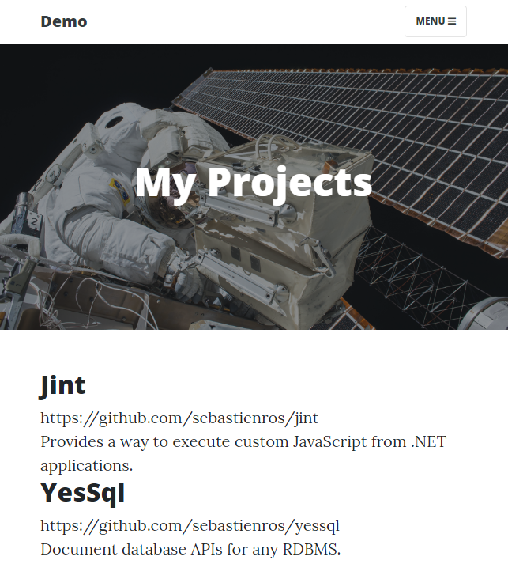

# Orchard Core Theming explained (`OrchardCore.Themes`)

This article explains how a Content Item is rendered, and the many ways in which the HTML that is rendered can be customized.  
It also explains the fundamental theming concepts, namely __Shapes__, __Alternates__, __Templates__, __Differentiators__, __Content Zones__ and __Display Types__.

## Goals

Let's assume we want to add a portfolio section to our Blog where we could list all the projects we are working on, and be able to manage these projects individually, as opposed to having an static page where we would have to copy-paste the HTML for each project.

The portfolio should have its own URL like `/portfolio`, and should display the projects in a predefined order.

The end result would look like this:



## Modeling the content

The only obvious thing that is required is to create a new `Project` content type.

However there are many different ways to model the content to represent a portfolio:

- Create a `Portfolio` content type with a `List` content part that is limited to `Project` content items. In this case, projects are independent from the list and can be reused elsewhere in the site (they are referenced by the portfolio).
- Create a `Portfolio` content type with a `BagPart` content part that is limited to `Project` content items. In this case project content items live inside the portfolio content item (they are contained by the portfolio).
- Create a Liquid Page content item to query and render all content items of type `Project`.
- Create a Razor Page that will use a query to load all the project content items.

This article will explain how to do it with a `BagPart` as it will provide the best performance by issuing a single database query, while allowing to do everything from the admin UI.

## Creating the content types

`Project` is a content type that will be composed of:

- a `Title` part to set a custom name;
- a `Text` field to store the link to the project;
- a `Markdown` part to provide a description in markdown format.

In the admin, select __Content Definition__ then __Content Types__ and create a new type named `Project`. Click **Create**.

Select __Title__ and __Markdown__ for the parts we can add already, then click **Save**.

Click **Edit** for the __Markdown__ part. Select __Wysiwyg editor__ and click **Save**. This will provide a richer markdown editing experience.

Click **Add Field**, give it a display name `Url`, and select __Text Field__. Click **Save** then **Save** again.

Take the time to drag and drop the __Title__ part at the top of the list such that it will appear first in the editor. Then click **Save**.


At that point you could already create all the Project content items you want very easily. However we need to create a `Portfolio` type to contain and organize them.

In the admin, select __Content Definition__ then __Content Types__ and create a new type named `Portfolio`. Click **Create**.

Select __Title__, __Autoroute__ and __Bag__, then click **Save**.

Now we can configure the `Portfolio` content type to only accept `Project` content items in its bag.

Click **Edit** for the __Bag__ part. Check __Project__ and click **Save**.

Click **Edit** for the __Autoroute__ part. Enter `{{ ContentItem | display_text | slugify }}` and check __Allow custom path__. Click **Save**. This will generate a customizable url or used what the user defines.

Take the time to drag and drop the __Title__ part at the top of the list such that it will appear first in the editor. Then click **Save**.


## Creating the Portfolio

Click on **New**, then __Portfolio__.

Give it a title like `My Project`.

In __Permalink__ enter `portfolio`. This will be the url to display this content item.

As you click on **Add Item** you'll notice that only __Project__ is available as configured in the `Bag` part for `Portfolio`.

Create a few Projects, then click **Publish**.

Click on the __View__ button to see how it looks like already.


At that point it already looks like something that could be shipped, and all the information that was entered is rendered in some way. Next step is to understand how all this content got rendered.

## Rendering logic

### Loading the portfolio from the database

When the url `/portfolio` is requested, a custom action is called to render the content item that is associated with this URL.  
The URL got associated with the portfolio thanks to the __Autoroute__ part that provides this mechanism.  
The autoroute registers a custom URL and stores the associated content item id.  
At this point the action will issue a database request to load the portfolio in its entirety, including the projects, as this is how it was modeled with the __Bag__ part.

### How a Content Item is displayed

With the portfolio in memory, the theming engine is invoked to render the content item.  
What happens at that moment is that all the components which want to participate in the rendering of a content item are invoked (the Display Drivers), and each component can return an object representing what to render (the Shapes).

In our case, the __Title__ and __Bag__ parts are provided by custom modules that have specific a __Display Driver__ for each of these parts.  
Then another display driver will be invoked for each __Text__ field.  
The __Bag__ part will invoke all available display drivers recursively, to render the `Project` content items it owns.

Each of these drivers return one or more shapes that are added to named zones (or sections) of a global __Shape__ called the `Content` shape.

For instance the `TitleDisplayDriver` class will return a shape of type `TitlePart` in the `Header` zone of the main shape at position `5`. See [TitlePartDisplayDriver](../../../../OrchardCore.Modules/OrchardCore.Title/Drivers/TitlePartDisplayDriver.cs#L14-L20)

Then the `BagPart` shape is added in the `Content` zone of the main shape at the position `5`. See [BagPartDisplayDriver](../../../../OrchardCore.Modules/OrchardCore.Flows/Drivers/BagPartDisplayDriver.cs#L39-L45).

Once all the drivers for all the parts and all the fields have returned their shapes to specific zones of the main `Content` shape, Orchard will look for a matching template.
Template matching is done dynamically, and if no specific ones are created for a Content Type, then the file `Content.cshtml` (or `Content.liquid`) is used.  
The default template will go over all the zones it knows about and render the shapes that are inside each of them.  
See [Header](../../../../OrchardCore.Modules/OrchardCore.Contents/Views/Content.cshtml#L17) where the `Header` zone shapes are rendered (the `TitlePart` shape) and also [Content](../../../../OrchardCore.Modules/OrchardCore.Contents/Views/Content.cshtml#L24) where the `Content` zone shapes are rendered (`BagPart` and `TextField` shapes).

## Customizing templates

We can already see that many shapes, and thus templates, are used to render a single content item. But every piece of HTML can be replaced, locally (for a page) or globally (for the whole site).

Templates are usually provided by the modules that create the corresponding shape types, but can always be redefined by a Theme.  
Themes are able to provide custom templates that will be used instead of the default ones. This means that a template can be copied to a theme in order to be customized.

### Alternates

When the __Content__ shape is rendered into HTML, it is done using the `Content.cshtml` file as mentioned earlier.  
Similarly, the __TitlePart__ shape will be converted using a `TitlePart.cshtml` template.

This means that we can copy the `Content.cshtml` file from the `OrchardCore.Contents` module in order to customize how the __Content__ shape is rendered.  

One issue with customizing the `Content.cshtml` file is that it would change how any content item is rendered.  
The original file is generic enough to be usable with any content type, and does so by rendering a generic `<article>` element with a `<header>`, a body and a `<footer>`.
Each driver provides shapes that will target these predefined zones, and the `Content.cshtml` default template just renders them all in order.  
For this reason it is not recommended to change this file as it may impact too many pages, unless you decide to change the way content items are rendered by default.

To be able to change how specific content types are rendered, the theming engine provides the concept of __Alternates__.  
An alternate is an optional shape type that should be used if a template can be found for it.  
Alternates provide more specific ways to customize templates.  
In the case of our Portfolio __Content__ shape, a special alternate named `Content__Portfolio` is added so that we can provide a template for the __Content__ shape that will be used only for __Portfolio__ content items.

When a shape contains `__` in its name, the theming engine will match a file with a `-` instead.  
In this case we can provide a template named `Content-Portfolio.cshtml` in order to customize how a __Portfolio__ content item is rendered.  
This file can be created by copying the original `Content.cshtml` file or by creating a brand new one.

Many other alternates are available to be able to selectively create templates for a content item.  
See [Content templates](../Templates/README.md#content-templates)

### Customizing Part templates

It might not be necessary to change the __Content__ template, but only to change how a single part or field is rendered.  
These are also rendered as shapes and have specific templates that can be customized.

The __Title__ part can be customized by creating a template for the `TitlePart` shape. See [`Title`](../Title/README.md)

Changing how the title is rendered for every content items would mean creating one of these files:

#### TitlePart.cshtml

```html
<h1>@Model.Title</h1>
```

#### TitlePart.liquid

```liquid
<h1>{{ Model.Title }}</h1>
```

Assuming only the title of __Portfolio__ content items should be customized, alternates can be used to create a specialized template. Content part shapes have alternates specific to their parent's content type, in this case `Portfolio__TitlePart`. see [Content type, Display type, Part type](../Templates/README.md#contenttype_displaytype__parttype)

The template file name for this shape is `Portfolio-TitlePart.cshtml`.

### Customizing Field templates

Because multiple fields of the same type can be added to the same content type or even the same content part, their shape type is not the optimal way to customize the template. Fortunately different alternates based on their name are available.

For a list of available shape alternates for fields see [Content field templates](../Templates/README.md#content-field-templates)

In our case, the __Project__ has a __Text__ field named `Url`. The best shape to override in this case is `Project__Url` which will match the template `Project-Url.cshtml`.

The model accessible from this field is described here [Available fields](../ContentFields/README.md#available-fields)

This page explains that the __Text__ field contains a property `Text` that contains the value of the field.

To create a link for this field we can create these templates:

#### `Project-Url.cshtml`

```razor
<a href="@Model.Text">External url</a>
```

#### `Project-Url.liquid`

```liquid
<a href="{{ Model.Text }}">External url</a>
```

### Display types

When a content item is rendered by the theming engine, a specific __Display Type__ is provided as a context of how rendered elements will be used. The default display type is called __Detail__. This is the one that is used to render a content item in its entirety.

When content items are rendered in a list, the convention is to use the `Summary` display type.  
Looking at how our __Portfolio__ content item is rendered, the __Project__ content items are displayed as a list, using the `Summary` display type.  
Alternates exist to target templates for a specific display type.  
For instance we can customize how __Project__ content items are displayed when rendered as part of a list by create a template for the shape `Content_Summary__Project`, which corresponds to the file `Content-Project.Summary.cshtml`.  
See [Templates documentation](../Templates/README.md#content_displaytype__contenttype)

Here, the `_` in the shape name is replaced by a dot (`.`) in the template name, and the dotted portion of the name is moved at the end.

### Content zones, differentiators

As previously stated, the __Content__ shape is made of zones that contains all the shapes which were provided by the display drivers, and ways to customize the templates for these shapes was explained.

Sometimes it is necessary to be able to reorganize the list of shapes that are added in these zones, for instance to remove some shapes of the list, or move them to a different location.

In the case of the __Project__ main content shape, the `Content` zone contains two shapes:

- `TextField`
- `MarkdownPart`

The `TitlePart` shape is rendered in the zone called `Header`.

Some templating helpers provide ways to select and remove these shapes.

In order to cherrypick specific shapes from a zone, shapes are given a nickname called a __Differentiator__.  
This is necessary, as multiple identical shape types can be added to content zones. See [Shape differentiators](../Templates/README.md#shape-differentiators)

For the `Url` text field the differentiator is `Project-Url`. For the __Markdown__ part it is `MarkdownPart`.

This lets us customize the __Content__ shape template for __Project__.

#### `Content-Project.cshtml`

```razor
<article>
    <header>
        @await DisplayAsync(Model.Header.TitlePart)
        @{ Model.Header.Remove("TitlePart") }

        @await DisplayAsync(Model.Header)
    </header>

        @await DisplayAsync(Model.Content["Project-Url"])
        @{ Model.Content.Remove("Project-Url") }

        @await DisplayAsync(Model.Content.MarkdownPart)
        @{ Model.Content.Remove("MarkdownPart") }

        @await DisplayAsync(Model.Content)
    <footer>
        @await DisplayAsync(Model.Footer)
    </footer>
</article>
```

#### `Content-Project.liquid`

```liquid
<article>
    <header>
        {{ Model.Header.TitlePart | shape_render }}
        

        {{ Model.Header | shape_render }}
    </header>

        {{ Model.Content["Project-Url"] | shape_render }}
        

        {{ Model.Content.MarkdownPart | shape_render }}
        

        {{ Model.Content | shape_render }}

    <footer>
        {{ Model.Footer | shape_render }}
    </footer>
</article>
```

Here the known shapes are extracted from their respective zones, then rendered explicitly.  
Finally the rest of the shapes in each of the zones are rendered, in case more content fields or parts are added to the content type later on.  
If the zones weren't being rendered, the new elements would not show up automatically.

Instead of rendering the shapes that have been removed from the zone, some custom rendering can be applied directly.  
One advantage of reusing the shape is that its template might contain some complex logic that is not easily reusable.  
This is the case for the `MarkdownPart` shape for instance, as it will have to convert some markdown content to HTML.  
The `TitlePart` however could easily be ignored and the __Content__ template directly access the `Title` property of this shape.
