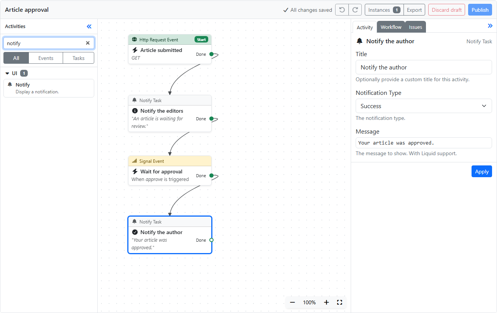
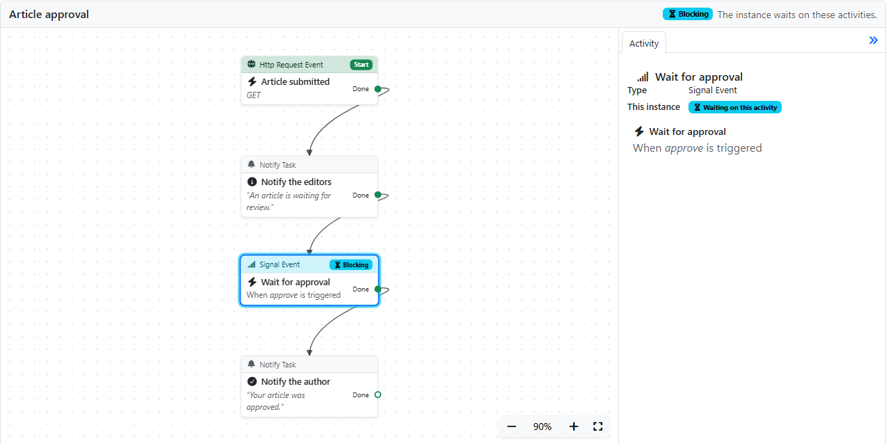

# Workflows (`OrchardCore.Workflows`)

The Workflows module provides a way for users to visually implement business rules using flowchart diagrams.

## General Concepts

A workflow is a collection of **activities** that are connected to each other. These connections are called **transitions**.  
Activities and their transitions are stored in a **Workflow Definition**.

A workflow is essentially a visual script, where each activity is a statement of that script.

There are two types of activities: **Task** and **Event**.  
A Task activity typically performs an action, such as publishing a content item, while an Event activity typically listens for an event to happen before execution continues.

In order for a workflow to execute, at least one activity must be marked as the *start of the workflow*.  
Only Event activities can be marked as the start of a workflow.  
An example of such an event activity is *Content Created*, which executes whenever a content item is created.  
A workflow can have more than one start event. This allows you to trigger (run) a workflow in response to various types of events.

Each activity has one or more **outcomes**, which represent a source endpoint from which a connection can be made to the next activity, which are called transitions.  
By connecting activities, you are effectively creating a program that can be executed by Orchard in response to a multitude of events.

## Workflow Designer

Workflow definitions are edited in the workflow designer: open **Workflows** in the admin menu, then select a workflow. The designer takes the whole page: its toolbar shows the name of the workflow, after a **Workflows** link back to the list.

**Create Workflow** only asks for a name; the other settings have defaults, under **More settings**, and the designer's **Workflow** tab changes them later. A new workflow starts empty, and offers the common events to start it with: a workflow runs when something happens, so its first activity is an event.

In the list of workflows, **Edit** opens the designer, and each workflow's **Actions** menu can **Clone** it (with a new name and its own settings), **Export** it as a recipe, or **Delete** it. The settings of a workflow, such as its name or whether it is enabled, are edited on the designer's **Workflow** tab.



The designer has four areas. What concerns the whole workflow is on the right, and what concerns the selected activity is below the canvas:

- **Activities** (on the left) lists the activities you can add, grouped by category. Search them by name or category, or show only events or tasks. Drag an activity onto the canvas, or click it to add it in the middle of the view.
- **The canvas** (in the middle) shows the activities and the transitions between them. Each activity shows its type, its settings, and one port per outcome. Transitions are drawn with right angles, around the activity they leave.
    - Click the port of an outcome that leads nowhere yet (it shows a **+**) to add the next activity: pick it in the list (type to search), and it's added to the right, already connected.
    - Drag from an outcome's port to another activity to connect them. An outcome has at most one transition, so connecting it again replaces its previous transition.
    - Start activities show a **Start** badge, and activities with problems show their number of issues.
    - Right-click an activity, a transition or the canvas for more actions, such as making an event the start activity.
- **The workflow panel** (on the right) has three tabs:
    - **Variables**: the [variables](#variables) of the workflow, with their types and default values.
    - **Workflow**: the settings of the workflow: its name, whether it is enabled, whether it is a singleton, its lock settings, and whether finished instances are deleted.
    - **Issues**: the problems found in the workflow, errors first. Select one to go to its activity.
- **The activity panel** (at the bottom of the canvas) opens when you double-click an activity, click the settings button at the top right of its card, or select it and press Enter. A click only selects an activity, so you can move activities around without opening it; moving them closes it, and so does a click on the canvas or **Close**. It has up to three tabs:
    - **Settings**: the editor of the activity.
    - **Outputs**: for an activity that produces values, each value with its type, and the [variable](#variables) to **Store in**, which the activities after it read. The variables of a type the value may not convert to are listed apart.
    - **Available data**: what the activity's expressions can read (see [Available Data](#available-data)).

The activity panel opens over the bottom of the canvas, without moving the workflow; the canvas only pans when the activity would be under the panel. Drag its top edge to resize it. Its **Delete** button deletes the activity, which the toast that follows can undo, as the Delete key does. **Pin** it to keep it open below the canvas, which then gets shorter, whether an activity is selected or not.

The activities pane and the workflow panel can be collapsed to a narrow rail, to give the canvas more room. Hover a rail to open its pane over the canvas, or click it to expand the pane again. The workflow panel's rail shows its tabs, so you can go straight to one of them. The width of the workflow panel, the height of the activity panel, whether it is pinned and whether each pane is collapsed are remembered in your browser.

### Focusing on Part of a Workflow

In a large workflow, you can hide the activities you aren't working on. Right-click an activity (or press Shift+F10 or the Menu key) and choose **Collapse the activities after it** to hide the activities that come after it. An activity that a start activity also reaches without going through the collapsed one (for example a branch that joins back) stays visible, and start activities are never hidden. The collapsed activity looks like a stack and shows how many activities it hides: click that number, or choose **Show the hidden activities after it**, to show them again.

While activities are hidden, a notice at the bottom of the canvas shows how many, with **Show all**. Hidden activities are still part of the workflow: they are saved, published and executed as usual. Selecting one, for example from the **Issues** tab, shows it again. The collapsed activities of each workflow are remembered in your browser.

### Drafts and Publishing

The designer saves your changes as you make them, to a **draft** of the workflow. A draft doesn't run: the workflow keeps running its published definition until you publish the draft.

- The toolbar shows whether all changes are saved. When the connection is lost, the designer retries until it can save, and leaving the page asks first while changes aren't saved.
- **Publish** makes the draft the published definition, as a new [version](#versions). Errors must be fixed first, and when the workflow has warnings, the designer asks before publishing. Running instances keep running on the version they started on.
- **Discard draft** deletes the draft and goes back to the published definition.
- When someone else changes the workflow while you edit it, the designer stops saving and asks what to do. **Reload** loads their version and drops your unsaved changes. **Overwrite** saves your layout and connections over theirs.
- When someone else last changed the draft, a banner shows who and when.

The changes made in an activity editor are applied when you leave a field, and when you select another activity. When a field is invalid, the editor shows the error, and the designer asks before you leave that activity.

**Instances** lists the instances of the workflow, and **Export** downloads its published definition as a recipe.

### Keyboard Shortcuts

| Keys | Action |
|------|--------|
| Ctrl+Z, Ctrl+Y (or Ctrl+Shift+Z) | Undo, redo a change on the canvas |
| Tab | Move between activities; the focused activity is selected |
| Enter | Edit the selected activity |
| Escape, in the activity panel | Go back to the activity on the canvas |
| Arrow keys | Move the selected activities by one grid cell, or by one pixel with Shift |
| Delete, Backspace | Delete the selection; the toast that follows can undo it |
| Ctrl+A | Select all the activities |
| Escape | Clear the selection |
| Shift+F10, Menu key | Open the actions of the focused activity, including **Connect an outcome to…** |
| +, − | Zoom in, zoom out |
| Ctrl+wheel | Zoom around the pointer |
| Drag the background, Space+drag, middle button, wheel | Pan |

Undo covers the changes made on the canvas: adding, moving, connecting and deleting activities. The changes made in an activity editor are applied on the server, so the undo history starts over after them.

### Right-to-Left Languages

In right-to-left languages, the activities pane and the workflow panel swap sides, but the canvas isn't mirrored: a workflow looks the same to every user, whatever their language.

### Workflow Instances

The page of a workflow instance shows the version of its workflow that the instance runs on, in a read-only designer, with the activities the instance waits on (its **blocking** activities) highlighted. Select an activity to see its details and outputs in the activity panel. The **Variables** tab of the workflow panel shows the values of the instance's variables, and the activities and connections the instance ran are highlighted (see [Execution Journal](#execution-journal)). Right-click an activity to collapse the activities after it; the blocking activities are never hidden. The **State** tab shows the instance's state as JSON.



## Versions

Each time a workflow is published, its definition is saved as a new **version**, numbered 1, 2, 3 and so on. A version holds what affects how the workflow runs: its activities and their settings, its transitions, its variables, and the **Singleton**, lock, **Delete finished workflows**, **Outcomes with several transitions** and **Fault the workflow on script errors** settings. Renaming a workflow, or enabling and disabling it, doesn't create a version.

- **Instances run on their version.** A new instance starts on the published version, and keeps running on it until it finishes, even when newer versions are published. Changing or removing the activities an instance waits on doesn't affect it.
- **Instances created before versions existed** (on a site upgraded from an earlier release) keep running on the current definition, as they did before. Upgrading turns each existing workflow into its version 1.
- **Restarting** an instance starts a new one on the published version.

**Versions**, in the designer's toolbar, lists the versions with when and by whom they were published, and how many instances run on each:

- **View** shows a version in a read-only designer.
- **Compare** shows a version next to the draft (or next to the published version when there is no draft), with the added, removed, changed and moved activities and the added and removed transitions highlighted, and listed below.
- **Restore** copies a version into the draft, so that it can be published again as the next version. The name and enabled state of the draft are kept.

The list of instances shows the version each instance runs on, and the page of an instance says which version it runs on and whether that is the published version.

### Versions in Recipes and Deployments

A `WorkflowType` recipe step that imports a workflow that already exists updates it: the imported definition becomes its next version, its instances are kept and keep running on their versions, and its draft is discarded. Exports and deployment plans contain the published definition, without the version history.

### Keeping Fewer Versions

Every version is kept by default. To keep only the most recent versions of each workflow, set `MaxCount` in the `OrchardCore:Workflows:Versions` configuration, for example in an `appsettings.json` file:

```json
{
  "OrchardCore": {
    "Workflows": {
      "Versions": {
        "MaxCount": 20
      }
    }
  }
}
```

When a version is created, the versions older than the most recent `MaxCount` ones are deleted, except those that instances run on. See [Configuration](../Configuration/README.md) for more information on such configuration.

### Versions for Developers

- `IWorkflowTypeStore.SaveAsync` creates the versions: saving a workflow type whose activities, transitions or execution settings changed creates its next `WorkflowTypeVersion` and sets `WorkflowType.VersionId`.
- `IWorkflowManager.NewWorkflow` stores that version in `Workflow.WorkflowTypeVersionId`, and `ResumeWorkflowAsync` runs it.
- `IWorkflowTypeVersionStore` lists and loads versions. Its `GetWorkflowTypeAsync(workflowType, versionId)` returns the definition an instance runs; never save the workflow type it returns.

## Execution Journal

Workflow instances record each activity they run in a **journal**: the activity, how it ended (completed, waiting on an event, or faulted), its outcomes, when it started and how long it took, and the error of a fault or of a [script that failed](#script-errors). The journal is saved with the instance, in its own collection, and is deleted with the instance (when it is deleted, trimmed, or when its workflow is deleted).

The page of a workflow instance uses the journal:

- **Executed path.** The activities the instance ran and the connections it followed are highlighted, with the number of times when it's more than one (in a loop, for example). The activity that faulted the instance is marked.
- **Journal tab.** The workflow panel lists the records in order, with their status, outcomes, duration and error. Select a record to open its activity on that run.
- **Runs tab.** The activity panel lists each time the instance ran the selected activity. Open a run to see what the activity did, when the workflow records it (see below).
- **Script errors.** An activity whose scripts failed is outlined in amber, with a badge that lists the errors.

### Recording What Each Activity Did

With **Record activity data** checked in the workflow's settings, each record of the journal also keeps the data of the activity's execution, which the **Runs** tab shows:

- **Expressions.** Each expression the activity evaluated, with the setting it belongs to (`Condition`, `Script`, `Inputs.amount`…), its syntax, and its result. For example, the condition of an If/Else and whether it was true.
- **Outputs.** The [outputs](#variables) the activity set.
- **Variables.** The variables the activity changed, with their new value, and the other workflow properties it changed (such as with **Set Property**).
- **Last result.** The value the activity returned, which the next activity reads as the [last result](#last-result).

Values are kept as JSON. A value longer than 2,000 characters is cut, and a record keeps at most 32,000 characters of values; the run then says that some values were cut or left out. A record of an activity that evaluated, set and changed nothing has no data.

The setting is checked for the workflows created in the admin, and off for the existing ones and those that recipes create without it. Values can be large, and they can be sensitive (personal data, keys): leave it unchecked for a workflow whose values shouldn't be stored. The data is deleted with the journal. The setting is part of the workflow's [versions](#versions).

The built-in JavaScript, Liquid and Literal syntaxes record their evaluations. A [custom syntax](#adding-a-syntax) records its own with `WorkflowExecutionContext.ReportEvaluation(syntax, expression, result)`, and an activity's outputs are recorded by `SetActivityOutput`.

### Retrying a Faulted Instance

When an activity fails, for example because a service it calls is down, the instance is **faulted** and stops. After fixing the cause, select an activity of the faulted instance, usually the one that faulted, and choose **Retry from here**. The instance runs again from that activity, with the state it had (its properties, variables and activity states), on the version it runs on. Retrying requires the **Execute workflows** permission.

### Script Errors

When a JavaScript expression fails, for example because it reads a field of a value that is missing (`input("Order").Total` when there is no `Order`), the error is logged and the expression returns its default value (nothing, `false` or `0`), so the activity goes on with that value. The journal records the error on the activity's record:

- **Canvas.** On the page of the instance, the activity is outlined in amber, with a warning badge that lists the errors. The legend explains the badge.
- **Journal tab.** The record shows a **Script error** badge, and the error.

To stop at such an error instead, check **Fault the workflow on script errors** in the workflow's settings. The instance then faults at the activity whose script failed, like with any other error: the activity is marked as faulted, the workflows that start with a **Catch Workflow Fault Event** run, and the instance can be [retried](#retrying-a-faulted-instance) after the script is fixed. The setting is off by default, and is part of the workflow's [versions](#versions).

An expression that is stopped, because it runs too long or the request is canceled, always faults the instance.

### Journal Settings

The journal is configured in the `OrchardCore:Workflows:Journal` section, for example in an `appsettings.json` file:

```json
{
  "OrchardCore": {
    "Workflows": {
      "Journal": {
        "Enabled": true,
        "MaxRecordsPerInstance": 1000
      }
    }
  }
}
```

| Setting | Description | Default |
|---|---|---|
| `Enabled` | Whether the activities instances run are recorded. | `true` |
| `MaxRecordsPerInstance` | The number of most recent records kept per instance; 0 keeps every record. | `1000` |

The journal doesn't record the input or output of the activities.

### Journal for Developers

- `IWorkflowExecutionJournal` lists, saves and deletes the `WorkflowExecutionRecord` documents of an instance.
- `WorkflowExecutionContext.ExecutedActivities` holds the most recent 100 activities and outcomes the instance ran, and is saved with its state (`WorkflowState.ExecutedActivities`, oldest first).
- `IWorkflowManager.RetryActivityAsync(workflow, activityId)` runs a faulted instance again from an activity.
- `WorkflowExecutionContext.ReportScriptError(message)` reports an error that an expression recovered from; the JavaScript evaluator reports the errors of its expressions. The engine records them on the activity's record, or faults the instance with a `WorkflowScriptException` when `WorkflowType.FaultOnScriptErrors` is set.

## Branching

An outcome usually has one transition. To run several branches, use a **Fork** activity, whose outcomes each start a branch, and a **Join** activity to wait for them.

A workflow can also follow every transition of an outcome. In its settings, set **Outcomes with several transitions** to **Follow every transition**:

- In the designer, connecting an outcome adds a transition instead of replacing the existing one.
- The engine runs the transitions in the order they were added, in the same run, like the branches of a Fork. A branch that waits on an event makes the instance wait while the other branches go on, and a Join after the branches waits for them as after a Fork.

With the default, **Follow the first transition only**, the other transitions of an outcome are ignored, and the designer warns about them. The setting is part of the workflow's [versions](#versions); workflows saved before it existed use the default.

### Modeling a State Machine

Approvals and other lifecycles can be modeled as a state machine with a variable and a loop:

1. Declare a `state` [variable](#variables) of type Text, and set it to the first state, for example `Draft`, with a **Set Variable** activity.
2. Add a **Script** task whose **Available Outcomes** are the states (`Draft, Review, Published`...), with the script `setOutcome(variable('state'));`.
3. From each state's outcome, wait for the events that leave the state: a **Signal**, a content or user event, or a timer. When several events can fire, use a **Fork** into the events and a **Join** whose mode is `WaitAny`. Then set `state` to the next state, and connect back to the Script task.
4. Leave the final state's outcome unconnected, so the workflow finishes.

The [execution journal](#execution-journal) of an instance shows the states it went through, and the work of each state can be a workflow of its own, run with [Execute Workflow](#workflows-as-activities).

## Workflows as Activities

A workflow can run another workflow as one of its activities, pass it values, and get values back:

1. In the settings of the workflow to run, check **Usable as an activity**.
2. In its **Variables** tab, mark the variables it takes as **Input**, and those it returns as **Output**.
3. Make its start activity a **Started By Workflow** event. A workflow without one starts on its first start activity.

The workflows usable as an activity are listed in the **Workflows** category of the activities pane. Each one adds an **Execute Workflow** task that runs it. The task can also be added from the **Primitives** category, and its workflow selected in its editor. The task has these settings:

- **Workflow.** The workflow to run. Its input variables show up below once it's selected.
- **Inputs.** An expression per input variable, in any [syntax](#choosing-the-syntax-of-an-expression). The value is converted to the variable's type; a value that doesn't convert is logged, and the variable keeps its default value.
- **Wait for the workflow to finish.**
    - When checked, the task continues with its **Done** outcome once the workflow finished, and its outputs are the workflow's output variables. They can be [bound](#reading-and-writing-variables) to the variables of the calling workflow. When the workflow waits on an event, the calling workflow waits too, and continues when the workflow finishes. When the workflow faults, the task takes its **Failed** outcome.
    - When unchecked, the task takes its **Done** outcome as soon as the workflow started.

The task's outputs are stored when it's edited (or added from the activities pane). Edit the task again after changing the outputs of the workflow it runs.

The workflow runs on its published version, as a new instance that records the instance and the activity that started it (`ParentWorkflowId` and `ParentActivityId`). Workflows can run each other 16 levels deep in a run; a task that runs the workflow it belongs to shows a warning in the designer.

Code can start a workflow as the child of an activity with `IWorkflowManager.StartChildWorkflowAsync`. When the child ends in a later run, the activity that started it is resumed with a `ChildWorkflowResult` input.

### Activity Presets

Entries of the activities pane can add an existing activity with preset properties: the workflows usable as an activity are presets of the Execute Workflow task. Modules can add presets with an `IActivityPresetProvider`, from code, configuration or data, like a catalog of HTTP calls:

```csharp
public sealed class WeatherPresetProvider : IActivityPresetProvider
{
    public Task<IEnumerable<ActivityPreset>> GetPresetsAsync()
        => Task.FromResult<IEnumerable<ActivityPreset>>(
        [
            new ActivityPreset
            {
                Id = "weather:forecast",
                ActivityName = "HttpRequestTask",
                DisplayText = "Weather forecast",
                Category = "Weather",
                Properties = new JsonObject
                {
                    ["Url"] = new JsonObject { ["Expression"] = "https://weather.example.com/forecast" },
                    ["HttpMethod"] = "GET",
                },
            },
        ]);
}
```

Register it with `services.AddScoped<IActivityPresetProvider, WeatherPresetProvider>()`. A preset sets the properties of the activity it adds over the activity's defaults; the stored workflow refers to the registered activity, so it keeps working when the preset changes or goes away.

## Real-Time Updates

When [SignalR](../SignalR/README.md) is enabled (the `OrchardCore.SignalR` feature), the designer and the instance pages update live:

- **Who else is here.** The designer's toolbar shows the initials of the other users who have the workflow open.
- **Others' changes.** When someone else changes the draft, publishes it or discards it, the designer shows a notice with **Reload**. Your unsaved changes stay until you reload. The changes you make in another tab are detected when you save, as before.
- **Running instances.** The page of an instance follows it: when the instance runs again (resumed by an event, or retried), the executed path, the journal and the activities it waits on update.

The pages connect to the `/hubs/workflows` hub of the tenant, which requires the **Manage workflows** permission. Clients subscribe to a workflow type or an instance; the server keeps no list of who is connected, so it works on several nodes with the Redis or Azure SignalR backplanes. Without SignalR, the pages work as before.

For developers, `IWorkflowDesignerNotifier` is told about the changes of workflow types (by the draft manager) and instances (each time the engine saves one). The default implementation does nothing; the feature's implementation sends the changes once the request's changes are committed.

## Variables

A workflow can declare **variables**: named values that every activity of an instance can read and write, each with a type and an optional default value. Variables are declared in the **Variables** tab of the designer's workflow panel, and are part of the workflow's [versions](#versions).

Variables belong to the workflow, not to an activity: an activity sets a variable, and the activities that run after it read the new value. Each instance has its own values, so two instances that run at the same time don't share them. The [samples](#samples) show them at work.

| Type | Name | Values | Default value |
|---|---|---|---|
| Text | `string` | Text. Numbers, dates (ISO 8601), booleans (`true`/`false`) and objects (JSON) convert to text. | Text |
| Number | `number` | A number (`double`). Numbers and text in the invariant culture convert to it. | A number |
| Yes or no | `boolean` | `true` or `false`, from booleans and the texts `true` and `false`. | Yes, no or none |
| Date and time | `datetime` | A UTC date and time, from dates and ISO 8601 text; text without an offset is UTC. | A date and time |
| Object | `object` | A dictionary, from objects, JSON objects and their text. | JSON |
| List | `array` | A list, from lists, JSON arrays and their text. | JSON |
| Any | `any` | Any value, as it is. | JSON |
| Content item | `contentItem` | A content item, when the `OrchardCore.Contents` feature is enabled. | None |

- **Defaults.** A variable gets its default value when an instance starts, or when it resumes on a version that declares a variable it doesn't have yet. A variable without a default has no value until it's set.
- **Names.** Names are identifiers (a letter or `_`, then letters, digits or `_`), unique ignoring case. Variables are found ignoring case.
- **Values.** Setting a variable converts the value to its type. When the value doesn't convert, the workflow faults, with a message naming the variable.
- **Inputs and outputs.** A variable marked as **Input** is set from the input value of the same name the workflow starts with, converted to its type. One marked as **Output** is returned to the workflow that runs this one as an activity. See [Workflows as Activities](#workflows-as-activities).

### Reading and Writing Variables

- **JavaScript.** `variable("name")` returns the value of a variable, and `setVariable("name", value)` sets it. In the designer's script editors, typing `variable` or `setVariable` suggests the declared variables. A value that doesn't convert is a script error: it's logged, and the variable doesn't change.
- **Liquid.** `{{ Workflow.Variables.name }}` returns the value of a variable.
- **Set Variable activity.** It sets a variable to the result of a JavaScript or Liquid expression. Its name field suggests the declared variables.
- **Activity outputs.** Some activities produce values, their **outputs**. The **Outputs** tab of the activity panel stores each output in a variable. The value is converted to the variable's type after the activity runs (not when it waits on an event or faults), and the workflow faults when it doesn't convert.

| Activity | Outputs |
|---|---|
| Script | `Result` (any): the value the script returns. |
| Liquid | `Result` (text): the rendered template. |
| Set Property | `Value` (any): the value it sets. |
| HTTP Request | `Body` (text), `StatusCode` (number) and `Response` (object): the response. |
| Create Content, Retrieve Content, Update Content | `ContentItem` (content item): the content item, when the activity succeeds. |

The **Issues** tab warns about a Set Variable activity or an output that names a variable the workflow doesn't declare, and about an output whose values may not convert to its variable's type (for example a number output stored in a yes or no variable). Any value converts to text, and nothing is checked for `any`.

### Samples

The **Workflow Variables Samples** recipe adds three sample workflows. Run it from **Configuration** → **Recipes**; it also enables the **Workflows** and **HTTP Workflows Activities** features. Each sample starts with an HTTP request: open that activity's editor to generate its URL, then open the URL in a browser.

- **Sample: order total.** Its variables have defaults, and its activities set them one after the other:
    1. **Read the query string** (Script) sets `customer` and `quantity` with `setVariable()`. The text `3` becomes the number `3`, since `quantity` is a number.
    2. **Compute the total** (Set Variable, JavaScript) sets `total` to `variable('quantity') * variable('unitPrice')`.
    3. **Choose a discount** (Script) returns the discount, and its **Result** output is stored in the `discount` variable.
    4. **Compose the reply** (Set Variable, Liquid) builds `message` from the other variables, and **Reply** returns it.

    With `&customer=Ann&quantity=3` at the end of its URL, it replies "Ann ordered 3 item(s) for 28.5, with a 10% discount."; without them, the defaults apply: "Guest ordered 1 item(s) for 9.5, with a 0% discount."
- **Sample: format a greeting.** It's usable as an activity: its `name` variable is an input, and its `greeting` variable an output.
- **Sample: greet through another workflow.** An Execute Workflow task runs **Sample: format a greeting**, with `queryString('name') || 'world'` as its `name` input, and stores its `greeting` output in the `reply` variable. With `&name=Ann`, it replies "Hello, Ann!".

The **Variables** tab of an instance's page shows the values its variables have.

### Variables and Properties

A variable is a workflow property with a type: the variable `greeting` is stored as `Properties["greeting"]`. Activities and scripts that use properties (`property("greeting")`, `{{ Workflow.Properties.greeting }}`, Set Property) see variables, and the existing workflows that use properties keep working. Writing a variable as a property doesn't convert the value. Setting an undeclared name with Set Variable or `setVariable()` stores the value as a property, as it is.

The page of a workflow instance lists its variables, with the values the instance has, in the **Variables** tab.

### Variables for Developers

- `WorkflowExecutionContext.Variables` reads and writes the declared variables with their types; a value that doesn't convert throws `WorkflowVariableException`.
- An activity declares outputs by implementing `IActivityOutputs`, each with a `Name`, a `TypeName`, a `DisplayName` and an optional `Description`, and sets them while it runs with `workflowContext.SetActivityOutput(activityContext, "Result", value)`. The bindings are stored in the activity's `Properties["OutputBindings"]` (see `ActivityOutputBindingExtensions`).
- A module adds a variable type by registering an `IWorkflowVariableType`: its name, display name, how the designer edits its default (`text`, `number`, `boolean`, `datetime`, `json` or `none`), and how values convert to it. Its values are persisted with the instance like other workflow properties, so it needs an `IWorkflowValueSerializer` if they don't serialize to JSON and back. A type registered with an existing name replaces it.
- The built-in types cover most values. A type of its own is worth it for a value that needs its own conversion, editor or storage. For example, `contentItem` stores the id of the content item, and loads the item again when the instance resumes, so instances don't keep a copy of the item that goes stale.

```csharp
services.AddScoped<IWorkflowVariableType, MyVariableType>();
```

## Vocabulary

When working with Orchard Workflows, you will encounter the following terms:

### Workflow Definition

A document (as in a "document-DB" document) that contains all the necessary information about a workflow, such as its name, whether it's enabled or not, its set of activities and their transitions.

### Workflow Instance

A document that represents an "instance" of a workflow definition. A workflow instance contains runtime-state of a workflow.  
Whenever a workflow is started, a new workflow instance is created of a given workflow definition.

### Activity

A step in a workflow definition.  
An activity performs an action and provides zero or more outcomes, which are used to connect to the next activity to execute.  
There are two types of activities: Task and Event.

### Task

A specialized type of activity. Tasks perform actions such as sending emails, publishing content and making HTTP requests.

### Event

A specialized type of activity.  
Like tasks, events can perform actions, but typically all they do is halt the workflow, awaiting an event to happen before continuing on to the next activity.  
When an event is configured as the starting activity of a workflow, that workflow is started when that event is triggered.

### Workflow Designer

The editor that allows you to create and manage a workflow definition visually. See [Workflow Designer](#workflow-designer).

### Activity Editor

Most activities expose settings that can be configured in the activity editor, on the **Settings** tab of the designer's activity panel.
To configure an activity, double-click it on the canvas, or select it and press Enter.

### Activities Pane

The list of the activities you can add to a workflow, on the left of the designer. Drag an activity onto the canvas, or click it to add it.

### Outcome

Each activity has zero or more outcomes. When an activity has executed, it yields control back to the workflow manager along with a list of outcomes.  
The workflow manager uses this list of outcomes to determine which activities to execute next.

Although many activities support multiple outcomes, they typically return only one of them when done executing.  
For example, the *Send Email* activity has two possible outcomes: "Done" and "Failed".  
When the email was sent successfully, it yields "Done" as the outcome, and "Failed" otherwise.

### Transition

A transition is the connection between the outcome of one activity to another activity. Transitions are created by dragging from an outcome's port to another activity in the designer, or with the **Connect an outcome to…** action of an activity.

### Workflow Manager

A service class that can execute workflows. When a workflow is executed, it takes care of creating a workflow instance which is then executed.

### Workflow Execution Context

When the Workflow Manager executes a workflow, it creates an object called the Workflow Execution Context. The Workflow Execution Context is a collection of all information relevant to workflow execution.  
For example, it contains a reference to the workflow instance, workflow definition, correlation values, input, output and properties.  
Each activity has access to this execution context.

### Correlation

Correlation is the act of associating a workflow instance with one or more *identifiers*. These identifiers can be anything.  
For example, when a workflow has the *Content Created* event as its starting point, the workflow instance will be associated, or rather *correlated* to the content item ID that was just created.  
This allows long-running workflow scenarios where only workflow instances associated with a given content item ID are resumed.

### Input

When a workflow is executed, the caller can provide input to the workflow instance. This input is stored in the `Input` dictionary of the workflow execution context.  
This is analogous to providing arguments to a function.

### Output

When a workflow executes, each activity can provide output values to the workflow instance. This output is stored in the `Output` dictionary of the workflow execution context.  
This is analogous to returning values from a function.

### Properties

When a workflow executes, each activity can set property values to the workflow instance. These properties are stored in the `Properties` dictionary of the workflow execution context.  
Each activity can set and access these properties, allowing a workflow to compute and retrieve information that can then be processed by other activities further down the chain.  
This is analogous to a function setting local variables.

### Variables

Variables are typed workflow properties that a workflow declares, with default values. See [Variables](#variables).

## Workflow Execution

When a workflow executes, the **Workflow Manager** creates a **Workflow Instance** and a **Workflow Execution Context**.  
A workflow instance maintains state about the execution, such as which activity to execute next and state that can be provided by individual activities.  
A Workflow Instance is ultimately persisted in the underlying data storage provider, while a Workflow Execution Context exists only in memory for the duration of a workflow execution.  
Workflows can be **short-running** as well as **long-running**.

### Short-running workflows

When a workflow executes without encountering any **blocking** activities (i.e. activities that wait for an event to occur, such as *Signal*), the workflow will run to completion in one go.

### Long-running workflows

When a workflow executes and encounters a blocking activity (such as an event), the workflow manager will *halt* execution and persist the workflow instance to the underlying persistence layer.  
When the appropriate event is triggered (which could happen seconds, days, weeks or even years from now), the workflow manager will load the workflow instance from storage and resume execution.

## Scripts and Expressions

Many activities have settings that are **expressions**, evaluated each time the activity runs. Liquid-enabled fields allow you to enter Liquid markup, enabling access to system-wide variables and filters as well as variables from the **workflow execution context**.

### Available Data

The **Available data** tab of the designer's activity panel, next to the activity's **Settings**, lists what the selected activity's expressions can read. Each group below is a tab of its own, with the number of values it has, and the first group that has values is shown first:

- **Variables.** The workflow's [variables](#variables).
- **This activity.** The values that the selected activity sets before it evaluates its own expressions, such as the `EmailConfirmationUrl` that **Register User Task** sets before it renders its email.
- **From an activity.** The values that the activities which can run before this one provide: the input of an event (the content item of a content event, for example), and the properties and outputs that tasks set. Only the activities on a path to the selected one are listed, nearest first.
- **Workflow.** The [last result](#last-result), and the correlation id of the instance.
- **Inputs.** The inputs the workflow starts with: its variables marked as **Input**, which the workflow that runs it as an activity passes, read with `input("name")` or `{{ Workflow.Input.name }}` as well as through the variable.
- **Global.** The Liquid values that every template can read, with their fields: `Site` (`{{ Site.SiteName }}`, `{{ Site.BaseUrl }}`, …), `User` (`{{ User.Identity.Name }}`), `Request`, `Culture` and `Environment`, and `Content` with the Contents feature. `User` and `Request` have no value when the workflow doesn't run in a request, for example after a timer.
- **Functions.** The functions that scripts can call: `setProperty()`, `setVariable()`, `output()`, `setCorrelationId()`, `workflowId()`, `uuid()`, `log()`, `base64()` and `html()`, and the HTTP functions, such as `queryString()` and `requestForm()`, with the HTTP workflows feature.

A value that has fields, such as a content item or a user, lists them under **Fields**, each with its own expressions.

Liquid filters, such as `raw`, `json` or `date`, aren't listed: the **Global** group links to the [Liquid documentation](../Liquid/README.md).

Each value shows its JavaScript and Liquid expressions, for example `input("ContentEvent").ContentType` and `{{ Workflow.Input.ContentEvent.ContentType }}`. Click one to insert it where the cursor was in the settings, which then come back into view. When no field of the settings had the cursor, the expression is copied instead. The script editors also suggest these values as you type.

The built-in activities provide the following values:

| Activity | Values |
|---|---|
| Content events (Content Created, Published, Updated, …) | Input `ContentItem`, and `ContentEvent`: `Name` (of the event), `ContentType`, `ContentItemId`, `ContentItemVersionId` and `IsStart`. |
| Create Content, Retrieve Content, Update Content | Property `ContentItem`. |
| User Task Event | Input `UserAction`, `ContentItem` and `ContentEvent`. |
| User events (User Created, Enabled, Updated, …) | Input `User`: `UserId`, `UserName`, `Email`, `EmailConfirmed`, `IsEnabled` and `RoleNames`. |
| User Logged In Event | Input `UserName`, `Roles`, `Provider` and `ExternalClaims`. |
| User Logged Out Event | Input `UserName` and `Roles`. |
| Validate User Task | Property `UserName`, when it sets the user name. |
| Register User Task | Property `EmailConfirmationUrl`. |
| Notify Content Owner | Input `Owner`, a user. |
| Get Users by Role Task | The output it is configured with, unless its name is a Liquid template. |
| Signal Event | Input `Signal`. |
| Http Request Event | Output `FormLocation`, when it saves the form location. |
| Catch Workflow Fault Event | Input `WorkflowFault`: `WorkflowName`, `WorkflowId`, `ActivityId`, `ActivityDisplayName`, `ActivityTypeName`, `ErrorMessage`, `FaultMessage`, `ExceptionDetails` and `ExecutedActivityCount`. |
| For Each, For Loop | The property of their loop variable. |
| Set Property, Set Output | The property or output they set. |

The [outputs](#reading-and-writing-variables) of activities are listed with the variables they are stored in. An activity whose values depend on how it runs, such as a Script that sets properties, doesn't list them.

### Last Result

The last result (`lastResult()`, `{{ Workflow.LastResult }}`) is the value that the activity which ran just before returned, so its type depends on that activity. When every activity with a connection to the selected one declares its last result, the **Available data** tab shows its type and what it is, and its fields when they all have the same; otherwise it's **Any**.

| Activity | Last result |
|---|---|
| Create Content, Update Content | The content item, or the validation result (`Succeeded`, `Errors`) when it failed. |
| Retrieve Content | The content item. |
| Script | The value the script returns. |
| Liquid | The rendered template, as text. |
| HTTP Request | The response: `Body`, `Headers`, `StatusCode`, `ReasonPhrase` and `IsSuccessStatusCode`. |
| Email, SMS, Meta Conversions API Event | The result of sending: `Succeeded` and `Errors`. |
| Notify User, Notify Content Owner, … | How many notifications were sent. |
| For Each, For Loop | The current item, or the current index. |
| Execute Workflow | The outputs of the workflow it ran, by name (its fields, for example `lastResult().greeting`), or its fault message when it failed. |
| Validate User | The names of the user's roles, when the user is in one of the roles. |
| Create Tenant | The settings of the tenant, or the validation errors when it failed. |
| Timer Event | The text `TimerEvent`. |

Other activities leave the last result as it was.

### Available Data for Developers

An activity lists the values it provides by implementing `IActivityProvidedValues`. `GetProvidedValues()` can use the activity's properties, for example to provide the property that it sets:

```csharp
public sealed class AssignCustomerTask : TaskActivity<AssignCustomerTask>, IActivityProvidedValues
{
    // ...

    public IEnumerable<ActivityProvidedValue> GetProvidedValues()
        =>
        [
            new ActivityProvidedValue
            {
                Source = WorkflowValueSource.Properties,
                Name = "Customer",
                TypeName = "object",
                Description = S["The customer of the order."],
                Members =
                [
                    new ActivityProvidedValueMember { Name = "Email", TypeName = "string", Description = S["The email address."] },
                ],
            },
        ];
}
```

- **Sources.** `Input` (`input("name")`, `{{ Workflow.Input.name }}`), `Output` (`workflow().Output["name"]`, `{{ Workflow.Output.name }}`) or `Properties` (`property("name")`, `{{ Workflow.Properties.name }}`).
- **Last result.** `ActivityProvidedValue.LastResult(typeName, description, members)` declares what the activity sets as the last result, for example `ActivityProvidedValue.LastResult("contentItem", S["The content item."], WorkflowValueMembers.ContentItem(S))`.
- **Types.** `TypeName` is the name of a [variable type](#variables-for-developers), or `any`.
- **Fields.** `Members` lists the fields of the value. `WorkflowValueMembers` has the fields of a content item, a content event, a user, a workflow fault, a `Result` and an HTTP response. The Liquid expressions of the fields only work for types registered with `TemplateOptions.MemberAccessStrategy`.
- **Its own expressions.** `AvailableToItself = true` lists the value for the activity itself too, when it sets the value before it evaluates its own expressions.
- **Registration.** A module can declare the values of an activity, its own or another module's, when it registers it. The values that the activity declares itself replace the declared values with the same source and name.

```csharp
services.AddActivity<MyTask, MyTaskDisplayDriver>(activity => activity
    .Provides(WorkflowValueSource.Input, "Customer", "object", "The customer of the order.", [new ActivityProvidedValueMember { Name = "Email", TypeName = "string" }]));
```

A module that adds a Liquid value to `TemplateOptions.Scope`, or a JavaScript method with `IGlobalMethodProvider`, lists it in the **Global** or **Functions** group with an `IWorkflowGlobalValueProvider`. A field name can be a path, such as `Identity.Name`.

```csharp
public sealed class StoreWorkflowGlobalValueProvider : IWorkflowGlobalValueProvider
{
    // ...

    public IEnumerable<WorkflowGlobalValue> GetGlobalValues()
        =>
        [
            WorkflowGlobalValue.Liquid("Store", "object", S["The settings of the store."],
            [
                new ActivityProvidedValueMember { Name = "Currency", TypeName = "string", Description = S["The currency of the prices."] },
            ]),
            WorkflowGlobalValue.Function("formatPrice(amount)", "string", S["Formats an amount in the store's currency."]),
        ];
}
```

```csharp
services.AddScoped<IWorkflowGlobalValueProvider, StoreWorkflowGlobalValueProvider>();
```

### Choosing the Syntax of an Expression

The expressions of the **Correlate**, **For Each**, **For Loop**, **If / Else**, **Set Output**, **Set Property**, **Set Variable** and **While Loop** activities each have their own syntax, chosen next to the expression:

| Syntax | The expression is | Example (If / Else) |
|---|---|---|
| Literal | The value itself, converted to the expected type: text as is, `true` or `false`, numbers in the invariant culture, JSON for objects, and a JSON array or comma-separated values for lists. A value that doesn't convert is an error in the editor. | `true` |
| Liquid | A Liquid template. | `{{ Workflow.Properties.Count > 0 }}` |
| JavaScript | A JavaScript expression. | `input("Count") > 0` |

Values that span several lines (Set Output, Set Property, Set Variable and Correlate) are edited in a code editor whose language follows the syntax. Modules can add syntaxes, which then appear in the same lists.

Activities saved before syntaxes could be chosen for each expression had one syntax setting for the whole activity, with a JavaScript and a Liquid property for each expression. They keep running as before. Opening one in the designer shows each expression with that syntax, and saving it stores the new shape: the expression with its `Syntax`, without the former properties.

```json
"Condition": {
  "Expression": "{{ Workflow.Properties.Count > 0 }}",
  "Syntax": "Liquid"
}
```

### Adding a Syntax

A module adds a syntax by registering an `IWorkflowExpressionProvider`: its name (stored in `WorkflowExpression<T>.Syntax`), its display name, the language of the code editor (a Monaco language such as `plaintext`, `liquid` or `javascript`), how it evaluates an expression to the expected type, and how it validates the text of an expression in the editor. A provider registered with the name of an existing one replaces it.

```csharp
services.AddScoped<IWorkflowExpressionProvider, MyExpressionProvider>();
```

`IWorkflowExpressionManager` lists the syntaxes and evaluates an expression with the provider of its syntax. An activity evaluates its expressions with it:

```csharp
var condition = await _expressionManager.EvaluateAsync(Condition, workflowContext, defaultSyntax: WorkflowExpressionSyntaxes.JavaScript);
```
### JavaScript Functions

The following JavaScript functions are available by default to any activity that supports script expressions:

| Function           | Description                                                                                                                                                                                                                                                                                      | Signature                                                                                |
|--------------------|--------------------------------------------------------------------------------------------------------------------------------------------------------------------------------------------------------------------------------------------------------------------------------------------------|------------------------------------------------------------------------------------------|
| `workflow`         | Returns the `WorkflowExecutionContext` which provides access to all information related to the current workflow execution context.                                                                                                                                                               | `workflow(): WorkflowExecutionContext`                                                   |
| `workflowId`       | Returns the unique workflow ID.                                                                                                                                                                                                                                                                  | `workflowId(): String`                                                                   |
| `input`            | Returns the input parameter with the specified name. Input to the workflow is provided when the workflow is executed by the workflow manager.                                                                                                                                                    | `input(name: string): any`                                                               |
| `output`           | Sets an output parameter with the specified name. Workflow output can be collected by the invoker of the workflow.                                                                                                                                                                               | `output(name: string, value: any): void`                                                 |
| `property`         | Returns the property value with the specified name. Properties are a dictionary that workflow activities can read and write information from and to.                                                                                                                                             | `property(name: string): any`                                                            |
| `setProperty`      | Stores the specified data in workflow properties.                                                                                                                                                                                                                                                | `setProperty(name: string,data:any):void`                                                |
| `variable`         | Returns the value of the [variable](#variables) with the specified name, converted to its type.                                                                                                                                                                                                 | `variable(name: string): any`                                                            |
| `setVariable`      | Sets the [variable](#variables) with the specified name, converting the value to its type.                                                                                                                                                                                                      | `setVariable(name: string, value: any): void`                                            |
| `executeQuery`     | Returns the result of the query, see [more](../Queries/README.md#scripting).                                                                                                                                                                                                                     | `executeQuery(name: String, parameters: Dictionary<string,object>): IEnumerable<object>` |
| `log`              | Output logs according to the specified log level. Allowed log levels : `'Trace','Debug','Information','Warning','Error','Critical','None'`                                                                                                                                                       | `log(level: string, text: string, param: object): void`                                  |
| `lastResult`       | Returns the value that the previous activity provided, if any.                                                                                                                                                                                                                                   | `lastResult(): any`                                                                      |
| `correlationId`    | Returns the correlation value of the workflow instance.                                                                                                                                                                                                                                          | `correlationId(): string`                                                                |
| `setCorrelationId` | Set the correlation value of the workflow instance.                                                                                                                                                                                                                                              | `setCorrelationId(id:string): void`                                                      |
| `signalUrl`        | Returns workflow trigger URL with a protected SAS token into which the specified signal name is encoded. Use this to generate URLs that can be shared with trusted parties to trigger the current workflow if it is blocked on the Signal activity that is configured with the same signal name. | `signalUrl(signal: string): string`                                                      |

#### JavaScript Functions in HTTP activities

The following JavaScript functions are available by default to any HTTP activity that supports script expressions:

| Function                 | Description                                                                                                                                                                                                 | Signature                                                                                                                           |
|--------------------------|-------------------------------------------------------------------------------------------------------------------------------------------------------------------------------------------------------------|-------------------------------------------------------------------------------------------------------------------------------------|
| `httpContext`            | Returns the `HttpContext` which encapsulates all HTTP-specific information about an individual HTTP request.                                                                                                | `httpContext(): HttpContext`                                                                                                        |
| `queryString`            | Returns the entire query string (including the leading `?`) when invoked with no arguments, or the value(s) of the parameter name passed in as an argument.                                                 | `queryString(): String`<br/>`queryString(name: String): String` or `Array`                                                          |
| `responseWrite`          | Writes the argument string directly to the HTTP response stream.                                                                                                                                            | `responseWrite(text: String): void`                                                                                                 |
| `absoluteUrl`            | Returns the absolute URL for the relative path argument.                                                                                                                                                    | `absoluteUrl(relativePath: String): String`                                                                                         |
| `readBody`               | Returns the raw HTTP request body.                                                                                                                                                                          | `readBody(): String`                                                                                                                |
| `requestForm`            | Returns the value(s) of the form field name passed in as an argument.                                                                                                                                       | `requestForm(): String`<br/>`requestForm(name: String): String` or `Array`                                                          |
| `deserializeRequestData` | Deserializes the request data automatically for requests that send JSON or form data. Returns the entire request data as a JSON object. For a query string or form data, a field with one value is a string and a field with several values is an array of strings. Replaces deprecated queryStringAsJson and requestFormAsJson methods | `deserializeRequestData(): { "field1": "field1-value", "field2": [ "field2-value1", "field2-value2" ], ... }` |

### Liquid Expressions

The following Liquid tags, properties and filters are available by default to any activity that supports Liquid expressions:

| Expression               | Type     | Description                                                                                                               | Example                               |
|--------------------------|----------|---------------------------------------------------------------------------------------------------------------------------|---------------------------------------|
| `Workflow.CorrelationId` | Property | Returns the correlation value of the workflow instance.                                                                   | `{{ Workflow.CorrelationId }}`        |
| `Workflow.Input`         | Property | Returns the Input dictionary.                                                                                             | `{{ Workflow.Input["ContentItem"] }}` |
| `Workflow.Output`        | Property | Returns the Output dictionary.                                                                                            | `{{ Workflow.Output["SomeResult"] }}` |
| `Workflow.Properties`    | Property | Returns the Properties dictionary.                                                                                        | `{{ Workflow.Properties["Foo"] }}`    |
| `Workflow.Variables`     | Property | Returns the [variables](#variables), converted to their types.                                                            | `{{ Workflow.Variables.greeting }}`   |
| `signal_url`             | Filter   | Returns the workflow trigger URL. You can use the `input("Signal")` JavaScript method to check which signal is triggered. | `{{ 'Approved' \| signal_url }}`      |

Instead of using the indexer syntax on the three workflow dictionaries `Input`, `Output` and `Properties`, you can also use dot notation, e.g.:

```liquid
{{ Workflow.Input.ContentItem }}
```

### Liquid Expressions and ContentItem Events

When handling content related events using a workflow, the content item in question is made available to the workflow via the `Input` dictionary.  
For example, if you have a workflow that starts with the **Content Created Event** activity, you can send an email or make an HTTP request and reference the content item from liquid-enabled fields as follows:

```liquid
{{ Workflow.Input.ContentItem | display_url }}
{{ Workflow.Input.ContentItem | display_text }}
{{ Workflow.Input.ContentItem.DisplayText }}
```

The event itself is in `Workflow.Input.ContentEvent`, for example `{{ Workflow.Input.ContentEvent.ContentType }}` or `{{ Workflow.Input.ContentEvent.Name }}`. The designer lists these values in the [available data](#available-data) of the activities that follow the event.

For more examples of supported content item filters, see the documentation on [Liquid](../Liquid/README.md).

## Activities out of the box

The following activities are available with any default Orchard installation:

| Activity                      | Type  | Description                                                                         |
|-------------------------------|-------|-------------------------------------------------------------------------------------|
| **Workflows**                 | *     | *                                                                                   |
| Correlate                     | Task  | Correlate the current workflow instance with a value.                               |
| For Each                      | Task  | Iterate over a JavaScript list or a Liquid-rendered JSON or comma-separated list.  |
| Fork                          | Task  | Fork workflow execution into separate paths of execution.                           |
| For Loop                      | Task  | Iterate between JavaScript or Liquid numeric start and end values.                  |
| If / Else                     | Task  | Evaluate a JavaScript or Liquid boolean condition and continue execution based on the outcome. |
| Join                          | Task  | Join a forked workflow execution back into a single path of execution.              |
| Liquid                        | Task  | Evaluate a Liquid expression and store the result as the workflow's last result.    |
| Log                           | Task  | Write a log entry.                                                                  |
| Notify                        | Task  | Display a notification.                                                             |
| Script                        | Task  | Execute script and continue execution based on the returned outcome.                |
| Set Output                    | Task  | Evaluate a JavaScript or Liquid expression and store the result into the workflow's output. |
| Set Property                  | Task  | Evaluate a JavaScript or Liquid expression and store the result into workflow properties. |
| Set Variable                  | Task  | Evaluate a JavaScript or Liquid expression and store the result into a [workflow variable](#variables). |
| While Loop                    | Task  | Iterate while a JavaScript or Liquid condition is true.                             |
| **HTTP Workflow Activities**  | *     | *                                                                                   | * |
| HTTP Redirect                 | Task  | Redirect the user agent to the specified URL (301/302).                             |
| HTTP Request                  | Task  | Perform a HTTP request to a given URL.                                              |
| Filter Incoming HTTP Request  | Event | Executes when the specified HTTP request comes in. Similar to an MVC Action Filter. |
| Signal                        | Event | Executes when a signal is triggered.                                                |
| **Email**                     | *     | *                                                                                   | * |
| Send Email                    | Task  | Send an email.                                                                      |
| **Timer Workflow Activities** | *     | *                                                                                   | * |
| Timer                         | Event | Executes repeatedly according to a specified CRON expression.                       |
| **Contents**                  | *     | *                                                                                   | * |
| Content Created               | Event | Executes when content is created.                                                   |
| Content Deleted               | Event | Executes when content is deleted.                                                   |
| Content Published             | Event | Executes when content is published.                                                 |
| Content Unpublished           | Event | Executes when content is unpublished.                                               |
| Content Updated               | Event | Executes when content is updated.                                                   |
| Content Versioned             | Event | Executes when content is versioned.                                                 |
| Create Content                | Task  | Create a content item.                                                              |
| Delete Content                | Task  | Delete a content item.                                                              |
| Publish Content               | Task  | Publish a content item.                                                             |
| **User**                      | *     | *                                                                                   | * |
| ValidateUser                  | Task  | Used to check if the user is logged in and has the specified role(s).               |

## Developing Custom Activities

Orchard is built to be extended, and the `Workflows` module is no different. When creating your own module, you can develop custom workflow activities.  
Developing custom activities involve the following steps:

1. Create a new class that directly or indirectly implements `IActivity`. In most cases, you either derive from `TaskActivity` or `EventActivity`, depending on whether your activity represents an event or not. Although not required, it is recommended to keep this class in a folder called `Activities`.
2. Create a new **display driver** class that directly or indirectly implements `IDisplayDriver`. An activity display driver controls the activity's display on the designer's **canvas**, in its **activities pane** and in the **activity editor**. Although not required, it is recommended to keep this class in a folder called `Drivers`.
3. Optionally implement a **view model** if your activity has properties that the user should be able to configure.
4. Implement the various Razor views for the various shapes provided by the driver. Although not required, it is recommended to store these files in the `Views/Items` folder. Note that it is required for your views to be discoverable by the display engine.  

You may trigger a custom event activity by calling the `TriggerEventAsync` method on `IWorkflowManager`. The following is an example of how to trigger the workflow for a custom event named `CustomTaskActivity`

```csharp
var customData = new CustomDto();

var input = new Dictionary<string, object>()
{
    // Here we are passing custom data to the workflow's input.
    { "data", customData}
};

await workflowManager.TriggerEventAsync("CustomTaskActivity", input);
```

You may passing an instance of a custom object to the workflow's input by adding it to the input collection. If you are looking to use liquid to access the member of the custom object, you must register a member access strategy. The following example for defining a custom type.

```csharp
services.Configure<TemplateOptions>(o =>
{
    o.MemberAccessStrategy.Register<CustomDto>();
});
```

### Activity Display Types

An activity has the following display types:

- Thumbnail
- Design

**Thumbnail**
Used for the activity's card in the designer's activities pane.

**Design**
Used for the body of the activity on the designer's canvas.

The designer renders the `Content` zone of these shapes, where `ActivityDisplayDriver` places the `{Name}_Fields_Thumbnail` and `{Name}_Fields_Design` shapes. It draws the card, the node, the icon and the outcome ports itself.

### Activity Icons

The designer shows an icon for each activity, on the canvas and in the activities pane. An activity that doesn't declare one gets the default icon of its category, or a generic event or task icon. To declare one, set a Font Awesome class when registering the activity:

```csharp
services.AddActivity<NotifyTask, NotifyTaskDisplayDriver>(activity => activity.Icon = "fa-solid fa-bell");
```

### Expression Editors in Custom Activities

A custom activity edits an expression with the `WorkflowExpressionEditor` shape, which shows the syntax select and the expression, and posts both:

1. In the activity's view model, the input is a `WorkflowExpressionInput`.
2. In the driver, `EditActivity` fills it with `WorkflowExpressionInput.From(activity.Condition)`, and `UpdateAsync` reads it back with `WorkflowExpressionInputValidator.Validate<T>()`. It adds the errors to the model state: a missing required expression, an unknown or disallowed syntax, and what the syntax's provider finds wrong.
3. In the editor view, `Factory.CreateWorkflowExpressionEditorAsync()` creates the shape, which `DisplayAsync` renders.

```cshtml
@{
    var conditionEditor = await Factory.CreateWorkflowExpressionEditorAsync(Html, m => m.Condition, editor =>
    {
        editor.Label = T["Condition"].Value;
        editor.Required = true;
        // Only these syntaxes; every registered one by default.
        editor.Syntaxes = [WorkflowExpressionSyntaxes.Liquid, WorkflowExpressionSyntaxes.JavaScript];
        editor.Examples[WorkflowExpressionSyntaxes.JavaScript] = "input(\"Count\") > 0";
    });
}
@await DisplayAsync(conditionEditor)
```

```csharp
activity.Condition = _expressionValidator.Validate<bool>(model.Condition, context.Updater.ModelState, Prefix, nameof(model.Condition), new()
{
    Label = S["Condition"],
    Required = true,
    Syntaxes = [WorkflowExpressionSyntaxes.Liquid, WorkflowExpressionSyntaxes.JavaScript],
});
```

Set `Multiline` for values that span several lines: they are edited in a code editor whose language follows the syntax.

### Activity Editors in the Designer

The designer loads an activity's editor (the `{Name}_Fields_Edit` shape) into its activity panel without reloading the page. It posts the editor as a form when a field changes, and replaces it when another activity is selected. Editors made of plain form fields need nothing more. An editor that has a script must be safe to inject:

- **Register the script as a resource** (`<script asp-name="…" at="Foot">` or `asp-src`), so the designer loads it with the editor. A script that is already on the page isn't loaded again, so it must also initialize the editors that are added to the page later. In the Orchard Core repository, `observeAndInit(selector, init)` from `@orchardcore/bloom/helpers/observeAndInit` does this: it runs `init` once for every matching element, including the ones added later.
- **Scope the script to its editor**, for example with a `data-task-editor="my-task"` wrapper element, and read element ids from `data-` attributes rather than hard-coding them.
- **Keep the form fields up to date.** The designer collects the form with `FormData`. It dispatches a `submit` event on the form first, so rich editors that copy their value when the form is submitted keep working. Dispatch a bubbling `change` event on a field when the user commits an edit, so the designer applies it.
- **Release what the script creates** when the editor is removed. Right before replacing an editor, the designer dispatches the bubbling `oc:editor-unmounting` event on the element that contains it.

The bloom helpers in `@orchardcore/bloom/helpers/editorLifecycle` implement this contract:

- `onEditorUnmounting(element, dispose)` calls `dispose` once, when the editor is removed.
- `dispatchFieldChange(field)` reports an edit.
- `bindCodeMirrorToTextArea(editor, textArea)` does all of it for a CodeMirror 5 editor.

```typescript
import observeAndInit from "@orchardcore/bloom/helpers/observeAndInit";
import { bindCodeMirrorToTextArea } from "@orchardcore/bloom/helpers/editorLifecycle";

observeAndInit('[data-task-editor="my-task"]', (element) => {
    const textArea = element.querySelector<HTMLTextAreaElement>(`#${CSS.escape(element.dataset.expressionId ?? "")}`);

    if (textArea) {
        bindCodeMirrorToTextArea(CodeMirror.fromTextArea(textArea, { mode: { name: "liquid" } }), textArea);
    }
});
```

The validation errors that the driver's `UpdateAsync` adds are shown in the editor.

### IActivity

`IActivity` has the following members:

- `Name`
- `Category`
- `DisplayText`
- `Properties`
- `HasEditor`
- `GetPossibleOutcomes`
- `CanExecuteAsync`
- `ExecuteAsync`
- `ResumeAsync`
- `OnInputReceivedAsync`
- `OnWorkflowStartingAsync`
- `OnWorkflowStartedAsync`
- `OnWorkflowResumingAsync`
- `OnWorkflowResumedAsync`
- `OnActivityExecutingAsync`
- `OnActivityExecutedAsync`

The following is an example of a simple task activity implementation that displays a notification:

```csharp
public class NotifyTask : TaskActivity
{
    private readonly INotifier _notifier;
    private readonly IStringLocalizer S;
    private readonly IHtmlLocalizer H;

    public NotifyTask(INotifier notifier, IStringLocalizer<NotifyTask> s, IHtmlLocalizer<NotifyTask> h)
    {
        _notifier = notifier;

        S = s;
        H = h;
    }

    // The technical name of the activity. Activities on a workflow definition reference this name.
    public override string Name => nameof(NotifyTask);

    // The displayed name of the activity, so it can use localization.
    public override LocalizedString DisplayText => S["Notify Task"];

    // The category to which this activity belongs. The activity picker groups activities by this category.
    public override LocalizedString Category => S["UI"];

    // A description of this activity's purpose. 
    public override LocalizedString Description => S["Display a message."];

    // The notification type to display.
    public NotifyType NotificationType
    {
        get => GetProperty<NotifyType>();
        set => SetProperty(value);
    }

    // The message to display.
    public WorkflowExpression<string> Message
    {
        get => GetProperty(() => new WorkflowExpression<string>());
        set => SetProperty(value);
    }

    // Returns the possible outcomes of this activity.
    public override IEnumerable<Outcome> GetPossibleOutcomes(WorkflowExecutionContext workflowContext, ActivityContext activityContext)
    {
        return Outcomes(S["Done"]);
    }

    // This is the heart of the activity and actually performs the work to be done.
    public override async Task<ActivityExecutionResult> ExecuteAsync(WorkflowExecutionContext workflowContext, ActivityContext activityContext)
    {
        var message = await workflowContext.EvaluateExpressionAsync(Message);
        _notifier.Add(NotificationType, H[message]);
        return Outcomes("Done");
    }
}
```

The following is an example of a simple activity display driver:

```csharp
public class NotifyTaskDisplayDriver : ActivityDisplayDriver<NotifyTask, NotifyTaskViewModel>
{
    protected override void EditActivity(NotifyTask activity, NotifyTaskViewModel model)
    {
        model.NotificationType = activity.NotificationType;
        model.Message = activity.Message.Expression;
    }

    protected override void UpdateActivity(NotifyTaskViewModel model, NotifyTask activity)
    {
        activity.NotificationType = model.NotificationType;
        activity.Message = new WorkflowExpression<string>(model.Message);
    }
}
```

The above code performs a simple mapping of a `NotifyTask` to a `NotifyTaskViewModel` and vice versa.  
This simple implementation is possible because the actual creation of the necessary editor and display shapes are taken care of by `ActivityDisplayDriver<TActivity, TEditViewModel>`, which looks like this (modified to focus on the important parts):

```csharp
public abstract class ActivityDisplayDriver<TActivity, TEditViewModel> : ActivityDisplayDriver<TActivity> where TActivity : class, IActivity where TEditViewModel : class, new()
{
    private static string ThumbnailshapeType = $"{typeof(TActivity).Name}_Fields_Thumbnail";
    private static string DesignShapeType = $"{typeof(TActivity).Name}_Fields_Design";
    private static string EditShapeType = $"{typeof(TActivity).Name}_Fields_Edit";

    public override Task<IDisplayResult> DisplayAsync(TActivity activity, BuildDisplayContext context)
    {
        return CombineAsync(
            Shape(ThumbnailshapeType, new ActivityViewModel<TActivity>(activity)).Location("Thumbnail", "Content"),
            Shape(DesignShapeType, new ActivityViewModel<TActivity>(activity)).Location("Design", "Content")
        );
    }

    public override IDisplayResult Edit(TActivity activity, BuildEditorContext context)
    {
        return Initialize<TEditViewModel>(_editShapeType, viewModel => EditActivityAsync(activity, viewModel)).Location("Content");
    }

    public override async Task<IDisplayResult> UpdateAsync(TActivity activity, UpdateEditorContext context)
    {
        var viewModel = new TEditViewModel();
        if (await context.Updater.TryUpdateModelAsync(viewModel, Prefix))
        {
            await UpdateActivityAsync(viewModel, activity);
        }

        return Edit(activity, context);
    }
}
```

Notice that the shape names are derived from the activity type, effectively implementing a naming convention for the shape template names to use.  
Continuing with the `NotifyTask` example, we now need to create the following Razor files:

- `NotifyTask.Fields.Design.cshtml`
- `NotifyTask.Fields.Thumbnail.cshtml`
- `NotifyTask.Fields.Edit.cshtml`

## Recipe Configuration

Workflow trimming settings can be configured using the `Settings` recipe step:

```json
{
  "steps": [
    {
      "name": "settings",
      "WorkflowTrimmingSettings": {
        "RetentionDays": 90,
        "Disabled": false,
        "Statuses": [
          "Finished",
          "Faulted",
          "Aborted"
        ]
      }
    }
  ]
}
```

| Property        | Type            | Description                                                                                                                                    |
|-----------------|-----------------|------------------------------------------------------------------------------------------------------------------------------------------------|
| `RetentionDays` | Integer         | The number of days to retain workflow instances before trimming. Default: `90`.                                                                |
| `Disabled`      | Boolean         | Whether automatic workflow trimming is disabled.                                                                                               |
| `Statuses`      | Array of String | The workflow statuses to include in trimming. Values: `Idle`, `Starting`, `Resuming`, `Executing`, `Halted`, `Finished`, `Faulted`, `Aborted`. |

## Trimming

Old workflow instances can be automatically deleted with the Trimming feature. This is enabled by default and you can configure it (including disabling it) in Settings → Workflow Trimming. Without trimming, workflow instances remain in the database indefinitely.

By default, the trimming background task runs once a day and removes at most 5000 workflow instances. You can change the frequency of the background task via [the `OrchardCore.BackgroundTasks` configuration](../BackgroundTasks/README.md), and the batch size via the `OrchardCore:Workflows` configuration from e.g. an `appsettings` file:

```json
{
  "OrchardCore": {
    "Workflows": {
      "Trimming": {
        "BatchSize": 1000
      }
    }
  }
}
```

See [Configuration](../Configuration/README.md) for more information on such configuration.

!!! tip
    If you enable the trimming feature on a site that has tens or even hundreds of thousands of workflow instances already, the initial trimming operation may take weeks to complete. You can expedite this by lowering the background task's frequency, even to once a minute temporarily with the `* * * * *` cron expression.

## Videos

<iframe width="560" height="315" src="https://www.youtube-nocookie.com/embed/n-O4WO6dVJk" title="YouTube video player" frameborder="0" allow="accelerometer; autoplay; clipboard-write; encrypted-media; gyroscope; picture-in-picture" allowfullscreen></iframe>

<iframe width="560" height="315" src="https://www.youtube-nocookie.com/embed/IcR-YpxKlGQ" title="YouTube video player" frameborder="0" allow="accelerometer; autoplay; clipboard-write; encrypted-media; gyroscope; picture-in-picture" allowfullscreen></iframe>

<iframe width="560" height="315" src="https://www.youtube-nocookie.com/embed/pi_WiSqp5x4" title="YouTube video player" frameborder="0" allow="accelerometer; autoplay; clipboard-write; encrypted-media; gyroscope; picture-in-picture" allowfullscreen></iframe>

<iframe width="560" height="315" src="https://www.youtube-nocookie.com/embed/Sd-aYy5DblI" title="YouTube video player" frameborder="0" allow="accelerometer; autoplay; clipboard-write; encrypted-media; gyroscope; picture-in-picture" allowfullscreen></iframe>
