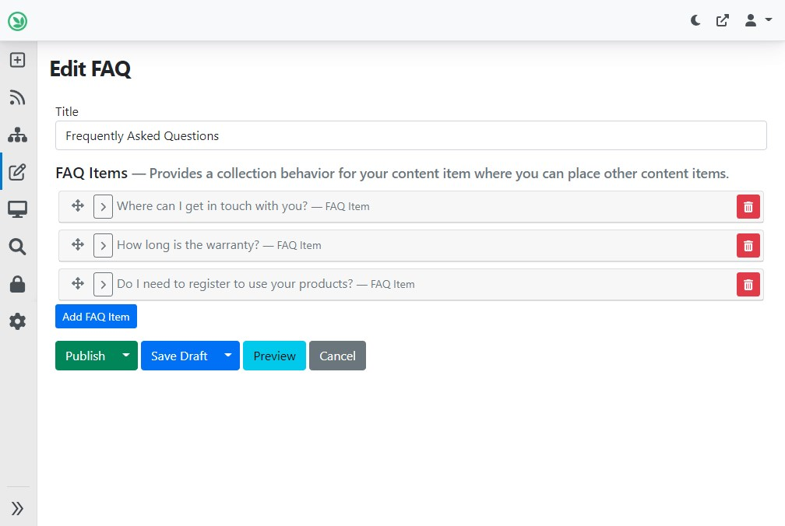
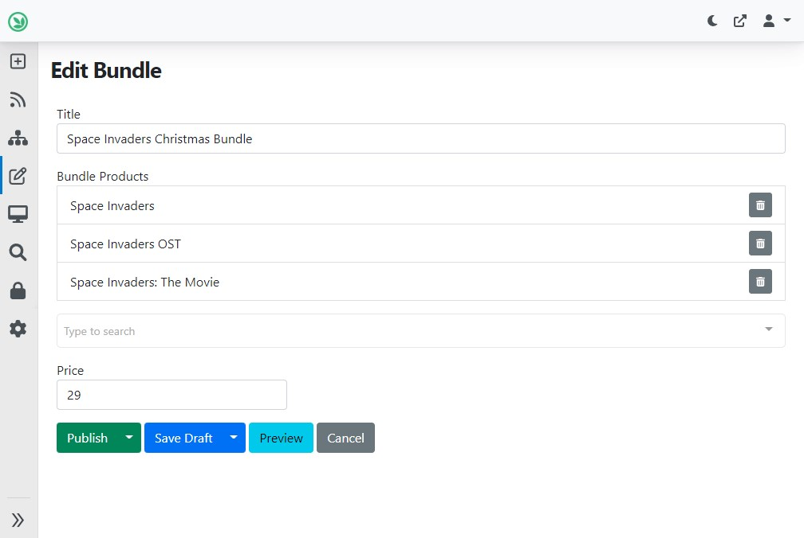
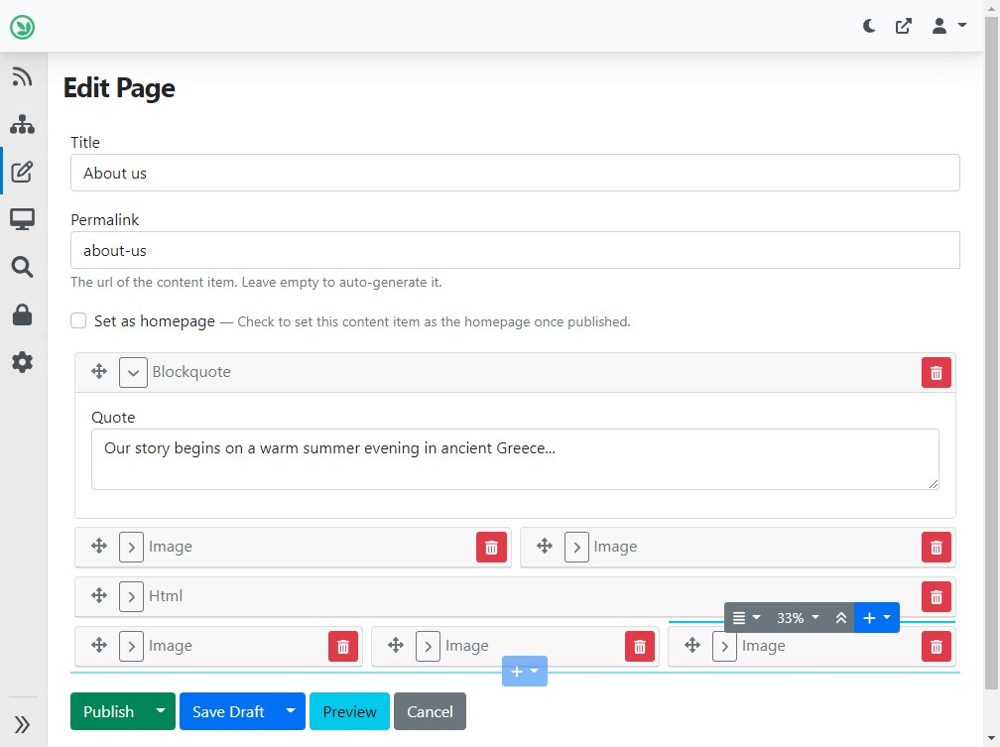
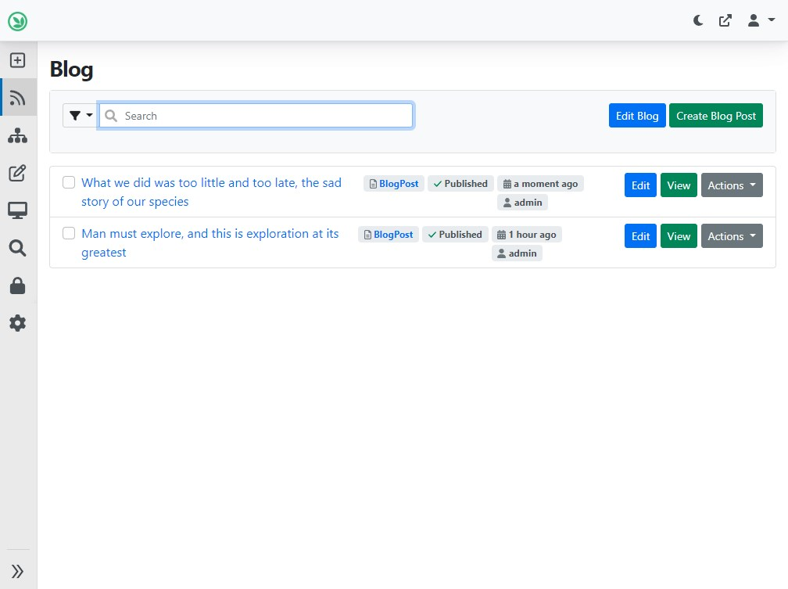
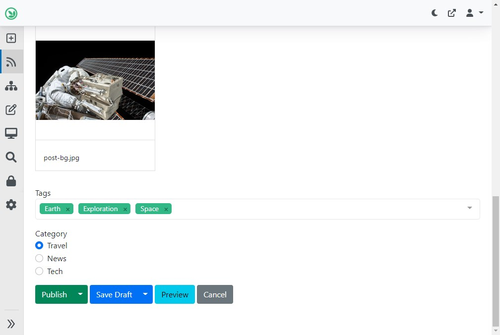
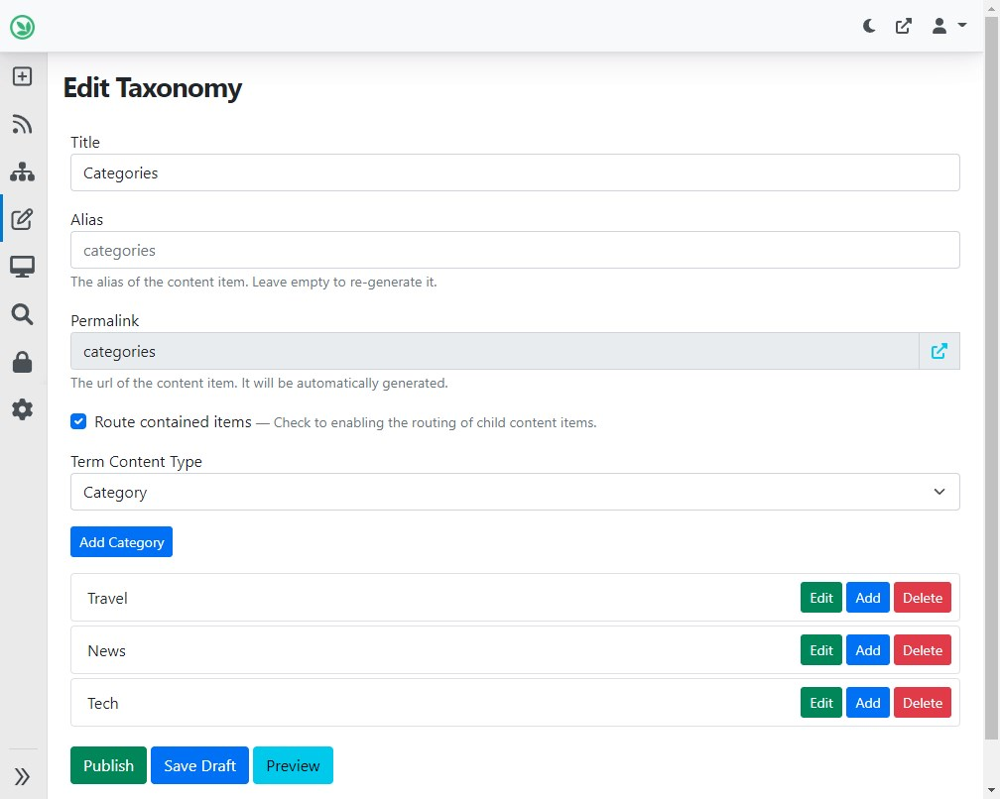

# Content Relationships

How can you relate (connect) content items to other content items in Orchard Core? When would you use each built-in option? This guide aims to clear up the available options.

!!! note
    This is a quick overview of the built-in options. However, you are free to roll out your own implementation for your custom content. Check out in Orchard's source code how these are implemented for inspiration.

!!! tip
    If you're working with the content relationship features mentioned below from code, note that there are also corresponding index tables for quick querying.

## Bag Part (`BagPart`) for Embedding Content Items within a Parent Item

Bag Part can contain other content items in a specified order. The contained items are stored within their parent item, so you can edit all of them in the same editor, and they're fast to retrieve from the database. You can also attach multiple Bag Parts to the same content type since it's a named (reusable) part. However, you can't directly add existing content items, just new ones. Learn more about Bag Part [here](../../reference/modules/Flow/BagPart.md).

!!! example
    When talking about a Frequently Asked Questions (FAQ) page, it's recommended to model each question-answer pair (FAQ item) as its own content type. That way, users can quickly add items following the existing pattern. FAQ items can be stored in a Bag Part on the parent FAQ content item.

The editor of a FAQ page modeled like in the example mentioned above:

## Content Picker Field for Many-to-Many Relationships of Specific Items

Content Picker Field can be used to select one or more arbitrary other content items that are related to a given content item. Furthermore, you can have any number of Content Picker Fields attached to a content part (and thus in effect, a content type), allowing you to manage multiple such relationships for each item. Learn more about Content Picker Field [here](../../reference/modules/ContentFields/README.md#contentpickerfield).

!!! example
    In the product catalog of an e-commerce website, you could have bundles of products: One can buy the individual products as well, but a bundle is a special offer. The products can be selected for the bundle with Content Picker Field. Similarly, in a blog, you can use Content Picker Field to select related blog posts, and thus display a recommended selection of further reading under each post.

The editor of a product bundle item, with products selected:

!!! note
    While it's not only about content item relationships, there's also the [User Picker Field](../../reference/modules/ContentFields/README.md#userpicker-field) that can be used to connect user accounts to content items.

## Flow Part (`FlowPart`) for Building Structured, Responsive Layouts

If you not only want to list content items under another item but also specify in what layout structure they'll be displayed, then Flow Part is the answer. With Flow Part, you can add [widgets](../../reference/modules/Widgets/README.md) to a canvas, and specify where they are displayed relative to each other. This can be used to build pages with complex layouts. Similar to Bag Part, see above, the widgets are stored within the parent content item. Learn more about Flow Part [here](../../reference/modules/Flow/README.md).

!!! example
    Flexible, ad-hoc pages on a website are suited to be built with the help of Flow Part. You'd create e.g. about, contact, or portfolio pages like this. Check out how the Page content type uses Flow Part in the [Blog recipe](../../getting-started/starter-recipes.md#theblogtheme-and-blog-recipe).

The editor of an About Us page using Flow Part:

## List Part for One-To-Many Hierarchical Relationships

With List Part, you can connect two otherwise independently managed content items in one-to-many relationships. The content items can be opened and fetched by their URL directly, but one of them is "contained" in the other one. Learn more about List Part [here](../../reference/modules/Lists/README.md).

!!! example
    The relationship between a blog and the blog posts contained in it is a textbook example of using List Part. Check out how the Blog content type uses List Part to contain Blog Posts in the [Blog recipe](../../getting-started/starter-recipes.md#theblogtheme-and-blog-recipe).

List of Blog Post content items in a Blog:

## Taxonomies for Categorization and Tagging

The Taxonomies module is about categorizing and tagging content items with Terms. Then, you can e.g. list all content items with a given Term, like all blog posts with the "Exploration" tag. In a way, the Term content items of Taxonomies provide a way to have indirect many-to-many relationships of content items. Learn more about Taxonomies [here](../../reference/modules/Taxonomies/README.md).

!!! example
    Tags of blog posts and categories of news articles can use Taxonomies. Terms can also be in a hierarchy, so e.g. categories can have sub-categories. Check out how the Blog Post content type is modeled in the [Blog recipe](../../getting-started/starter-recipes.md#theblogtheme-and-blog-recipe).

Tags and category Taxonomy Terms under a Blog Post content item:

Editor of the Categories Taxonomy with Terms:

